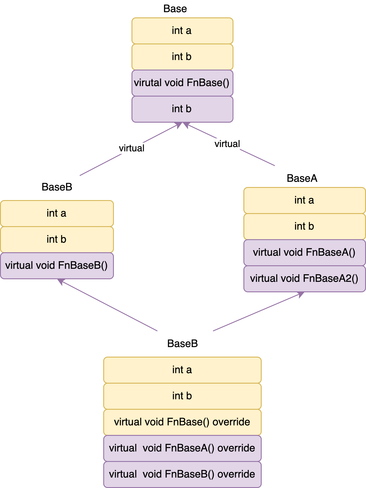
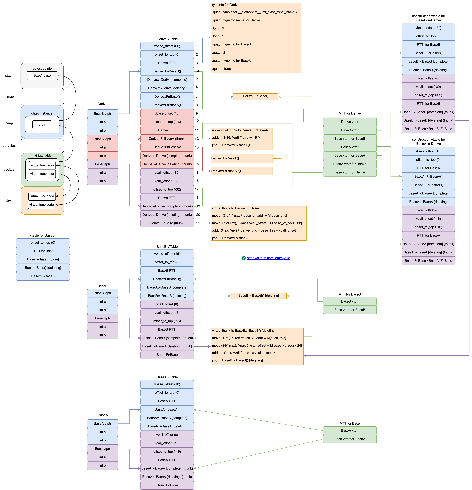

* [C++](#c)
    * [Understanding C++ Virutal Table from Assembly](#Understanding-C-Virutal-Table-from-Assembly)
        * [VTable Layout](#vtable-layout)
        * [Record Layout](#record-layout)
        * [Constructor](#constructor)
        * [Derive Destructor](#derive-distructor)
        * [BaseB Destructor](#baseb-distructor)
        * [BaseA Destructor](#basea-distructor)
        * [VTable](#vtable)
        * [VTT](#vtt)
        * [Construction VTable](#construction-vtable)
        * [Type Info](#typeinfo)

    * [Build Commands](#build-commands)

* [STL](#stl)
   * [shared_ptr](#sharedptr)
   * [malloc](#gcc)

* [IPC](#ipc)

# C++
## Understanding C++ Virutal Table from Assembly

* [Itanium C++ ABI (Revision: 1.75)](https://refspecs.linuxfoundation.org/cxxabi-1.75.html)
---
* [VTable Beginner 1: Interview Series C++ object layout :link: :us: EN](https://developpaper.com/interview-series-c-object-layout/)    [:link: :cn: CN](https://mp.weixin.qq.com/s?__biz=MzkyODE5NjU2Mw==&mid=2247484758&idx=1&sn=4e614430f666f63ab135c13a716d07c1&source=41#wechat_redirect)
* [VTable Beginner 2: Understand C++ vtable from assembly code :link: Part 1](https://guihao-liang.github.io/2020/05/30/what-is-vtable-in-cpp)
* [VTable Expert 1: What does C++ Object Layout Look Like?](https://nimrod.blog/posts/what-does-cpp-object-layout-look-like/)
* [VTable Expert 2: C++ Virtual Table Tables(VTT)](https://nimrod.blog/posts/cpp-virtual-table-tables/)

```c++
g++ -fdump-class-hierarchy layout.cc
clang -Xclang -fdump-record-layouts -stdlib=libc++ -std=c++17 -c layout.cc
clang -Xclang -fdump-vtable-layouts -stdlib=libc++ -std=c++17 -c layout.cc
```


```c++
//  https://godbolt.org/z/3hz5WsKnv
struct Base {
   virtual ~Base() = default;

   virtual void FnBase() {  }

   int a;
   int b;
};

struct BaseA : virtual public Base {
   virtual void FnBaseA() {  }
   virtual void FnBaseA2() {  }  // Not overrided by Derive

   int a;
   int b;
};

struct BaseB : virtual public Base {
   virtual void FnBaseB() {  }

   int a;
   int b;
};

struct Derive : public BaseB, public BaseA {
   void FnBase() override {  }
   void FnBaseA() override {  }
   void FnBaseB() override {  }
};

int main() {
   Base* bptr = new Derive();
   bptr->FnBase();
   delete bptr;

   return 0;
}
```


* BaseA has its own virtual `FunB`, Derive overrides it and adds it into vtable of both BaseA and BaseB.

#### VTable Layout
```c++
Vtable for 'Derive' (22 entries).
   0 | vbase_offset (32)
   1 | offset_to_top (0)
   2 | Derive RTTI
       -- (BaseB, 0) vtable address --
       -- (Derive, 0) vtable address --
   3 | void Derive::FnBaseB()
   4 | Derive::~Derive() [complete]
   5 | Derive::~Derive() [deleting]
   6 | void Derive::FnBase()
   7 | void Derive::FnBaseA()
   8 | vbase_offset (16)
   9 | offset_to_top (-16)
  10 | Derive RTTI
       -- (BaseA, 16) vtable address --
  11 | void Derive::FnBaseA()
       [this adjustment: -16 non-virtual] method: void BaseA::FnBaseA()
  12 | void BaseA::FnBaseA2()
  13 | Derive::~Derive() [complete]
       [this adjustment: -16 non-virtual] method: BaseA::~BaseA()
  14 | Derive::~Derive() [deleting]
       [this adjustment: -16 non-virtual] method: BaseA::~BaseA()
  15 | vcall_offset (-32)
  16 | vcall_offset (-32)
  17 | offset_to_top (-32)
  18 | Derive RTTI
       -- (Base, 32) vtable address --
  19 | Derive::~Derive() [complete]
       [this adjustment: 0 non-virtual, -24 vcall offset offset] method: Base::~Base()
  20 | Derive::~Derive() [deleting]
       [this adjustment: 0 non-virtual, -24 vcall offset offset] method: Base::~Base()
  21 | void Derive::FnBase()
       [this adjustment: 0 non-virtual, -32 vcall offset offset] method: void Base::FnBase()

Virtual base offset offsets for 'Derive' (1 entry).
   Base | -24

Thunks for 'Derive::~Derive()' (2 entries).
   0 | this adjustment: -16 non-virtual
   1 | this adjustment: 0 non-virtual, -24 vcall offset offset

Thunks for 'void Derive::FnBase()' (1 entry).
   0 | this adjustment: 0 non-virtual, -32 vcall offset offset

Thunks for 'void Derive::FnBaseA()' (1 entry).
   0 | this adjustment: -16 non-virtual

VTable indices for 'Derive' (5 entries).
   0 | void Derive::FnBaseB()
   1 | Derive::~Derive() [complete]
   2 | Derive::~Derive() [deleting]
   3 | void Derive::FnBase()
   4 | void Derive::FnBaseA()
```
[Itanium C++ ABI 1.1 Definitions](https://refspecs.linuxfoundation.org/cxxabi-1.75.html#definitions)
* **Thunk**: A segment of code associated (in this ABI) with a target function, which is called instead of the target function for the purpose of modifying parameters (e.g. this) or other parts of the environment before transferring control to the target function, and possibly making further modifications after its return. A thunk may contain as little as an instruction to be executed prior to falling through to an immediately following target function, or it may be a full function with its own stack frame that does a full call to the target function.
* **dsize**: the data size of an object, which is the size of O without tail padding.
* **nvsize**: the non-virtual size of an object, which is the size of O without virtual bases.
* **nvalign**: the non-virtual alignment of an object, which is the alignment of O without virtual bases.

[Itanium C++ ABI 2.5.2 Virtual Table Components and Order](https://refspecs.linuxfoundation.org/cxxabi-1.75.html#vtable)
* Virtual call (**vcall**) offsets are used to perform pointer adjustment for virtual functions that are declared in a virtual base class or its subobjects and overridden in a class derived from it. These entries are allocated in the virtual table for the virtual base class that is most immediately derived from the base class containing the overridden virtual function declaration. They are used to find the necessary adjustment from the virtual base to the derived class containing the overrider, if any. When a virtual function is invoked via a virtual base, but has been overridden in a derived class, the overriding function first adds a fixed offset to adjust the this pointer to the virtual base, and then adds the value contained at the vcall offset in the virtual base to its this pointer to get the address of the derived object where the function was overridden. These values may be positive or negative. These are first in the virtual table if present, ordered as specified in categories 3 and 4 of Section 2.5.3 below.

* Virtual Base (**vbase**) offsets are used to access the virtual bases of an object. Such an entry is added to the derived class object address (i.e. the address of its virtual table pointer) to get the address of a virtual base class subobject. Such an entry is required for each virtual base class. The values can be positive or negative.


* The **offset to top** holds the displacement to the top of the object from the location within the object of the virtual table pointer that addresses this virtual table, as a  ptrdiff_t. It is always present. The offset provides a way to find the top of the object from any base subobject with a virtual table pointer. This is necessary for dynamic_cast<void*> in particular.

Why does C++ need vcall_offset for virtual inheritance but not for non-virtual inheritance?
* In the non-virtual inheritance, this pointer is adjusted in the thunk function directly since the offset between the base class pointer and the derived class pointer is a constant, so the offset can be a constant in the thunk function.
* In virtual inheritance, the offset between the base class pointer and the derived class pointer is vary. This pointer is adjusted indirectly in virtual thunk:
    1. find the vcall_offset
    2. adjust this pointer.

    E.g., the vcall_offset between baseB_this and base_this is different in BaseB->Base inheritance and Derive->(BaseB, BaseA)->Base inheritance even though they have the same thunk when constructing BaseB.

    The reason behide vcall_offfset is code reusability.
    * `BaseB vtable` and `construction vtable for BaseB-in-Derive` have same virtual thunk to BaseB::~BaseB() [deleting destructor], but have different vcall_offset.
    * If vcall_offset is a constant in thunk, the compiler has to generate two versions of thunk, which only differ in vcall_offset, and both pointers point to the same BaseB::~BaseB.

#### Record Layout
```c++
*** Dumping AST Record Layout
         0 | struct Base
         0 |   (Base vtable pointer)
         8 |   int a
        12 |   int b
           | [sizeof=16, dsize=16, align=8,
           |  nvsize=16, nvalign=8]

*** Dumping AST Record Layout
         0 | struct BaseA
         0 |   (BaseA vtable pointer)
         8 |   int a
        12 |   int b
        16 |   struct Base (virtual base)
        16 |     (Base vtable pointer)
        24 |     int a
        28 |     int b
           | [sizeof=32, dsize=32, align=8,
           |  nvsize=16, nvalign=8]

*** Dumping AST Record Layout
         0 | struct BaseB
         0 |   (BaseB vtable pointer)
         8 |   int a
        12 |   int b
        16 |   struct Base (virtual base)
        16 |     (Base vtable pointer)
        24 |     int a
        28 |     int b
           | [sizeof=32, dsize=32, align=8,
           |  nvsize=16, nvalign=8]

*** Dumping AST Record Layout
         0 | struct Derive
         0 |   struct BaseB (primary base)
         0 |     (BaseB vtable pointer)
         8 |     int a
        12 |     int b
        16 |   struct BaseA (base)
        16 |     (BaseA vtable pointer)
        24 |     int a
        28 |     int b
        32 |   struct Base (virtual base)
        32 |     (Base vtable pointer)
        40 |     int a
        44 |     int b
           | [sizeof=48, dsize=48, align=8,
           |  nvsize=32, nvalign=8]
```

#### Constructor

```c++
main:
        pushq   %rbp
        movq    %rsp, %rbp
        subq    $32, %rsp                   # alloc stack
        movl    $0, -4(%rbp)
        movl    $48, %edi                   # 48 = sizeof(Derive)
        callq   operator new(unsigned long)
        movq    %rax, %rdi                  # ptr = derive_this = new Derive()
        movq    %rdi, -32(%rbp)
        xorl    %esi, %esi                  # val = 0
        movl    $48, %edx                   # len = 48
        callq   memset@PLT                  # memset(void* ptr, int val, int len)
        movq    -32(%rbp), %rdi             # derive_this
        callq   Derive::Derive() [complete object constructor]
        movq    -32(%rbp), %rcx             # derive_this
        xorl    %eax, %eax
        cmpq    $0, %rcx
        movq    %rax, -24(%rbp)
        je      .LBB0_2
        movq    -32(%rbp), %rax             # derive_this
        movq    (%rax), %rcx                # derive_vt_addr = M[derive_this]
        movq    -24(%rcx), %rcx             # vbase_offset = M[derive_vt_addr - 24]
        addq    %rcx, %rax                  # base_this = derive_this + vbase_offset
        movq    %rax, -24(%rbp)
.LBB0_2:
        movq    -24(%rbp), %rax             # base_this
        movq    %rax, -16(%rbp)
        movq    -16(%rbp), %rdi             # base_this
        movq    (%rdi), %rax                # base_vt_addr = M[base_this]
        callq   *16(%rax)                   # FnBase = M[base_vt_addr + 16]
        movq    -16(%rbp), %rax
        movq    %rax, -40(%rbp)
        cmpq    $0, %rax
        je      .LBB0_4
        movq    -40(%rbp), %rdi             # base_this
        movq    (%rdi), %rax                # base_vt_addr = M[base_this]
        callq   *8(%rax)                    # ~Base = M[base_vt_addr + 8]
.LBB0_4:
        xorl    %eax, %eax
        addq    $48, %rsp
        popq    %rbp
        retq

# Constructor execution order:
# 1. construct virtual base
# 2. construct non-virtual base
# 3. initialize every base subobject vtptrs
# 4. member initialization list
# 5. explicit user code

Derive::Derive() [complete object constructor]:
        pushq   %rbp
        movq    %rsp, %rbp
        subq    $16, %rsp
        movq    %rdi, -8(%rbp)              # derive_this

        # 1. construct virtual base
        movq    -8(%rbp), %rdi
        movq    %rdi, -16(%rbp)
        addq    $32, %rdi                   # base_this = derive_this + 32
        callq   Base::Base() [base object constructor] # base_vtptr is not set correctly

        # 2. construct non-virtual base
        movq    -16(%rbp), %rdi             # derive_this
        movabsq $VTT for Derive, %rsi
        addq    $8, %rsi                    # baseB_vt_vtt = derive_vtt + 8
        callq   BaseB::BaseB() [base object constructor]
        movq    -16(%rbp), %rdi             # derive_this
        addq    $16, %rdi                   # baseA_this = derive_this + 16
        movabsq $VTT for Derive, %rsi
        addq    $24, %rsi                   # baseA_vt_vtt = derive_vtt + 24
        callq   BaseA::BaseA() [base object constructor]
        movq    -16(%rbp), %rax             # derive_this

        # 3. init each base subobject vtptrs
        movabsq $vtable for Derive, %rcx
        addq    $24, %rcx                   # derive_vtptr = derive_vt_addr + 24
        movq    %rcx, (%rax)
        movabsq $vtable for Derive, %rcx
        addq    $152, %rcx                  # base_vtptr = derive_vt_addr + 152
        movq    %rcx, 32(%rax)
        movabsq $vtable for Derive, %rcx
        addq    $88, %rcx                   # baseA_vtptr = derive_vt_addr + 88
        movq    %rcx, 16(%rax)

        addq    $16, %rsp
        popq    %rbp
        retq
Base::Base() [base object constructor]:
        pushq   %rbp
        movq    %rsp, %rbp
        movq    %rdi, -8(%rbp)
        movq    -8(%rbp), %rax      # base_this
        movabsq $vtable for Base, %rcx
        addq    $16, %rcx
        movq    %rcx, (%rax)        # M[base_vtptr] = vtable_base + 16
        popq    %rbp
        retq
BaseB::BaseB() [base object constructor]:
        pushq   %rbp
        movq    %rsp, %rbp
        movq    %rdi, -8(%rbp)      # baseB_this
        movq    %rsi, -16(%rbp)     # baseB_vt_vtt
        movq    -8(%rbp), %rax
        movq    -16(%rbp), %rcx     # baseB_vt_vtt
        movq    (%rcx), %rdx        # baseB_vt_addr = M[baseB_vt_vtt]
        movq    %rdx, (%rax)        # M[baseB_vtptr] = baseB_vt_addr
        movq    8(%rcx), %rdx       # base_vt_addr = M[baseB_vt_vtt + 8]
        movq    (%rax), %rcx        # baseB_vt_addr
        movq    -24(%rcx), %rcx     # vbase_offset = M[baseB_vt_addr - 24]
        movq    %rdx, (%rax,%rcx)   # M[base_vtptr] = M[baseB_vt_addr + vbase_offset] = base_vt_addr
        popq    %rbp
        retq
BaseA::BaseA() [base object constructor]:
        pushq   %rbp
        movq    %rsp, %rbp
        movq    %rdi, -8(%rbp)      # baseA_this
        movq    %rsi, -16(%rbp)     # baseA_vt_vtt
        movq    -8(%rbp), %rax
        movq    -16(%rbp), %rcx     # baseA_vt_vtt
        movq    (%rcx), %rdx        # baseA_vt_addr = M[baseA_vt_vtt]
        movq    %rdx, (%rax)        # M[baseA_vtptr] = baseA_vt_addr
        movq    8(%rcx), %rdx       # base_vt_addr = M[baseA_vt_vtt + 8]
        movq    (%rax), %rcx        # baseA_vt_addr
        movq    -24(%rcx), %rcx     # vbase_offset = M[baseA_vt_addr - 24]
        movq    %rdx, (%rax,%rcx)   # M[base_vtptr] = M[baseA_vt_addr + vbase_offset] = base_vt_addr
        popq    %rbp
        retq
non-virtual thunk to Derive::FnBaseA():
        pushq   %rbp
        movq    %rsp, %rbp
        movq    %rdi, -8(%rbp)
        movq    -8(%rbp), %rdi
        addq    $-16, %rdi          # derive_this = baseA_this - 16
        popq    %rbp
        jmp     Derive::FnBaseA()
Derive::FnBaseA():
        pushq   %rbp
        movq    %rsp, %rbp
        movq    %rdi, -8(%rbp)
        popq    %rbp
        retq
virtual thunk to Derive::FnBase():
        pushq   %rbp
        movq    %rsp, %rbp
        movq    %rdi, -8(%rbp)
        movq    -8(%rbp), %rdi
        movq    (%rdi), %rax        # base_vt_addr = M[base_this]
        movq    -32(%rax), %rax     # vcall_offset = M[base_vt_addr - 32]
        addq    %rax, %rdi          # derive_this = base_this + vcall_offset
        popq    %rbp
        jmp     Derive::FnBase()
Derive::FnBase():
        pushq   %rbp
        movq    %rsp, %rbp
        movq    %rdi, -8(%rbp)
        popq    %rbp
        retq
Derive::FnBaseB():
        pushq   %rbp
        movq    %rsp, %rbp
        movq    %rdi, -8(%rbp)
        popq    %rbp
        retq
BaseB::FnBaseB():
        pushq   %rbp
        movq    %rsp, %rbp
        movq    %rdi, -8(%rbp)
        popq    %rbp
        retq
Base::FnBase():
        pushq   %rbp
        movq    %rsp, %rbp
        movq    %rdi, -8(%rbp)
        popq    %rbp
        retq
BaseA::FnBaseA():
        pushq   %rbp
        movq    %rsp, %rbp
        movq    %rdi, -8(%rbp)
        popq    %rbp
        retq
BaseA::FnBaseA2():
        pushq   %rbp
        movq    %rsp, %rbp
        movq    %rdi, -8(%rbp)
        popq    %rbp
        retq
```

#### Derive Destructor
[Itanium C++ ABI 1.1 Definitions](https://refspecs.linuxfoundation.org/cxxabi-1.75.html#definitions)

* **Complete destructor**. A function that, in addition to the actions required of a base object destructor, runs the destructors for the virtual base classes of T.
* **Deleting destructor**. A function that, in addition to the actions required of a complete object destructor, calls the appropriate deallocation function (i.e,. operator delete) for T.

```c++
non-virtual thunk to Derive::~Derive() [complete object destructor]:
        pushq   %rbp
        movq    %rsp, %rbp
        movq    %rdi, -8(%rbp)
        movq    -8(%rbp), %rdi
        addq    $-16, %rdi              # derive_this = this - 16
        popq    %rbp
        jmp     Derive::~Derive() [complete object destructor]
non-virtual thunk to Derive::~Derive() [deleting destructor]:
        pushq   %rbp
        movq    %rsp, %rbp
        movq    %rdi, -8(%rbp)
        movq    -8(%rbp), %rdi
        addq    $-16, %rdi              # derive_this = this - 16
        popq    %rbp
        jmp     Derive::~Derive() [deleting destructor]
virtual thunk to Derive::~Derive() [complete object destructor]:
        pushq   %rbp
        movq    %rsp, %rbp
        movq    %rdi, -8(%rbp)
        movq    -8(%rbp), %rdi
        movq    (%rdi), %rax            # base_vt_addr = M[base_this]
        movq    -24(%rax), %rax         # vcall_offset = M[base_vt_addr - 24]
        addq    %rax, %rdi              # derive_this = base_this + vcall_offset
        popq    %rbp
        jmp     Derive::~Derive() [complete object destructor]
virtual thunk to Derive::~Derive() [deleting destructor]:
        pushq   %rbp
        movq    %rsp, %rbp
        movq    %rdi, -8(%rbp)
        movq    -8(%rbp), %rdi
        movq    (%rdi), %rax            # base_vt_addr = M[base_this]
        movq    -24(%rax), %rax         # vcall_offset = M[base_vt_addr - 24]
        addq    %rax, %rdi              # derive_this = base_this + vcall_offset
        popq    %rbp
        jmp     Derive::~Derive() [deleting destructor]
Derive::~Derive() [deleting destructor]:
        pushq   %rbp
        movq    %rsp, %rbp
        subq    $16, %rsp
        movq    %rdi, -8(%rbp)
        movq    -8(%rbp), %rdi
        movq    %rdi, -16(%rbp)         # derive_this
        callq   Derive::~Derive() [complete object destructor]
        movq    -16(%rbp), %rdi
        callq   operator delete(void*)  # delete derive_this
        addq    $16, %rsp
        popq    %rbp
        retq
Derive::~Derive() [complete object destructor]:
        pushq   %rbp
        movq    %rsp, %rbp
        subq    $16, %rsp
        movq    %rdi, -8(%rbp)
        movq    -8(%rbp), %rdi
        movq    %rdi, -16(%rbp)         # derive_this
        movabsq $VTT for Derive, %rsi
        callq   Derive::~Derive() [base object destructor]
        movq    -16(%rbp), %rdi
        addq    $32, %rdi               # base_this = derive_this + 32
        callq   Base::~Base() [base object destructor]
        addq    $16, %rsp
        popq    %rbp
        retq
Derive::~Derive() [base object destructor]:
        pushq   %rbp
        movq    %rsp, %rbp
        subq    $32, %rsp
        movq    %rdi, -8(%rbp)          # derive_this
        movq    %rsi, -16(%rbp)         # derive_vtt
        movq    -8(%rbp), %rdi
        movq    %rdi, -32(%rbp)
        movq    -16(%rbp), %rsi
        movq    %rsi, -24(%rbp)
        addq    $16, %rdi               # baseA_this = derive_this + 16
        addq    $24, %rsi               # baseA_vtt = derive_vtt + 24
        callq   BaseA::~BaseA() [base object destructor]
        movq    -32(%rbp), %rdi
        movq    -24(%rbp), %rsi
        addq    $8, %rsi                # baseB_vtt = derive_vtt + 8
        callq   BaseB::~BaseB() [base object destructor]
        addq    $32, %rsp
        popq    %rbp
        retq
```

#### BaseB Destructor
```c++
virtual thunk to BaseB::~BaseB() [complete object destructor]:
        pushq   %rbp
        movq    %rsp, %rbp
        movq    %rdi, -8(%rbp)
        movq    -8(%rbp), %rdi
        movq    (%rdi), %rax            # base_vt_addr = M[base_this]
        movq    -24(%rax), %rax         # vcall_offset = M[base_vt_addr - 24]
        addq    %rax, %rdi              # baseB_this = base_this + vcall_offset
        popq    %rbp
        jmp     BaseB::~BaseB() [complete object destructor]
virtual thunk to BaseB::~BaseB() [deleting destructor]:
        pushq   %rbp
        movq    %rsp, %rbp
        movq    %rdi, -8(%rbp)
        movq    -8(%rbp), %rdi
        movq    (%rdi), %rax            # base_vt_addr = M[base_this]
        movq    -24(%rax), %rax         # vcall_offset = M[base_vt_addr - 24]
        addq    %rax, %rdi              # baseB_this = base_this + vcall_offset
        popq    %rbp
        jmp     BaseB::~BaseB() [deleting destructor]
BaseB::~BaseB() [deleting destructor]:
        pushq   %rbp
        movq    %rsp, %rbp
        subq    $16, %rsp
        movq    %rdi, -8(%rbp)
        movq    -8(%rbp), %rdi
        movq    %rdi, -16(%rbp)
        callq   BaseB::~BaseB() [complete object destructor]
        movq    -16(%rbp), %rdi
        callq   operator delete(void*)
        addq    $16, %rsp
        popq    %rbp
        retq
BaseB::~BaseB() [complete object destructor]:
        pushq   %rbp
        movq    %rsp, %rbp
        subq    $16, %rsp
        movq    %rdi, -8(%rbp)
        movq    -8(%rbp), %rdi
        movq    %rdi, -16(%rbp)
        movabsq $VTT for BaseB, %rsi
        callq   BaseB::~BaseB() [base object destructor]
        movq    -16(%rbp), %rdi
        addq    $16, %rdi
        callq   Base::~Base() [base object destructor]
        addq    $16, %rsp
        popq    %rbp
        retq
BaseB::~BaseB() [base object destructor]:
        pushq   %rbp
        movq    %rsp, %rbp
        movq    %rdi, -8(%rbp)
        movq    %rsi, -16(%rbp)
        popq    %rbp
        retq
```

#### BaseA Destructor
```c++
virtual thunk to BaseA::~BaseA() [complete object destructor]:
        pushq   %rbp
        movq    %rsp, %rbp
        movq    %rdi, -8(%rbp)
        movq    -8(%rbp), %rdi
        movq    (%rdi), %rax            # base_vt_addr = M[base_this]
        movq    -24(%rax), %rax         # vcall_offset = M[base_vt_addr - 24]
        addq    %rax, %rdi              # baseA_this = base_this + vcall_offset
        popq    %rbp
        jmp     BaseA::~BaseA() [complete object destructor]
virtual thunk to BaseA::~BaseA() [deleting destructor]:
        pushq   %rbp
        movq    %rsp, %rbp
        movq    %rdi, -8(%rbp)
        movq    -8(%rbp), %rdi
        movq    (%rdi), %rax            # base_vt_addr = M[base_this]
        movq    -24(%rax), %rax         # vcall_offset = M[base_vt_addr - 24]
        addq    %rax, %rdi              # baseA_this = base_this + vcall_offset
        popq    %rbp
        jmp     BaseA::~BaseA() [deleting destructor]
BaseA::~BaseA() [deleting destructor]:
        pushq   %rbp
        movq    %rsp, %rbp
        subq    $16, %rsp
        movq    %rdi, -8(%rbp)
        movq    -8(%rbp), %rdi
        movq    %rdi, -16(%rbp)
        callq   BaseA::~BaseA() [complete object destructor]
        movq    -16(%rbp), %rdi         # derive_this = baseA_this + 16
        callq   operator delete(void*)  # delete derive_this
        addq    $16, %rsp
        popq    %rbp
        retq
BaseA::~BaseA() [complete object destructor]:
        pushq   %rbp
        movq    %rsp, %rbp
        subq    $16, %rsp
        movq    %rdi, -8(%rbp)
        movq    -8(%rbp), %rdi
        movq    %rdi, -16(%rbp)
        movabsq $VTT for BaseA, %rsi
        callq   BaseA::~BaseA() [base object destructor]
        movq    -16(%rbp), %rdi
        addq    $16, %rdi
        callq   Base::~Base() [base object destructor]
        addq    $16, %rsp
        popq    %rbp
        retq
BaseA::~BaseA() [base object destructor]:
        pushq   %rbp
        movq    %rsp, %rbp
        movq    %rdi, -8(%rbp)
        movq    %rsi, -16(%rbp)
        popq    %rbp
        retq
Base::~Base() [base object destructor]:
        pushq   %rbp
        movq    %rsp, %rbp
        movq    %rdi, -8(%rbp)
        popq    %rbp
        retq
Base::~Base() [deleting destructor]:
        pushq   %rbp
        movq    %rsp, %rbp
        subq    $16, %rsp
        movq    %rdi, -8(%rbp)
        movq    -8(%rbp), %rdi
        movq    %rdi, -16(%rbp)
        callq   Base::~Base() [base object destructor]
        movq    -16(%rbp), %rdi
        callq   operator delete(void*)
        addq    $16, %rsp
        popq    %rbp
        retq
```

There's a correspond thunk function for each overrided virtual function.

#### VTable

```c++
vtable for Derive:
        .quad   32                                          # vbase_offset
        .quad   0                                           # offset_to_top
        .quad   typeinfo for Derive
        .quad   Derive::FnBaseB()                           # derive_vtptr = +24
        .quad   Derive::~Derive() [complete object destructor]
        .quad   Derive::~Derive() [deleting destructor]
        .quad   Derive::FnBase()
        .quad   Derive::FnBaseA()
        .quad   16                                          # vbase_offset
        .quad   -16                                         # offset_to_top
        .quad   typeinfo for Derive
        .quad   non-virtual thunk to Derive::FnBaseA()      # baseA_vtptr = +88
        .quad   BaseA::FnBaseA2()
        .quad   non-virtual thunk to Derive::~Derive() [complete object destructor]
        .quad   non-virtual thunk to Derive::~Derive() [deleting destructor]
        .quad   -32                                         # vcall_offset
        .quad   -32                                         # vcall_offset
        .quad   -32                                         # offset_to_top
        .quad   typeinfo for Derive
        .quad   virtual thunk to Derive::~Derive() [complete object destructor]  # base_vtptr = +152
        .quad   virtual thunk to Derive::~Derive() [deleting destructor]
        .quad   virtual thunk to Derive::FnBase()

vtable for Base:
        .quad   0                                           # offset_to_top
        .quad   typeinfo for Base
        .quad   Base::~Base() [base object destructor]
        .quad   Base::~Base() [deleting destructor]
        .quad   Base::FnBase()

vtable for BaseB:
        .quad   16                                          # vbase_offset
        .quad   0                                           # offset_to_top
        .quad   typeinfo for BaseB
        .quad   BaseB::FnBaseB()
        .quad   BaseB::~BaseB() [complete object destructor]
        .quad   BaseB::~BaseB() [deleting destructor]
        .quad   0                                           # vcall_offset
        .quad   -16                                         # vcall_offset
        .quad   -16                                         # offset_to_top
        .quad   typeinfo for BaseB
        .quad   virtual thunk to BaseB::~BaseB() [complete object destructor]
        .quad   virtual thunk to BaseB::~BaseB() [deleting destructor]
        .quad   Base::FnBase()

vtable for BaseA:
        .quad   16                                          # vbase_offset
        .quad   0                                           # offset_to_top
        .quad   typeinfo for BaseA
        .quad   BaseA::FnBaseA()
        .quad   BaseA::FnBaseA2()
        .quad   BaseA::~BaseA() [complete object destructor]
        .quad   BaseA::~BaseA() [deleting destructor]
        .quad   0                                           # vcall_offset
        .quad   -16                                         # vcall_offset
        .quad   -16                                         # offset_to_top
        .quad   typeinfo for BaseA
        .quad   virtual thunk to BaseA::~BaseA() [complete object destructor]
        .quad   virtual thunk to BaseA::~BaseA() [deleting destructor]
        .quad   Base::FnBase()
```

#### VTT

Virtual Table Table(VTT) is a table holding vtable pointers to ensure virtual table pointers are set correctly during the construction of base classes under the virtual inheritance hierarchy.

```c++
VTT for BaseB:
        .quad   vtable for BaseB+24                         # baseB_vtptr
        .quad   vtable for BaseB+80                         # base_vtptr

VTT for BaseA:
        .quad   vtable for BaseA+24                         # baseA_vtptr
        .quad   vtable for BaseA+88                         # base_vtptr

VTT for Derive:
        .quad   vtable for Derive+24                        # derive_vtptr
        .quad   construction vtable for BaseB-in-Derive+24  # baseB_vtptr
        .quad   construction vtable for BaseB-in-Derive+80  # base_vtptr in BaseB
        .quad   construction vtable for BaseA-in-Derive+24  # baesA_vtptr
        .quad   construction vtable for BaseA-in-Derive+88  # base_vtptr in BaseA
        .quad   vtable for Derive+152                       # Base vtptr in Derive
        .quad   vtable for Derive+88                        # baseA_vtptr in Derive
```

#### Construction VTable

```c++
construction vtable for BaseB-in-Derive:
        .quad   32                                          # vbase_offset
        .quad   0                                           # offset_to_top
        .quad   typeinfo for BaseB
        .quad   BaseB::FnBaseB()
        .quad   BaseB::~BaseB() [complete object destructor]
        .quad   BaseB::~BaseB() [deleting destructor]
        .quad   0                                           # vcall_offset
        .quad   -32                                         # vcall_offset
        .quad   -32                                         # offset_to_top
        .quad   typeinfo for BaseB
        .quad   virtual thunk to BaseB::~BaseB() [complete object destructor]
        .quad   virtual thunk to BaseB::~BaseB() [deleting destructor]
        .quad   Base::FnBase()

construction vtable for BaseA-in-Derive:
        .quad   16                                          # vbase_offset
        .quad   0                                           # offset_to_top
        .quad   typeinfo for BaseA
        .quad   BaseA::FnBaseA()
        .quad   BaseA::FnBaseA2()
        .quad   BaseA::~BaseA() [complete object destructor]
        .quad   BaseA::~BaseA() [deleting destructor]
        .quad   0                                           # vcall_offset
        .quad   -16                                         # vcall_offset
        .quad   -16                                         # offset_to_top
        .quad   typeinfo for BaseA
        .quad   virtual thunk to BaseA::~BaseA() [complete object destructor]
        .quad   virtual thunk to BaseA::~BaseA() [deleting destructor]
        .quad   Base::FnBase()
```

#### TypeInfo
```c++
typeinfo name for BaseB:
        .asciz  "5BaseB"

typeinfo name for Base:
        .asciz  "4Base"

typeinfo for Base:
        .quad   vtable for __cxxabiv1::__class_type_info+16
        .quad   typeinfo name for Base

typeinfo for BaseB:
        .quad   vtable for __cxxabiv1::__vmi_class_type_info+16
        .quad   typeinfo name for BaseB
        .long   0                               # 0x0
        .long   1                               # 0x1
        .quad   typeinfo for Base
        .quad   -6141                           # 0xffffffffffffe803

typeinfo name for BaseA:
        .asciz  "5BaseA"

typeinfo for BaseA:
        .quad   vtable for __cxxabiv1::__vmi_class_type_info+16
        .quad   typeinfo name for BaseA
        .long   0                               # 0x0
        .long   1                               # 0x1
        .quad   typeinfo for Base
        .quad   -6141                           # 0xffffffffffffe803

typeinfo name for Derive:
        .asciz  "6Derive"

typeinfo for Derive:
        .quad   vtable for __cxxabiv1::__vmi_class_type_info+16
        .quad   typeinfo name for Derive
        .long   2                               # 0x2
        .long   2                               # 0x2
        .quad   typeinfo for BaseB
        .quad   2                               # 0x2
        .quad   typeinfo for BaseA
        .quad   4098                            # 0x1002
```

## Build Commands
```c++
/* 1. Preprocess
 * runs the C preprocessor (cpp),
 * which translates the C source file main.c into an ASCII intermediate file main.i: */

cpp [other arguments] main.c /tmp/main.i


/* 2. Compile
 * runs the C compiler (cc1), which translates main.i into an ASCII assembly language file main.s. */

cc1 /tmp/main.i main.c -O2 [other arguments] -o /tmp/main.s


/* 3. Assembly
 * runs the assembler (as), which translates main.s into a relocatable object file main.o: */

as [other arguments] -o /tmp/main.o /tmp/main.s

/* 4. Link
 * it runs the linker program ld, which combines main.o and swap.o,
 * along with the necessary system object files, to create the executable object file p: */

ld -o p [system object files and args] /tmp/main.o /tmp/swap.o
```

```c++
// static link
gcc -c addvec.c multvec.c
ar rcs libvector.a addvec.o multvec.o
gcc -O2 -c main2.c
gcc -static -o p2 main2.o ./libvector.a
```

```c++
// dynamic link
gcc -shared -fPIC -o libvector.so addvec.c multvec.c
gcc -o p2 main2.c ./libvector.so
```

# STL

## shared_ptr
* 
* [Gcc source code](./STL/shared-ptr-gcc.md)

## GCC
* [GCC: new allocator malloc](../OpenSource/new-allocator-malloc.md)

# IPC

