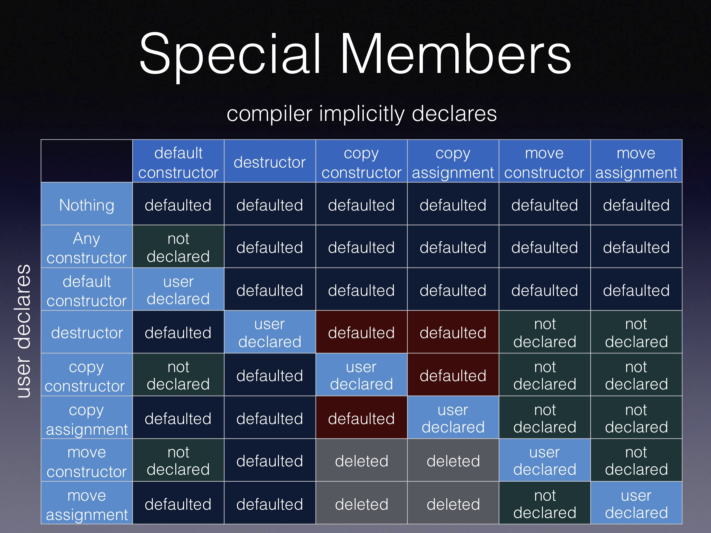
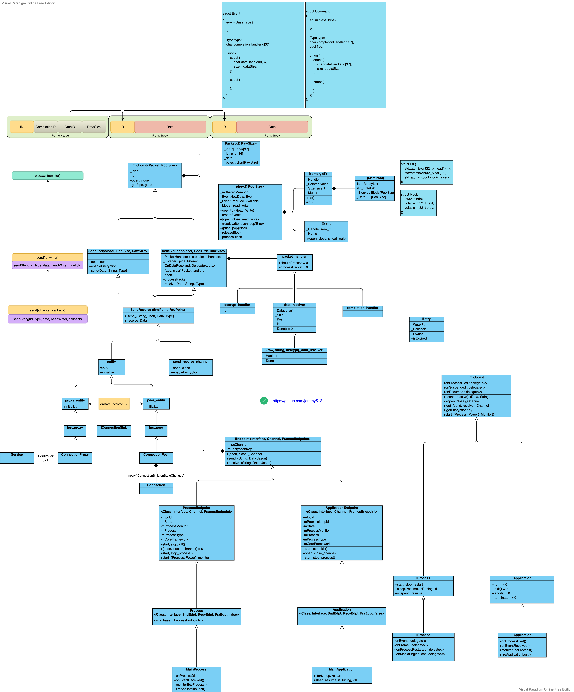

* [C++](#c)
    * [Understanding C++ Virutal Table from Assembly](#Understanding-C-Virutal-Table-from-Assembly)
        * [VTable Layout](#vtable-layout)
        * [Record Layout](#record-layout)
        * [Constructor](#constructor)
        * [Derive Destructor](#derive-distructor)
        * [BaseB Destructor](#baseb-distructor)
        * [BaseA Destructor](#basea-distructor)
        * [VTable](#vtable)
        * [VTT](#vtt)
        * [Construction VTable](#construction-vtable)
        * [Type Info](#typeinfo)

    * [Build Commands](#build-commands)

* [STL](#stl)
   * [shared_ptr](#sharedptr)
   * [malloc](#gcc)

* [IPC](#ipc)

# C++

## Rule of Five



## Understanding C++ Virutal Table from Assembly

* [Itanium C++ ABI (Revision: 1.75)](https://refspecs.linuxfoundation.org/cxxabi-1.75.html)
---
* [VTable Beginner 1: Interview Series C++ object layout :link: :us: EN](https://developpaper.com/interview-series-c-object-layout/)    [:link: :cn: CN](https://mp.weixin.qq.com/s?__biz=MzkyODE5NjU2Mw==&mid=2247484758&idx=1&sn=4e614430f666f63ab135c13a716d07c1&source=41#wechat_redirect)
* [VTable Beginner 2: Understand C++ vtable from assembly code :link: Part 1](https://guihao-liang.github.io/2020/05/30/what-is-vtable-in-cpp)
* [VTable Expert 1: What does C++ Object Layout Look Like?](https://nimrod.blog/posts/what-does-cpp-object-layout-look-like/)
* [VTable Expert 2: C++ Virtual Table Tables(VTT)](https://nimrod.blog/posts/cpp-virtual-table-tables/)

```c++
g++ -fdump-class-hierarchy layout.cc
clang -Xclang -fdump-record-layouts -stdlib=libc++ -std=c++17 -c layout.cc
clang -Xclang -fdump-vtable-layouts -stdlib=libc++ -std=c++17 -c layout.cc
```

```c++
// https://godbolt.org/z/YxY45ros5

struct Base {
    Base() = default;
    Base(int a, int b) : a(a), b(b) {}

    virtual ~Base() = default;
    virtual void FnBase() {  }

    int a;
    int b;
};

struct BaseA : virtual public Base {
    BaseA() = default;

    // Base construction is ignored if BaseA is constructed as part of Derive
    BaseA(int a, int b, int aa, int ab)
    : Base(a, b), a(aa), b(ab) {}

    virtual void FnBase() override {  }
    virtual void FnBaseA() {  }
    virtual void FnBaseA2() {  }  // Not overrided by Derive

    int a;
    int b;
};

struct BaseB : virtual public Base {
    BaseB() = default;

    // Base construction is ignored if BaseB is constructed as part of Derive
    BaseB(int a, int b, int ba, int bb)
    : Base(a, b), a(ba), b(bb) {}

    virtual void FnBase() override {  }
    virtual void FnBaseB() {  }

    int a;
    int b;
};

struct Derive : public BaseB, public BaseA {
    Derive() = default;

    /* The construction of Base is ignored in the constructor of both BaseB and BaseA,
     * Derive is responsible for constructing Base
     *
     * The base object constructor is called for BaseB and BaseA,
     * not complete object constructor eventhough Base paramters are
     * passed to their constructor */
    Derive(int a, int b, int aa, int ab, int ba, int bb, int da, int db)
    : Base(a, b), BaseB(a, b, ba, bb), BaseA(a, b, aa, ab), a(da), b(db) {}

    virtual void FnBase() override {  }
    virtual void FnBaseA() override {  }
    virtual void FnBaseB() override {  }

    virtual void FnDerive() { }

    int a;
    int b;
};

int main() {
    Base* bptr = new Derive(1, 2, 3, 4, 5, 6, 7, 8);
    bptr->FnBase();
    delete bptr;

    Base* ptr = new BaseB(1, 2, 3, 4);

    return 0;
}
```


* BaseA has its own virtual `FunB`, Derive overrides it and adds it into vtable of both BaseA and BaseB.

### VTable Layout

Virtual Table Setup:
1. Base Sub-object: Initially, the FnBase slot in its virtual table points to Base::FnBase.
2. BaseA: When constructed, the FnBase slot in its virtual table points to BaseA::FnBase. This does not affect the Base virtual table directly because of the virtual inheritance mechanism.
3. BaseB: Similarly, when constructed, the FnBase slot in its virtual table points to BaseB::FnBase.
4. Derive: When constructed, it overrides the FnBase slots in all related virtual tables (including Base, BaseA, and BaseB) to point to Derive::FnBase.

```c++
VTable indices for 'Derive' (6 entries).
   0 | void Derive::FnBase()
   1 | void Derive::FnBaseB()
   2 | Derive::~Derive() [complete]
   3 | Derive::~Derive() [deleting]
   4 | void Derive::FnBaseA()
   5 | void Derive::FnDerive()

Original map
 void Derive::FnBase() -> void BaseB::FnBase()
 Derive::~Derive() -> BaseB::~BaseB()
 void Derive::FnBaseB() -> void BaseB::FnBaseB()
Vtable for 'Derive' (24 entries).
   0 | vbase_offset (40)
   1 | offset_to_top (0)
   2 | Derive RTTI
       -- (BaseB, 0) vtable address --
       -- (Derive, 0) vtable address --
   3 | void Derive::FnBase()
   4 | void Derive::FnBaseB()
   5 | Derive::~Derive() [complete]
   6 | Derive::~Derive() [deleting]
   7 | void Derive::FnBaseA()
   8 | void Derive::FnDerive()
   9 | vbase_offset (24)
  10 | offset_to_top (-16)
  11 | Derive RTTI
       -- (BaseA, 16) vtable address --
  12 | non-virtual thunk to void Derive::FnBase()
       [this adjustment: -16 non-virtual] method: void BaseA::FnBase()
  13 | non-virtual thunk to void Derive::FnBaseA()
       [this adjustment: -16 non-virtual] method: void BaseA::FnBaseA()
  14 | void BaseA::FnBaseA2()
  15 | non-virtual thunk to Derive::~Derive() [complete]
       [this adjustment: -16 non-virtual] method: BaseA::~BaseA()
  16 | non-virtual thunk to Derive::~Derive() [deleting]
       [this adjustment: -16 non-virtual] method: BaseA::~BaseA()
  17 | vcall_offset (-40)
  18 | vcall_offset (-40)
  19 | offset_to_top (-40)
  20 | Derive RTTI
       -- (Base, 40) vtable address --
  21 | virtual thunk to Derive::~Derive() [complete]
       [this adjustment: 0 non-virtual, -24 vcall offset offset] method: Base::~Base()
  22 | virtual thunk to Derive::~Derive() [deleting]
       [this adjustment: 0 non-virtual, -24 vcall offset offset] method: Base::~Base()
  23 | virtual thunk to void Derive::FnBase()
       [this adjustment: 0 non-virtual, -32 vcall offset offset] method: void Base::FnBase()

Virtual base offset offsets for 'Derive' (1 entry).
   Base | -24

Thunks for 'Derive::~Derive()' (2 entries).
   0 | this adjustment: -16 non-virtual
   1 | this adjustment: 0 non-virtual, -24 vcall offset offset

Thunks for 'void Derive::FnBase()' (2 entries).
   0 | this adjustment: -16 non-virtual
   1 | this adjustment: 0 non-virtual, -32 vcall offset offset

Thunks for 'void Derive::FnBaseA()' (1 entry).
   0 | this adjustment: -16 non-virtual
```

```cpp
VTable indices for 'Base' (3 entries).
   0 | Base::~Base() [complete]
   1 | Base::~Base() [deleting]
   2 | void Base::FnBase()

Original map
Vtable for 'Base' (5 entries).
   0 | offset_to_top (0)
   1 | Base RTTI
       -- (Base, 0) vtable address --
   2 | Base::~Base() [complete]
   3 | Base::~Base() [deleting]
   4 | void Base::FnBase()
```

```cpp
VTable indices for 'BaseB' (4 entries).
   0 | void BaseB::FnBase()
   1 | void BaseB::FnBaseB()
   2 | BaseB::~BaseB() [complete]
   3 | BaseB::~BaseB() [deleting]

Original map
 void Derive::FnBase() -> void BaseB::FnBase()
 Derive::~Derive() -> BaseB::~BaseB()
 void Derive::FnBaseB() -> void BaseB::FnBaseB()
Vtable for 'BaseB' (14 entries).
   0 | vbase_offset (16)
   1 | offset_to_top (0)
   2 | BaseB RTTI
       -- (BaseB, 0) vtable address --
   3 | void BaseB::FnBase()
   4 | void BaseB::FnBaseB()
   5 | BaseB::~BaseB() [complete]
   6 | BaseB::~BaseB() [deleting]
   7 | vcall_offset (-16)
   8 | vcall_offset (-16)
   9 | offset_to_top (-16)
  10 | BaseB RTTI
       -- (Base, 16) vtable address --
  11 | virtual thunk to BaseB::~BaseB() [complete]
       [this adjustment: 0 non-virtual, -24 vcall offset offset] method: Base::~Base()
  12 | virtual thunk to BaseB::~BaseB() [deleting]
       [this adjustment: 0 non-virtual, -24 vcall offset offset] method: Base::~Base()
  13 | virtual thunk to void BaseB::FnBase()
       [this adjustment: 0 non-virtual, -32 vcall offset offset] method: void Base::FnBase()

Virtual base offset offsets for 'BaseB' (1 entry).
   Base | -24

Thunks for 'BaseB::~BaseB()' (1 entry).
   0 | this adjustment: 0 non-virtual, -24 vcall offset offset

Thunks for 'void BaseB::FnBase()' (1 entry).
   0 | this adjustment: 0 non-virtual, -32 vcall offset offset
```

```cpp
VTable indices for 'BaseA' (5 entries).
   0 | void BaseA::FnBase()
   1 | void BaseA::FnBaseA()
   2 | void BaseA::FnBaseA2()
   3 | BaseA::~BaseA() [complete]
   4 | BaseA::~BaseA() [deleting]

Original map
 void Derive::FnBase() -> void BaseB::FnBase()
 Derive::~Derive() -> BaseB::~BaseB()
 void Derive::FnBaseB() -> void BaseB::FnBaseB()
Vtable for 'BaseA' (15 entries).
   0 | vbase_offset (16)
   1 | offset_to_top (0)
   2 | BaseA RTTI
       -- (BaseA, 0) vtable address --
   3 | void BaseA::FnBase()
   4 | void BaseA::FnBaseA()
   5 | void BaseA::FnBaseA2()
   6 | BaseA::~BaseA() [complete]
   7 | BaseA::~BaseA() [deleting]
   8 | vcall_offset (-16)
   9 | vcall_offset (-16)
  10 | offset_to_top (-16)
  11 | BaseA RTTI
       -- (Base, 16) vtable address --
  12 | virtual thunk to BaseA::~BaseA() [complete]
       [this adjustment: 0 non-virtual, -24 vcall offset offset] method: Base::~Base()
  13 | virtual thunk to BaseA::~BaseA() [deleting]
       [this adjustment: 0 non-virtual, -24 vcall offset offset] method: Base::~Base()
  14 | virtual thunk to void BaseA::FnBase()
       [this adjustment: 0 non-virtual, -32 vcall offset offset] method: void Base::FnBase()

Virtual base offset offsets for 'BaseA' (1 entry).
   Base | -24

Thunks for 'BaseA::~BaseA()' (1 entry).
   0 | this adjustment: 0 non-virtual, -24 vcall offset offset

Thunks for 'void BaseA::FnBase()' (1 entry).
   0 | this adjustment: 0 non-virtual, -32 vcall offset offset
```

[Itanium C++ ABI 1.1 Definitions](https://refspecs.linuxfoundation.org/cxxabi-1.75.html#definitions)
* **Thunk**: A segment of code associated (in this ABI) with a target function, which is called instead of the target function for the purpose of modifying parameters (e.g. this) or other parts of the environment before transferring control to the target function, and possibly making further modifications after its return. A thunk may contain as little as an instruction to be executed prior to falling through to an immediately following target function, or it may be a full function with its own stack frame that does a full call to the target function.
* **dsize**: the data size of an object, which is the size of O without tail padding.
* **nvsize**: the non-virtual size of an object, which is the size of O without virtual bases.
* **nvalign**: the non-virtual alignment of an object, which is the alignment of O without virtual bases.

[Itanium C++ ABI 2.5.2 Virtual Table Components and Order](https://refspecs.linuxfoundation.org/cxxabi-1.75.html#vtable)

* Virtual call (**vcall**) offsets are used to perform pointer adjustment for virtual functions that are declared in a virtual base class or its subobjects and overridden in a class derived from it. These entries are allocated in the virtual table for the virtual base class that is most immediately derived from the base class containing the overridden virtual function declaration. They are used to find the necessary adjustment from the virtual base to the derived class containing the overrider, if any. When a virtual function is invoked via a virtual base, but has been overridden in a derived class, the overriding function first adds a fixed offset to adjust the this pointer to the virtual base, and then adds the value contained at the vcall offset in the virtual base to its this pointer to get the address of the derived object where the function was overridden. These values may be positive or negative. These are first in the virtual table if present, ordered as specified in categories 3 and 4 of Section 2.5.3 below.

* Virtual Base (**vbase**) offsets are used to access the virtual bases of an object. Such an entry is added to the derived class object address (i.e. the address of its virtual table pointer) to get the address of a virtual base class subobject. Such an entry is required for each virtual base class. The values can be positive or negative.


* The **offset to top** holds the displacement to the top of the object from the location within the object of the virtual table pointer that addresses this virtual table, as a  ptrdiff_t. It is always present. The offset provides a way to find the top of the object from any base subobject with a virtual table pointer. This is necessary for dynamic_cast<void*> in particular.

* Q: Why does C++ need `vcall_offset` for virtual inheritance but not for non-virtual inheritance?
    * In the non-virtual inheritance, this pointer is adjusted in the thunk function directly since the offset between the base class pointer and the derived class pointer is a constant, so the offset can be a constant in the thunk function.
    * In virtual inheritance, the offset between the base class pointer and the derived class pointer is vary. This pointer is adjusted indirectly in virtual thunk:
        1. find the vcall_offset
        2. adjust this pointer.

        E.g., the vcall_offset between baseB_this and base_this is different in BaseB->Base inheritance and Derive->(BaseB, BaseA)->Base inheritance even though they have the same thunk when constructing BaseB.

        The reason behide vcall_offfset is code reusability.
        * `BaseB vtable` and `construction vtable for BaseB-in-Derive` have same virtual thunk to BaseB::~BaseB() [deleting destructor], but have different vcall_offset.
        * If vcall_offset is a constant in thunk, the compiler has to generate two versions of thunk, which only differ in vcall_offset, and both pointers point to the same BaseB::~BaseB.

### Record Layout

```c++
*** Dumping AST Record Layout
         0 | struct Base
         0 |   (Base vtable pointer)
         8 |   int a
        12 |   int b
           | [sizeof=16, dsize=16, align=8,
           |  nvsize=16, nvalign=8]

*** Dumping AST Record Layout
         0 | struct BaseA
         0 |   (BaseA vtable pointer)
         8 |   int a
        12 |   int b
        16 |   struct Base (virtual base)
        16 |     (Base vtable pointer)
        24 |     int a
        28 |     int b
           | [sizeof=32, dsize=32, align=8,
           |  nvsize=16, nvalign=8]

*** Dumping AST Record Layout
         0 | struct BaseB
         0 |   (BaseB vtable pointer)
         8 |   int a
        12 |   int b
        16 |   struct Base (virtual base)
        16 |     (Base vtable pointer)
        24 |     int a
        28 |     int b
           | [sizeof=32, dsize=32, align=8,
           |  nvsize=16, nvalign=8]

*** Dumping AST Record Layout
         0 | struct Derive
         0 |   struct BaseB (primary base)
         0 |     (BaseB vtable pointer)
         8 |     int a
        12 |     int b
        16 |   struct BaseA (base)
        16 |     (BaseA vtable pointer)
        24 |     int a
        28 |     int b
        32 |   int a
        36 |   int b
        40 |   struct Base (virtual base)
        40 |     (Base vtable pointer)
        48 |     int a
        52 |     int b
           | [sizeof=56, dsize=56, align=8,
           |  nvsize=40, nvalign=8]
```

### main

```c
main:
    pushq   %rbp                ; Save old base pointer
    movq    %rsp, %rbp          ; Set up new base pointer
    subq    $128, %rsp          ; Allocate 128 bytes on stack for local variables

    movl    $0, -4(%rbp)        ; Initialize local variable to 0

    ; First new operation (Derive object)
    movl    $56, %edi           ; Set size parameter for new (56 bytes for Derive)
    callq   operator new        ; Call new operator
    movq    %rax, %rdi          ; Save pointer(derive_this) returned by new
    movq    %rdi, %rax          ; Copy pointer
    movq    %rax, -56(%rbp)     ; Store pointer in local variable
    movq    %rdi, %rax          ; Copy pointer again
    movq    %rax, -48(%rbp)     ; Store pointer in another local variable

    ; Set up parameters for Derive constructor (1,2,3,4,5,6,7,8)
    movq    %rsp, %rax          ; Get stack pointer
    movl    $8, 16(%rax)        ; Parameter da = 8
    movl    $7, 8(%rax)         ; Parameter db = 7
    movl    $6, (%rax)          ; Parameter bb = 6
    movl    $1, %esi            ; Parameter a = 1
    movl    $2, %edx            ; Parameter b = 2
    movl    $3, %ecx            ; Parameter aa = 3
    movl    $4, %r8d            ; Parameter ab = 4
    movl    $5, %r9d            ; Parameter ba = 5
    callq   Derive::Derive      ; Call Derive constructor
    jmp     .LBB0_1             ; Jump to next block

.LBB0_1:
    ; Virtual function call setup
    movq    -48(%rbp), %rcx     ; Load derive_this pointer
    xorl    %eax, %eax          ; Clear eax
    cmpq    $0, %rcx            ; Check for null pointer
    movq    %rax, -64(%rbp)     ; Store 0 in local variable
    je      .LBB0_3             ; Jump if pointer is null

    ; Virtual function call resolution
    ; bptr = dynamic_cast<Base*>(derive_this)
    movq    -48(%rbp), %rax     ; Load derive_this pointer
    movq    (%rax), %rcx        ; derive_vtptr = M[derive_this]
    movq    -24(%rcx), %rcx     ; Load vbase_offset = M[derive_vtpr - 24]
    addq    %rcx, %rax          ; base_this = vbase_offset + derive_this
    movq    %rax, -64(%rbp)     ; bptr = base_this

.LBB0_3:
    ; Call virtual function FnBase()
    movq    -64(%rbp), %rax     ; Load base_this
    movq    %rax, -16(%rbp)     ; Store base_this
    movq    -16(%rbp), %rdi     ; Load base_this pointer for call
    movq    (%rdi), %rax        ; base_vtptr = M[base_this]
    callq   *16(%rax)           ; Call virtual function FnBase(), M(base_vtptr + 16)()

    ; Delete object setup
    movq    -16(%rbp), %rax     ; Load base_this pointer
    movq    %rax, -72(%rbp)     ; Store base_this
    cmpq    $0, %rax            ; Check for null
    je      .LBB0_5             ; Skip if null

    ; Call destructor
    movq    -72(%rbp), %rdi     ; Load base_this pointer
    movq    (%rdi), %rax        ; Load vtable, base_vtptr = M[base_this]
    callq   *8(%rax)            ; Call virtual destructor, M[base_vtptr + 8]()

.LBB0_5:
    ; Second new operation (BaseB object)
    movl    $32, %edi           ; Set size parameter for new (32 bytes for BaseB)
    callq   operator new        ; Call new operator
    movq    %rax, %rdi          ; Save returned pointer, baseB_this
    movq    %rdi, %rax          ; Copy baseB_this
    movq    %rax, -88(%rbp)     ; Store baseB_this
    movq    %rdi, %rax          ; Copy baseB_this again
    movq    %rax, -80(%rbp)     ; Store baseB_this

    ; Set up parameters for BaseB constructor (1,2,3,4)
    movl    $1, %esi            ; Parameter a = 1
    movl    $2, %edx            ; Parameter b = 2
    movl    $3, %ecx            ; Parameter ba = 3
    movl    $4, %r8d            ; Parameter bb = 4
    callq   BaseB::BaseB        ; Call BaseB constructor
    jmp     .LBB0_6             ; Jump to next block

.LBB0_6:
    ; Similar virtual pointer setup for BaseB
    movq    -80(%rbp), %rcx     ; Load baseB_this pointer
    xorl    %eax, %eax          ; Clear eax
    cmpq    $0, %rcx            ; Check for null
    movq    %rax, -96(%rbp)     ; Store 0
    je      .LBB0_8             ; Jump if null

    ; Adjust BaseB pointer to Base
    movq    -80(%rbp), %rax     ; Load baseB_this pointer
    movq    (%rax), %rcx        ; Load vtable, baseB_vtptr = M[baseB_this]
    movq    -24(%rcx), %rcx     ; vbase_offset = M[baseB_vtptr - 24], Get Base subobject offset
    addq    %rcx, %rax          ; base_this = baseB_this + vbase_offset
    movq    %rax, -96(%rbp)     ; Store adjusted pointer

.LBB0_8:
    ; Function return
    movq    -96(%rbp), %rax     ; Load final pointer
    movq    %rax, -40(%rbp)     ; Store it
    xorl    %eax, %eax          ; Set return value to 0
    addq    $128, %rsp          ; Restore stack pointer
    popq    %rbp                ; Restore base pointer
    retq                        ; Return

    ; Exception handling code
    movq    -56(%rbp), %rdi     ; Load object pointer
    movq    %rax, %rcx          ; Save exception info
    movl    %edx, %eax          ; Save exception code
    movq    %rcx, -24(%rbp)     ; Store exception info
    movl    %eax, -28(%rbp)     ; Store exception code
    callq   operator delete     ; Delete object
    jmp     .LBB0_11            ; Jump to exception handler

    ; Similar exception handling for second object
    movq    -88(%rbp), %rdi     ; Load second object pointer
    movq    %rax, %rcx          ; Save exception info
    movl    %edx, %eax          ; Save exception code
    movq    %rcx, -24(%rbp)     ; Store exception info
    movl    %eax, -28(%rbp)     ; Store exception code
    callq   operator delete     ; Delete object

.LBB0_11:
    ; Final exception handling
    movq    -24(%rbp), %rdi     ; Load exception info
    callq   _Unwind_Resume@PLT  ; Resume exception handling
```

### Constructor

Constructor execution order:
1. construct virtual base
2. construct non-virtual base
3. initialize every base subobject vtptrs
4. member initialization list
5. explicit user code

Item | Constructing BaseB **directly** | Constructing BaseB **as part of Derive**:
--- | --- | ---
Constructor Type | **complete-object constructor**(Constructs everything including virtual bases) for BaseB | **base-object constructor**(Skips virtual base construction) for BaseB
Virtual Base Handling | **DOES** call Base's constructor | **DOES NOT** call Base's constructor, most derived class is responsible for constructing Base
Virtua Table | Uses BaseB's vtable directly | Uses VTT (Virtual Table Table)
Memory laytou | simpler (no diamond pattern) | complex (diamond pattern)

[Itanium C++ ABI 1.1 Definitions](https://refspecs.linuxfoundation.org/cxxabi-1.75.html#definitions)
\ | **non-virtual thunk** | **virtual thunk**
--- | --- | ---
offset | Uses fixed, compile-time known offset (static) | Offset stored in vtable (dynamic)
Performance | Simple and fast | Slower, more complex, requires vtable lookup
Use case | Used for regular inheritance (BaseA to Derive adjustment) | Used for virtual inheritance (Base to Derive adjustment)

#### Derive ctor

```cpp
Derive::Derive(int, int, int, int, int, int, int, int)[complete object constructor]:
    pushq   %rbp                   ; Save old base pointer
    movq    %rsp, %rbp             ; Set up new base pointer
    subq    $64, %rsp              ; Allocate 64 bytes on stack

    ; Load stack parameters (7th and 8th parameters, which were pushed on stack)
    movl    32(%rbp), %eax         ; Load db (8th parameter)
    movl    24(%rbp), %eax         ; Load da (7th parameter)
    movl    16(%rbp), %eax         ; Load bb (6th parameter)

    ; Save parameters to local variables
    movq    %rdi, -8(%rbp)         ; Save 'derive_this' pointer
    movl    %esi, -12(%rbp)        ; Save a (1st parameter)
    movl    %edx, -16(%rbp)        ; Save b (2nd parameter)
    movl    %ecx, -20(%rbp)        ; Save aa (3rd parameter)
    movl    %r8d, -24(%rbp)        ; Save ab (4th parameter)
    movl    %r9d, -28(%rbp)        ; Save ba (5th parameter)

    ; 1. construct
    ; 1.1 Construct virtual Base subobject
    movq    -8(%rbp), %rdi         ; Load 'derive_this' pointer
    movq    %rdi, -56(%rbp)        ; Save it
    addq    $40, %rdi              ; base_this = derive_this + 40
    movl    -12(%rbp), %esi        ; Load a
    movl    -16(%rbp), %edx        ; Load b
    callq   Base::Base(int, int) [base object constructor]

    ; 1.2 Construct direct BaseB subobject
    movq    -56(%rbp), %rdi        ; Load 'derive_this' pointer
    movl    -12(%rbp), %edx        ; Load a
    movl    -16(%rbp), %ecx        ; Load b
    movl    -28(%rbp), %r8d        ; Load ba
    movl    16(%rbp), %r9d         ; Load bb
    movl    $VTT for Derive+8, %esi ; Load VTT for BaseB
    callq   BaseB::BaseB(int, int, int, int) [base object constructor]
    jmp     .LBB1_1                ; Continue to next block

.LBB1_1:
    ; 1.3 Construct direct BaseA subobject
    movq    -56(%rbp), %rdi        ; Load 'derive_this' pointer
    addq    $16, %rdi              ; baseA_this = derive_this + 16
    movl    -12(%rbp), %edx        ; Load a
    movl    -16(%rbp), %ecx        ; Load b
    movl    -20(%rbp), %r8d        ; Load aa
    movl    -24(%rbp), %r9d        ; Load ab
    movl    $VTT for Derive+24, %esi ; Load VTT for BaseA
    callq   BaseA::BaseA(int, int, int, int) [base object constructor]
    jmp     .LBB1_2                ; Continue to next block

.LBB1_2:
    ; 2. Set up virtual tables
    ; 2.1 Set up Derive virtual tables
    movq    -56(%rbp), %rax        ; Load derive_this/derive_vtptr_ptr pointer
    movabsq $vtable for Derive, %rcx ; derive_vt_addr
    addq    $24, %rcx              ; derive_vtptr = derive_vt_addr + 24
    movq    %rcx, (%rax)           ; M[derive_vtptr_ptr] = M[derive_this] = derive_vtptr

    ; 2.2 Set up Base virtual tables
    addq    $168, %rcx             ; base_vtptr = derive_vtptr_ptr + 168
    movq    %rcx, 40(%rax)         ; M[base_vtptr_ptr] = M[base_this] = base_vptr

    ; 2.2 Set up BaseA virtual tables
    addq    $96, %rcx              ; baseA_vtptr = derive_vt_addr + 96
    movq    %rcx, 16(%rax)         ; M[baseA_vtptr_ptr] = M[baseA_this] = baseA_vtptr

    ; 3. Initialize Derive's data members
    movl    24(%rbp), %ecx         ; Load da
    movl    %ecx, 32(%rax)         ; Set Derive::a
    movl    32(%rbp), %ecx         ; Load db
    movl    %ecx, 36(%rax)         ; Set Derive::b

    ; 4. execute constructor body

    ; Function epilogue
    addq    $64, %rsp              ; Restore stack
    popq    %rbp                   ; Restore base pointer
    retq                           ; Return

    ; Exception handling code
    movq    %rax, %rcx             ; Save exception pointer
    movl    %edx, %eax             ; Save exception code
    movq    %rcx, -40(%rbp)        ; Store exception pointer
    movl    %eax, -44(%rbp)        ; Store exception code
    jmp     .LBB1_5                ; Jump to cleanup

    ; More exception handling
    movq    -56(%rbp), %rdi        ; Load 'this' pointer
    movq    %rax, %rcx             ; Save exception info
    movl    %edx, %eax
    movq    %rcx, -40(%rbp)
    movl    %eax, -44(%rbp)
    movabsq $VTT for Derive, %rsi  ; Load VTT
    addq    $8, %rsi
    callq   BaseB::~BaseB() [base object destructor]

.LBB1_5:
    ; Cleanup for exception
    movq    -56(%rbp), %rdi        ; Load 'this' pointer
    addq    $40, %rdi              ; Adjust to Base
    callq   Base::~Base            ; Destroy Base
    movq    -40(%rbp), %rdi        ; Load exception info
    callq   _Unwind_Resume@PLT     ; Resume exception handling
```

#### Base ctor

```cpp
Base::Base(int, int) [base object constructor]:
    pushq   %rbp                   ; Save old base pointer
    movq    %rsp, %rbp             ; Set up new stack frame

    ; Save parameters to local variables
    movq    %rdi, -8(%rbp)         ; Save 'this' pointer
    movl    %esi, -12(%rbp)        ; Save first parameter (a)
    movl    %edx, -16(%rbp)        ; Save second parameter (b)

    ; 1. Set up virtual table
    movq    -8(%rbp), %rax         ; Load base_this/base_vtptr_ptr pointer
    movabsq $vtable for Base, %rcx ; Load address of Base vtable, base_vt_addr
    addq    $16, %rcx              ; base_vtptr = base_vt_addr + 16
    movq    %rcx, (%rax)           ; M[base_vtptr_ptr] = M[base_this] = base_vtptr

    ; 2. Initialize Base's data members
    movl    -12(%rbp), %ecx        ; Load 'a' parameter
    movl    %ecx, 8(%rax)          ; Set Base::a member
    movl    -16(%rbp), %ecx        ; Load 'b' parameter
    movl    %ecx, 12(%rax)         ; Set Base::b member

    ; Function epilogue
    popq    %rbp                   ; Restore base pointer
    retq                           ; Return
```

#### BaseB ctor

```cpp
BaseB::BaseB(int, int, int, int) [complete object constructor]:
    pushq   %rbp                   ; Save old base pointer
    movq    %rsp, %rbp             ; Set up new base pointer
    subq    $32, %rsp              ; Allocate 32 bytes on stack

    ; Save parameters to local variables
    movq    %rdi, -8(%rbp)         ; Save 'base_this' pointer
    movl    %esi, -12(%rbp)        ; Save first parameter (a)
    movl    %edx, -16(%rbp)        ; Save second parameter (b)
    movl    %ecx, -20(%rbp)        ; Save third parameter (ba)
    movl    %r8d, -24(%rbp)        ; Save fourth parameter (bb)

    ; 1. Construct Base subobject
    movq    -8(%rbp), %rdi         ; Get 'baseB_this' pointer
    movq    %rdi, -32(%rbp)        ; Save 'baseB_this' pointer
    addq    $16, %rdi              ; base_this = baseB_this + 16
    movl    -12(%rbp), %esi        ; Load 'a' parameter
    movl    -16(%rbp), %edx        ; Load 'b' parameter
    callq   Base::Base(int, int) [base object constructor]

    ; 2. Set up virtual tables
    ; 2.1 Set up this virtual tables
    movq    -32(%rbp), %rax        ; Load 'baseB_this' pointer
    movabsq $vtable for BaseB, %rcx; Load baseB_vt_addr
    addq    $24, %rcx              ; baseB_vtptr = baseB_vt_addr + 24
    movq    %rcx, (%rax)           ; M[baseB_vtptr_ptr] = M[baseB_this] = base_vtptr

    ; 2.2 Set up  virtual base vtables
    addq    $88, %rcx              ; base_vtptr = baseB_vtptr + 88
    movq    %rcx, 16(%rax)         ; M[base_this] = base_vtptr

    ; 3. Initialize BaseB's data members
    movl    -20(%rbp), %ecx        ; Load 'ba' parameter
    movl    %ecx, 8(%rax)          ; Set BaseB::ba member
    movl    -24(%rbp), %ecx        ; Load 'bb' parameter
    movl    %ecx, 12(%rax)         ; Set BaseB::bb member

    ; Function epilogue
    addq    $32, %rsp              ; Restore stack pointer
    popq    %rbp                   ; Restore base pointer
    retq                           ; Return
```

```cpp
BaseB::BaseB(int, int, int, int) [base object constructor]:
    pushq   %rbp                   # Save old base pointer
    movq    %rsp, %rbp             # Set up new base pointer

    # Save parameters to local variables
    movq    %rdi, -8(%rbp)         ; Save 'baseB_this' pointer
    movq    %rsi, -16(%rbp)        ; Save VTT pointer
    movl    %edx, -20(%rbp)        ; Save first parameter (a)
    movl    %ecx, -24(%rbp)        ; Save second parameter (b)
    movl    %r8d, -28(%rbp)        ; Save third parameter (ba)
    movl    %r9d, -32(%rbp)        ; Save fourth parameter (bb)

    ; 1 Set up virtual tables using VTT
    ; 1.1 Set up this vtable
    movq    -8(%rbp), %rax         ; Load 'baseB_this' pointer
    movq    -16(%rbp), %rcx        ; Load VTT pointer, baseB_vtt
    movq    (%rcx), %rdx           ; baseB_vtpr = M[baseB_vtt]
    movq    %rdx, (%rax)           ; M[baseB_this] = baseB_vptr

    ; 1.2 Set up virtual base vtable
    movq    8(%rcx), %rdx          ; base_vtptr = M[baseB_vtt + 8]
    movq    (%rax), %rcx           ; Load primary vtable, baseB_vtptr_ptr/baseB_this
    movq    -24(%rcx), %rcx        ; vbase_offset = M[baseB_vtptr_ptr - 24]
    movq    %rdx, (%rax,%rcx)      ; M[base_vptr_ptr] = M[baseB_vtptr_ptr + vbase_offset] = base_vtptr

    ; 2. Initialize BaseB's data members
    movl    -28(%rbp), %ecx        ; Load 'ba' parameter
    movl    %ecx, 8(%rax)          ; Set BaseB::ba member
    movl    -32(%rbp), %ecx        ; Load 'bb' parameter
    movl    %ecx, 12(%rax)         ; Set BaseB::bb member

    ; Function epilogue
    popq    %rbp                   ; Restore base pointer
    retq                           ; Return
```

### Destructor

#### Derive dtor


* **Complete destructor**. A function that, in addition to the actions required of a base object destructor, runs the destructors for the virtual base classes of T.
* **Deleting destructor**. A function that, in addition to the actions required of a complete object destructor, calls the appropriate deallocation function (i.e,. operator delete) for T.

```c++
non-virtual thunk to Derive::~Derive() [complete object destructor]:
        pushq   %rbp
        movq    %rsp, %rbp

        movq    %rdi, -8(%rbp)      # save baseA_this
        movq    -8(%rbp), %rdi      # load baseA_this
        addq    $-16, %rdi          # derive_this = baseA_this - 16
        popq    %rbp
        jmp     Derive::~Derive() [complete object destructor]

non-virtual thunk to Derive::~Derive() [deleting destructor]:
        pushq   %rbp
        movq    %rsp, %rbp

        movq    %rdi, -8(%rbp)      # save baseA_this
        movq    -8(%rbp), %rdi      # load baseA_this
        addq    $-16, %rdi          # derive_this = baseA_this - 16
        popq    %rbp
        jmp     Derive::~Derive() [deleting destructor]

virtual thunk to Derive::~Derive() [complete object destructor]:
        pushq   %rbp
        movq    %rsp, %rbp
        movq    %rdi, -8(%rbp)

        # Adjust 'this' pointer for virtual base
        movq    -8(%rbp), %rdi      # load base_this
        movq    (%rdi), %rax        # base_vtptr = M[base_this]
        movq    -24(%rax), %rax     # vcall_offset = M[base_vtptr - 24]
        addq    %rax, %rdi          # derive_this = base_this + vcall_offset
        popq    %rbp
        jmp     Derive::~Derive() [complete object destructor]

virtual thunk to Derive::~Derive() [deleting destructor]:
        pushq   %rbp
        movq    %rsp, %rbp
        movq    %rdi, -8(%rbp)

        # Adjust 'this' pointer for virtual base
        movq    -8(%rbp), %rdi      # load base_this
        movq    (%rdi), %rax        # base_vtptr = M[base_this]
        movq    -24(%rax), %rax     # vcall_offset = M[base_vtptr - 24]
        addq    %rax, %rdi          # derive_this = base_this + vcall_offset
        popq    %rbp
        jmp     Derive::~Derive() [deleting destructor]

Derive::~Derive() [deleting destructor]:
        pushq   %rbp
        movq    %rsp, %rbp
        subq    $16, %rsp

        movq    %rdi, -8(%rbp)      # save derive_this
        movq    -8(%rbp), %rdi      # load derive_this
        movq    %rdi, -16(%rbp)     # save derive_this for later deletion

        # 1: Call the complete object destructor
        callq   Derive::~Derive() [complete object destructor]

        # 2: Free the memory
        movq    -16(%rbp), %rdi     # reload original derive_this
        callq   operator delete     # delete derive_this

        addq    $16, %rsp
        popq    %rbp
        retq
```

```cpp
Derive::~Derive() [complete object destructor]:
        pushq   %rbp
        movq    %rsp, %rbp
        subq    $16, %rsp

        movq    %rdi, -8(%rbp)      # save derive_this
        movq    -8(%rbp), %rdi      # load derive_this
        movq    %rdi, -16(%rbp)      store original derive_this for later use

        # 1: Destroy derived part using VTT
        movabsq $VTT for Derive, %rsi   # load derive_vtt
        callq   Derive::~Derive() [base object destructor]

        # 2: Destroy virtual base
        movq    -16(%rbp), %rdi     # reload original derive_this
        addq    $40, %rdi           # base_this = derive_this + 40
        callq   Base::~Base() [base object destructor]

        addq    $16, %rsp
        popq    %rbp
        retq

Derive::~Derive() [base object destructor]:
        pushq   %rbp
        movq    %rsp, %rbp
        subq    $32, %rsp

        movq    %rdi, -8(%rbp)      # save derive_this
        movq    %rsi, -16(%rbp)     # save derive_vtt

        movq    -8(%rbp), %rdi      # load derive_this
        movq    %rdi, -32(%rbp)     # store original derive_this for later
        movq    -16(%rbp), %rsi     # load derive_vtt
        movq    %rsi, -24(%rbp)     # store derive_vtt for later

        # 1. Destroy BaseA
        addq    $16, %rdi           # baseA_this = derive_this + 16
        addq    $24, %rsi           # baseA_vtt = derive_vtt + 24
        callq   BaseA::~BaseA() [base object destructor]

        # 2. Destroy BaseB
        movq    -32(%rbp), %rdi     # reload original derive_this
        movq    -24(%rbp), %rsi     # reload original derive_vtt
        addq    $8, %rsi            # baseB_vtt = derive_vtt + 8
        callq   BaseB::~BaseB() [base object destructor]

        addq    $32, %rsp
        popq    %rbp
        retq
```

#### BaseB dtor

```c++
virtual thunk to BaseB::~BaseB() [complete object destructor]:
        pushq   %rbp
        movq    %rsp, %rbp
        movq    %rdi, -8(%rbp)      # save baseB_this

        # Adjust 'this' pointer for virtual base
        movq    -8(%rbp), %rdi      # load baseB_this
        movq    (%rdi), %rax        # baseB_vtptr = M[baseB_this]
        movq    -24(%rax), %rax     # offset_to_top = M[baseB_vtptr - 24]
        addq    %rax, %rdi          # derive_this = base_this + offset_to_top
        popq    %rbp
        jmp     BaseB::~BaseB() [complete object destructor]

virtual thunk to BaseB::~BaseB() [deleting destructor]:
        pushq   %rbp
        movq    %rsp, %rbp

        movq    %rdi, -8(%rbp)      # save baseB_this
        movq    -8(%rbp), %rdi      # load baseB_this
        movq    (%rdi), %rax        # baseB_vtptr = M[baseB_this]
        movq    -24(%rax), %rax     # offset_to_top = M[baseB_vtptr - 24]
        addq    %rax, %rdi          # derive_this = baseB_this + offset_to_top
        popq    %rbp
        jmp     BaseB::~BaseB() [deleting destructor]

BaseB::~BaseB() [deleting destructor]:
        pushq   %rbp
        movq    %rsp, %rbp
        subq    $16, %rsp

        movq    %rdi, -8(%rbp)      # save derive_this
        movq    -8(%rbp), %rdi      # load derive_this
        movq    %rdi, -16(%rbp)     # save derive_this for later

        # 1: Call complete object destructor
        callq   BaseB::~BaseB() [complete object destructor]

        # 2: free memory
        movq    -16(%rbp), %rdi     # reload original derive_this
        callq   operator delete(void*)

        addq    $16, %rsp
        popq    %rbp
        retq
```

```cpp
BaseB::~BaseB() [complete object destructor]:
        pushq   %rbp
        movq    %rsp, %rbp
        subq    $16, %rsp

        movq    %rdi, -8(%rbp)      # save derive_this
        movq    -8(%rbp), %rdi      # load derive_this
        movq    %rdi, -16(%rbp)     # save derive_this for later

        # 1: Destroy BaseB part
        movabsq $VTT for BaseB, %rsi # load baseB_vtt
        callq   BaseB::~BaseB() [base object destructor]

        # 2: Destroy virtual base (Base)
        movq    -16(%rbp), %rdi     # reload original derive_this
        addq    $16, %rdi           # base_this = derive_this + 16
        callq   Base::~Base() [base object destructor]

        addq    $16, %rsp
        popq    %rbp
        retq

BaseB::~BaseB() [base object destructor]:
        pushq   %rbp
        movq    %rsp, %rbp
        movq    %rdi, -8(%rbp)      # save derive_this
        movq    %rsi, -16(%rbp)     # save baseB_vtt
        popq    %rbp
        retq
```

#### BaseA dtor

```c++
virtual thunk to BaseA::~BaseA() [complete object destructor]:
        pushq   %rbp
        movq    %rsp, %rbp

        movq    %rdi, -8(%rbp)      # save base_this
        movq    -8(%rbp), %rdi      # load base_this
        movq    (%rdi), %rax        # base_vtptr = M[base_this]
        movq    -24(%rax), %rax     # vcall_offset = M[base_vtptr - 24]
        addq    %rax, %rdi          # baseA_this = base_this + vcall_offset
        popq    %rbp
        jmp     BaseA::~BaseA() [complete object destructor]

virtual thunk to BaseA::~BaseA() [deleting destructor]:
        pushq   %rbp
        movq    %rsp, %rbp

        movq    %rdi, -8(%rbp)      # save base_this
        movq    -8(%rbp), %rdi      # load base_this
        movq    (%rdi), %rax        # base_vtptr = M[base_this]
        movq    -24(%rax), %rax     # vcall_offset = M[base_vtptr - 24]
        addq    %rax, %rdi          # baseA_this = base_this + vcall_offset
        popq    %rbp
        jmp     BaseA::~BaseA() [deleting destructor]

BaseA::~BaseA() [deleting destructor]:
        pushq   %rbp
        movq    %rsp, %rbp
        subq    $16, %rsp

        movq    %rdi, -8(%rbp)      # save baseA_this
        movq    -8(%rbp), %rdi      # load baseA_this
        movq    %rdi, -16(%rbp)     # save baseA_this for later

        callq   BaseA::~BaseA() [complete object destructor]

        movq    -16(%rbp), %rdi     # derive_this = baseA_this - 16
        callq   operator delete(void*)  # delete derive_this

        addq    $16, %rsp
        popq    %rbp
        retq

BaseA::~BaseA() [complete object destructor]:
        pushq   %rbp
        movq    %rsp, %rbp
        subq    $16, %rsp

        movq    %rdi, -8(%rbp)      # save baseA_this
        movq    -8(%rbp), %rdi      # load baseA_this
        movq    %rdi, -16(%rbp)     # save baseA_this for later

        movabsq $VTT for BaseA, %rsi # load baseA_vtt
        callq   BaseA::~BaseA() [base object destructor]

        movq    -16(%rbp), %rdi     # load saved baseA_this
        addq    $16, %rdi           # base_this = baseA_this + 16
        callq   Base::~Base() [base object destructor]

        addq    $16, %rsp
        popq    %rbp
        retq

BaseA::~BaseA() [base object destructor]:
        pushq   %rbp
        movq    %rsp, %rbp
        movq    %rdi, -8(%rbp)
        movq    %rsi, -16(%rbp)
        popq    %rbp
        retq

Base::~Base() [deleting destructor]:
        pushq   %rbp
        movq    %rsp, %rbp
        subq    $16, %rsp

        movq    %rdi, -8(%rbp)      # save base_this
        movq    -8(%rbp), %rdi      # load base_this
        movq    %rdi, -16(%rbp)     # save base_this for later

        callq   Base::~Base() [base object destructor]

        movq    -16(%rbp), %rdi     # load saved base_this
        callq   operator delete(void*)

        addq    $16, %rsp
        popq    %rbp
        retq

Base::~Base() [base object destructor]:
        pushq   %rbp
        movq    %rsp, %rbp
        movq    %rdi, -8(%rbp)
        popq    %rbp
        retq
```

There's a correspond thunk function for each overrided virtual function.

### VTT

Virtual Table Table(VTT) is a table holding vtable pointers to ensure virtual table pointers are set correctly during the construction of base classes under the virtual inheritance hierarchy.

```c++
VTT for BaseB:
        .quad   vtable for BaseB+24 # baseB_vtptr
        .quad   vtable for BaseB+80 # base_vtptr

VTT for BaseA:
        .quad   vtable for BaseA+24 # baseA_vtptr
        .quad   vtable for BaseA+88 # base_vtptr

VTT for Derive:
        .quad   vtable for Derive+24    # derive_vtptr
        .quad   construction vtable for BaseB-in-Derive+24  # baseB_vtptr
        .quad   construction vtable for BaseB-in-Derive+80  # base_vtptr in BaseB
        .quad   construction vtable for BaseA-in-Derive+24  # baesA_vtptr
        .quad   construction vtable for BaseA-in-Derive+88  # base_vtptr in BaseA
        .quad   vtable for Derive+160   # Base vtptr in Derive
        .quad   vtable for Derive+96    # baseA_vtptr in Derive
```

### Construction VTable

```c++
Original map
 void Derive::FnBase() -> void BaseB::FnBase()
 Derive::~Derive() -> BaseB::~BaseB()
 void Derive::FnBaseB() -> void BaseB::FnBaseB()
Construction vtable for ('BaseB', 0) in 'Derive' (14 entries).
   0 | vbase_offset (40)
   1 | offset_to_top (0)
   2 | BaseB RTTI
       -- (BaseB, 0) vtable address --
   3 | void BaseB::FnBase()
   4 | void BaseB::FnBaseB()
   5 | BaseB::~BaseB() [complete]
   6 | BaseB::~BaseB() [deleting]
   7 | vcall_offset (-40)
   8 | vcall_offset (-40)
   9 | offset_to_top (-40)
  10 | BaseB RTTI
       -- (Base, 40) vtable address --
  11 | BaseB::~BaseB() [complete]
       [this adjustment: 0 non-virtual, -24 vcall offset offset] method: Base::~Base()
  12 | BaseB::~BaseB() [deleting]
       [this adjustment: 0 non-virtual, -24 vcall offset offset] method: Base::~Base()
  13 | void BaseB::FnBase()
       [this adjustment: 0 non-virtual, -32 vcall offset offset] method: void Base::FnBase()

Original map
 Derive::~Derive() -> BaseB::~BaseB()
 void Derive::FnBaseB() -> void BaseB::FnBaseB()
Construction vtable for ('BaseA', 16) in 'Derive' (15 entries).
   0 | vbase_offset (24)
   1 | offset_to_top (0)
   2 | BaseA RTTI
       -- (BaseA, 16) vtable address --
   3 | void BaseA::FnBase()
   4 | void BaseA::FnBaseA()
   5 | void BaseA::FnBaseA2()
   6 | BaseA::~BaseA() [complete]
   7 | BaseA::~BaseA() [deleting]
   8 | vcall_offset (-24)
   9 | vcall_offset (-24)
  10 | offset_to_top (-24)
  11 | BaseA RTTI
       -- (Base, 40) vtable address --
  12 | BaseA::~BaseA() [complete]
       [this adjustment: 0 non-virtual, -24 vcall offset offset] method: Base::~Base()
  13 | BaseA::~BaseA() [deleting]
       [this adjustment: 0 non-virtual, -24 vcall offset offset] method: Base::~Base()
  14 | void BaseA::FnBase()
       [this adjustment: 0 non-virtual, -32 vcall offset offset] method: void Base::FnBase()
```

### TypeInfo

```c++
typeinfo name for BaseB:
        .asciz  "5BaseB"

typeinfo name for Base:
        .asciz  "4Base"

typeinfo for Base:
        .quad   vtable for __cxxabiv1::__class_type_info+16
        .quad   typeinfo name for Base

typeinfo for BaseB:
        .quad   vtable for __cxxabiv1::__vmi_class_type_info+16
        .quad   typeinfo name for BaseB
        .long   0                               # 0x0
        .long   1                               # 0x1
        .quad   typeinfo for Base
        .quad   -6141                           # 0xffffffffffffe803

typeinfo name for BaseA:
        .asciz  "5BaseA"

typeinfo for BaseA:
        .quad   vtable for __cxxabiv1::__vmi_class_type_info+16
        .quad   typeinfo name for BaseA
        .long   0                               # 0x0
        .long   1                               # 0x1
        .quad   typeinfo for Base
        .quad   -6141                           # 0xffffffffffffe803

typeinfo name for Derive:
        .asciz  "6Derive"

typeinfo for Derive:
        .quad   vtable for __cxxabiv1::__vmi_class_type_info+16
        .quad   typeinfo name for Derive
        .long   2                               # 0x2
        .long   2                               # 0x2
        .quad   typeinfo for BaseB
        .quad   2                               # 0x2
        .quad   typeinfo for BaseA
        .quad   4098                            # 0x1002
```

## Build Commands

```c++
/* 1. Preprocess
 * runs the C preprocessor (cpp),
 * which translates the C source file main.c into an ASCII intermediate file main.i: */

cpp [other arguments] main.c /tmp/main.i


/* 2. Compile
 * runs the C compiler (cc1), which translates main.i into an ASCII assembly language file main.s. */

cc1 /tmp/main.i main.c -O2 [other arguments] -o /tmp/main.s


/* 3. Assembly
 * runs the assembler (as), which translates main.s into a relocatable object file main.o: */

as [other arguments] -o /tmp/main.o /tmp/main.s

/* 4. Link
 * it runs the linker program ld, which combines main.o and swap.o,
 * along with the necessary system object files, to create the executable object file p: */

ld -o p [system object files and args] /tmp/main.o /tmp/swap.o
```

```c++
// static link
gcc -c addvec.c multvec.c
ar rcs libvector.a addvec.o multvec.o
gcc -O2 -c main2.c
gcc -static -o p2 main2.o ./libvector.a
```

```c++
// dynamic link
gcc -shared -fPIC -o libvector.so addvec.c multvec.c
gcc -o p2 main2.c ./libvector.so
```

# STL

## shared_ptr
* 
* [Gcc source code](./STL/shared-ptr-gcc.md)

## GCC
* [GCC: new allocator malloc](../OpenSource/new-allocator-malloc.md)

# IPC

