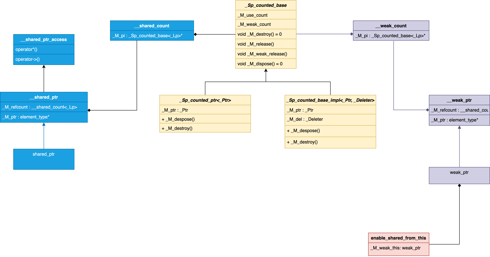

# shared_ptr
```c++
template<typename _Tp>
class shared_ptr : public __shared_ptr<_Tp> {
    template<typename... _Args>
    using _Constructible = typename enable_if<is_constructible<__shared_ptr<_Tp>, _Args...>::value>::type;

    template<typename _Arg>
    using _Assignable = typename enable_if<is_assignable<__shared_ptr<_Tp>&, _Arg>::value, shared_ptr&>::type;

public:
    /// The type pointed to by the stored pointer, remove_extent_t<_Tp>
    using element_type = typename __shared_ptr<_Tp>::element_type;

    using weak_type = weak_ptr<_Tp>;

    constexpr shared_ptr() noexcept : __shared_ptr<_Tp>() { }

    shared_ptr(const shared_ptr&) noexcept = default; ///< Copy constructor

    template<typename _Yp, typename = _Constructible<_Yp*>>
    explicit shared_ptr(_Yp* __p) 
    : __shared_ptr<_Tp>(__p) { }

    template<typename _Yp, typename _Deleter, typename = _Constructible<_Yp*, _Deleter>>
    shared_ptr(_Yp* __p, _Deleter __d) 
    : __shared_ptr<_Tp>(__p, std::move(__d)) { }

    template<typename _Deleter>
    shared_ptr(nullptr_t __p, _Deleter __d) 
    : __shared_ptr<_Tp>(__p, std::move(__d)) { }

    template<typename _Yp, typename _Deleter, typename _Alloc, typename = _Constructible<_Yp*, _Deleter, _Alloc>>
    shared_ptr(_Yp* __p, _Deleter __d, _Alloc __a) 
    : __shared_ptr<_Tp>(__p, std::move(__d), std::move(__a)) { }

    template<typename _Deleter, typename _Alloc>
    shared_ptr(nullptr_t __p, _Deleter __d, _Alloc __a) 
    : __shared_ptr<_Tp>(__p, std::move(__d), std::move(__a)) { }

    template<typename _Yp>
    shared_ptr(const shared_ptr<_Yp>& __r, element_type* __p) noexcept 
    : __shared_ptr<_Tp>(__r, __p) { }

    template<typename _Yp>
    shared_ptr(shared_ptr<_Yp>&& __r, element_type* __p) noexcept
    : __shared_ptr<_Tp>(std::move(__r), __p) { }

    template<typename _Yp, typename = _Constructible<const shared_ptr<_Yp>&>>
    shared_ptr(const shared_ptr<_Yp>& __r) noexcept
    : __shared_ptr<_Tp>(__r) { }

    shared_ptr(shared_ptr&& __r) noexcept
    : __shared_ptr<_Tp>(std::move(__r)) { }

    template<typename _Yp, typename = _Constructible<shared_ptr<_Yp>>>
    shared_ptr(shared_ptr<_Yp>&& __r) noexcept
    : __shared_ptr<_Tp>(std::move(__r)) { }

    template<typename _Yp, typename = _Constructible<const weak_ptr<_Yp>&>>
    explicit shared_ptr(const weak_ptr<_Yp>& __r)
    : __shared_ptr<_Tp>(__r) { }

    // _GLIBCXX_RESOLVE_LIB_DEFECTS
    // 2399. shared_ptr's constructor from unique_ptr should be constrained
    template<typename _Yp, typename _Del, typename = _Constructible<unique_ptr<_Yp, _Del>>>
    shared_ptr(unique_ptr<_Yp, _Del>&& __r)
    : __shared_ptr<_Tp>(std::move(__r)) { }

    template<typename _Yp, typename _Del, _Constructible<unique_ptr<_Yp, _Del>, __sp_array_delete>* = 0>
    shared_ptr(unique_ptr<_Yp, _Del>&& __r)
    : __shared_ptr<_Tp>(std::move(__r), __sp_array_delete()) { }

    constexpr shared_ptr(nullptr_t) noexcept : shared_ptr() { }

    shared_ptr& operator=(const shared_ptr&) noexcept = default;

    template<typename _Yp>
    _Assignable<const shared_ptr<_Yp>&> operator=(const shared_ptr<_Yp>& __r) noexcept {
        this->__shared_ptr<_Tp>::operator=(__r);
        return *this;
    }

    template<typename _Yp>
    _Assignable<auto_ptr<_Yp>> operator=(auto_ptr<_Yp>&& __r) {
        this->__shared_ptr<_Tp>::operator=(std::move(__r));
        return *this;
    }

    shared_ptr& operator=(shared_ptr&& __r) noexcept {
        this->__shared_ptr<_Tp>::operator=(std::move(__r));
        return *this;
    }

    template<class _Yp>
    _Assignable<shared_ptr<_Yp>> operator=(shared_ptr<_Yp>&& __r) noexcept {
        this->__shared_ptr<_Tp>::operator=(std::move(__r));
        return *this;
    }

    template<typename _Yp, typename _Del>
    _Assignable<unique_ptr<_Yp, _Del>> operator=(unique_ptr<_Yp, _Del>&& __r) {
        this->__shared_ptr<_Tp>::operator=(std::move(__r));
        return *this;
    }

private:
    // This constructor is non-standard, it is used by allocate_shared, make_shared
    template<typename _Alloc, typename... _Args>
    shared_ptr(_Sp_alloc_shared_tag<_Alloc> __tag, _Args&&... __args)
    : __shared_ptr<_Tp>(__tag, std::forward<_Args>(__args)...)
    { }

    template<typename _Yp, typename _Alloc, typename... _Args>
    friend shared_ptr<_Yp> allocate_shared(const _Alloc& __a, _Args&&... __args);

    // This constructor is non-standard, it is used by weak_ptr::lock().
    shared_ptr(const weak_ptr<_Tp>& __r, std::nothrow_t) noexcept
    : __shared_ptr<_Tp>(__r, std::nothrow) { }

    friend class weak_ptr<_Tp>;
};
```

## __shared_ptr
```c++
template<typename _Tp, _Lock_policy _Lp>
class __shared_ptr : public __shared_ptr_access<_Tp, _Lp> {
public:
    using element_type = typename remove_extent<_Tp>::type;

private:
    // Constraint for taking ownership of a pointer of type _Yp*:
    template<typename _Yp>
    using _SafeConv = typename enable_if<__sp_is_constructible<_Tp, _Yp>::value>::type;

    // Constraint for construction from shared_ptr and weak_ptr:
    template<typename _Yp, typename _Res = void>
    using _Compatible = typename enable_if<__sp_compatible_with<_Yp*, _Tp*>::value, _Res>::type;

    // Constraint for assignment from shared_ptr and weak_ptr:
    template<typename _Yp>
    using _Assignable = _Compatible<_Yp, __shared_ptr&>;

    // Constraint for construction from unique_ptr:
    template<typename _Yp, typename _Del, typename _Res = void, typename _Ptr = typename unique_ptr<_Yp, _Del>::pointer>
    using _UniqCompatible = __enable_if_t<__and_<
        __sp_compatible_with<_Yp*, _Tp*>,
        is_convertible<_Ptr, element_type*>,
        is_move_constructible<_Del>
        >::value, _Res>;

    // Constraint for assignment from unique_ptr:
    template<typename _Yp, typename _Del>
    using _UniqAssignable = _UniqCompatible<_Yp, _Del, __shared_ptr&>;

public:
    using weak_type = __weak_ptr<_Tp, _Lp>;

    constexpr __shared_ptr() noexcept : _M_ptr(0), _M_refcount()
    { }

    template<typename _Yp, typename = _SafeConv<_Yp>>
    explicit __shared_ptr(_Yp* __p)
    : _M_ptr(__p), _M_refcount(__p, typename is_array<_Tp>::type()) {
        static_assert( !is_void<_Yp>::value, "incomplete type" );
        static_assert( sizeof(_Yp) > 0, "incomplete type" );
        _M_enable_shared_from_this_with(__p);
    }

    template<typename _Yp, typename _Deleter, typename = _SafeConv<_Yp>>
    __shared_ptr(_Yp* __p, _Deleter __d)
    : _M_ptr(__p), _M_refcount(__p, std::move(__d)) {
        static_assert(__is_invocable<_Deleter&, _Yp*&>::value,
            "deleter expression d(p) is well-formed");
        _M_enable_shared_from_this_with(__p);
    }

    template<typename _Yp, typename _Deleter, typename _Alloc, typename = _SafeConv<_Yp>>
    __shared_ptr(_Yp* __p, _Deleter __d, _Alloc __a)
    : _M_ptr(__p), _M_refcount(__p, std::move(__d), std::move(__a)) {
        static_assert(__is_invocable<_Deleter&, _Yp*&>::value,
            "deleter expression d(p) is well-formed");
        _M_enable_shared_from_this_with(__p);
    }

    template<typename _Deleter>
    __shared_ptr(nullptr_t __p, _Deleter __d)
    : _M_ptr(0), _M_refcount(__p, std::move(__d))
    { }

    template<typename _Deleter, typename _Alloc>
    __shared_ptr(nullptr_t __p, _Deleter __d, _Alloc __a)
    : _M_ptr(0), _M_refcount(__p, std::move(__d), std::move(__a))
    { }

    // Aliasing constructor
    template<typename _Yp>
    __shared_ptr(const __shared_ptr<_Yp, _Lp>& __r, element_type* __p) noexcept
    : _M_ptr(__p), _M_refcount(__r._M_refcount) // never throws
    { }

    // Aliasing constructor
    template<typename _Yp>
    __shared_ptr(__shared_ptr<_Yp, _Lp>&& __r, element_type* __p) noexcept
    : _M_ptr(__p), _M_refcount() {
        _M_refcount._M_swap(__r._M_refcount);
        __r._M_ptr = nullptr;
    }

    __shared_ptr(const __shared_ptr&) noexcept = default;
    __shared_ptr& operator=(const __shared_ptr&) noexcept = default;
    ~__shared_ptr() = default;

    template<typename _Yp, typename = _Compatible<_Yp>>
    __shared_ptr(const __shared_ptr<_Yp, _Lp>& __r) noexcept
    : _M_ptr(__r._M_ptr), _M_refcount(__r._M_refcount)
    { }

    __shared_ptr(__shared_ptr&& __r) noexcept
    : _M_ptr(__r._M_ptr), _M_refcount() {
        _M_refcount._M_swap(__r._M_refcount);
        __r._M_ptr = nullptr;
    }

    template<typename _Yp, typename = _Compatible<_Yp>>
    __shared_ptr(__shared_ptr<_Yp, _Lp>&& __r) noexcept
    : _M_ptr(__r._M_ptr), _M_refcount() {
        _M_refcount._M_swap(__r._M_refcount);
        __r._M_ptr = nullptr;
    }

    template<typename _Yp, typename = _Compatible<_Yp>>
    explicit __shared_ptr(const __weak_ptr<_Yp, _Lp>& __r)
    : _M_refcount(__r._M_refcount) { // may throw
        // It is now safe to copy __r._M_ptr, as
        // _M_refcount(__r._M_refcount) did not throw.
        _M_ptr = __r._M_ptr;
    }

    // If an exception is thrown this constructor has no effect.
    template<typename _Yp, typename _Del, typename = _UniqCompatible<_Yp, _Del>>
    __shared_ptr(unique_ptr<_Yp, _Del>&& __r)
    : _M_ptr(__r.get()), _M_refcount() {
        auto __raw = __to_address(__r.get());
        _M_refcount = __shared_count<_Lp>(std::move(__r));
        _M_enable_shared_from_this_with(__raw);
    }

    constexpr __shared_ptr(nullptr_t) noexcept : __shared_ptr() { }

    template<typename _Yp>
    _Assignable<_Yp> operator=(const __shared_ptr<_Yp, _Lp>& __r) noexcept {
        _M_ptr = __r._M_ptr;
        _M_refcount = __r._M_refcount; // __shared_count::op= doesn't throw
        return *this;
    }

    __shared_ptr& operator=(__shared_ptr&& __r) noexcept {
        __shared_ptr(std::move(__r)).swap(*this);
        return *this;
    }

    template<class _Yp>
    _Assignable<_Yp> operator=(__shared_ptr<_Yp, _Lp>&& __r) noexcept {
        __shared_ptr(std::move(__r)).swap(*this);
        return *this;
    }

    template<typename _Yp, typename _Del>
    _UniqAssignable<_Yp, _Del> operator=(unique_ptr<_Yp, _Del>&& __r) {
        __shared_ptr(std::move(__r)).swap(*this);
        return *this;
    }

    void reset() noexcept
    { __shared_ptr().swap(*this); }

    template<typename _Yp>
    _SafeConv<_Yp> reset(_Yp* __p) { // _Yp must be complete
        // Catch self-reset errors.
        __glibcxx_assert(__p == nullptr || __p != _M_ptr);
        __shared_ptr(__p).swap(*this);
    }

    template<typename _Yp, typename _Deleter>
    _SafeConv<_Yp> reset(_Yp* __p, _Deleter __d)
    { __shared_ptr(__p, std::move(__d)).swap(*this); }

    template<typename _Yp, typename _Deleter, typename _Alloc>
    _SafeConv<_Yp> reset(_Yp* __p, _Deleter __d, _Alloc __a)
    { __shared_ptr(__p, std::move(__d), std::move(__a)).swap(*this); }

    /// Return the stored pointer.
    element_type* get() const noexcept
    { return _M_ptr; }

    /// Return true if the stored pointer is not null.
    explicit operator bool() const noexcept
    { return _M_ptr != nullptr; }

    /// Return true if use_count() == 1.
    bool unique() const noexcept
    { return _M_refcount._M_unique(); }

    /// If *this owns a pointer, return the number of owners, otherwise zero.
    long use_count() const noexcept
    { return _M_refcount._M_get_use_count(); }

    /// Exchange both the owned pointer and the stored pointer.
    void swap(__shared_ptr<_Tp, _Lp>& __other) noexcept {
        std::swap(_M_ptr, __other._M_ptr);
        _M_refcount._M_swap(__other._M_refcount);
    }

    template<typename _Tp1>
    bool owner_before(__shared_ptr<_Tp1, _Lp> const& __rhs) const noexcept
    { return _M_refcount._M_less(__rhs._M_refcount); }

    template<typename _Tp1>
    bool owner_before(__weak_ptr<_Tp1, _Lp> const& __rhs) const noexcept
    { return _M_refcount._M_less(__rhs._M_refcount); }

protected:
    // This constructor is non-standard, it is used by allocate_shared, by std::make_shared
    template<typename _Alloc, typename... _Args>
    __shared_ptr(_Sp_alloc_shared_tag<_Alloc> __tag, _Args&&... __args)
    : _M_ptr(), _M_refcount(_M_ptr, __tag, std::forward<_Args>(__args)...)
    { _M_enable_shared_from_this_with(_M_ptr); }

    template<typename _Tp1, _Lock_policy _Lp1, typename _Alloc, typename... _Args>
    friend __shared_ptr<_Tp1, _Lp1> __allocate_shared(const _Alloc& __a, _Args&&... __args);

    // This constructor is used by __weak_ptr::lock() and
    // shared_ptr::shared_ptr(const weak_ptr&, std::nothrow_t).
    __shared_ptr(const __weak_ptr<_Tp, _Lp>& __r, std::nothrow_t) noexcept
    : _M_refcount(__r._M_refcount, std::nothrow) {
        _M_ptr = _M_refcount._M_get_use_count() ? __r._M_ptr : nullptr;
    }

    friend class __weak_ptr<_Tp, _Lp>;

private:
    template<typename _Yp>
    using __esft_base_t = decltype(__enable_shared_from_this_base(
        std::declval<const __shared_count<_Lp>&>(),
        std::declval<_Yp*>()));

    // Detect an accessible and unambiguous enable_shared_from_this base.
    template<typename _Yp, typename = void>
    struct __has_esft_base : false_type { };

    template<typename _Yp>
    struct __has_esft_base<_Yp, __void_t<__esft_base_t<_Yp>>>
    : __not_<is_array<_Tp>> { }; // No enable shared_from_this for arrays

    template<typename _Yp, typename _Yp2 = typename remove_cv<_Yp>::type>
    typename enable_if<__has_esft_base<_Yp2>::value>::type
    _M_enable_shared_from_this_with(_Yp* __p) noexcept {
        if (auto __base = __enable_shared_from_this_base(_M_refcount, __p))
            __base->_M_weak_assign(const_cast<_Yp2*>(__p), _M_refcount);
    }

    template<typename _Yp, typename _Yp2 = typename remove_cv<_Yp>::type>
    typename enable_if<!__has_esft_base<_Yp2>::value>::type
    _M_enable_shared_from_this_with(_Yp*) noexcept
    { }

    void* _M_get_deleter(const std::type_info& __ti) const noexcept
    { return _M_refcount._M_get_deleter(__ti); }

    template<typename _Tp1, _Lock_policy _Lp1> friend class __shared_ptr;
    template<typename _Tp1, _Lock_policy _Lp1> friend class __weak_ptr;

    template<typename _Del, typename _Tp1, _Lock_policy _Lp1>
    friend _Del* get_deleter(const __shared_ptr<_Tp1, _Lp1>&) noexcept;

    template<typename _Del, typename _Tp1>
    friend _Del* get_deleter(const shared_ptr<_Tp1>&) noexcept;

    element_type*           _M_ptr;         // Contained pointer.
    __shared_count<_Lp>     _M_refcount;    // Reference counter.
};
```

## __shared_ptr_access
```c++
template<typename _Tp, _Lock_policy _Lp, bool = is_array<_Tp>::value, bool = is_void<_Tp>::value>
class __shared_ptr_access
{
public:
    using element_type = _Tp;

    element_type& operator*() const noexcept {
        __glibcxx_assert(_M_get() != nullptr);
        return *_M_get();
    }

    element_type* operator->() const noexcept {
        _GLIBCXX_DEBUG_PEDASSERT(_M_get() != nullptr);
        return _M_get();
    }

private:
    element_type* _M_get() const noexcept {
        return static_cast<const __shared_ptr<_Tp, _Lp>*>(this)->get();
    }
};
```

## __shared_count
```c++
template<_Lock_policy _Lp>
class __shared_count
{
    template<typename _Tp> struct __not_alloc_shared_tag { using type = void; };

    template<typename _Tp> struct __not_alloc_shared_tag<_Sp_alloc_shared_tag<_Tp>> { };

public:
    constexpr __shared_count() noexcept : _M_pi(0) { }

    template<typename _Ptr> explicit __shared_count(_Ptr __p) : _M_pi(0) {
        __try {
            _M_pi = new _Sp_counted_ptr<_Ptr, _Lp>(__p);
        }  __catch(...) {
            delete __p;
            __throw_exception_again;
        }
    }

    template<typename _Ptr> __shared_count(_Ptr __p, /* is_array = */ false_type)
    : __shared_count(__p)
    { }

    template<typename _Ptr> __shared_count(_Ptr __p, /* is_array = */ true_type)
    : __shared_count(__p, __sp_array_delete{}, allocator<void>())
    { }

    template<typename _Ptr, typename _Deleter, typename = typename __not_alloc_shared_tag<_Deleter>::type>
    __shared_count(_Ptr __p, _Deleter __d)
    : __shared_count(__p, std::move(__d), allocator<void>())
    { }

    template<typename _Ptr, typename _Deleter, typename _Alloc, typename = typename __not_alloc_shared_tag<_Deleter>::type>
    __shared_count(_Ptr __p, _Deleter __d, _Alloc __a) 
    : _M_pi(0) {
        typedef _Sp_counted_deleter<_Ptr, _Deleter, _Alloc, _Lp> _Sp_cd_type;
        __try {
            typename _Sp_cd_type::__allocator_type __a2(__a);
            auto __guard = std::__allocate_guarded(__a2);
            _Sp_cd_type* __mem = __guard.get();
            ::new (__mem) _Sp_cd_type(__p, std::move(__d), std::move(__a));
            _M_pi = __mem;
            __guard = nullptr;
        } __catch(...) {
            __d(__p); // Call _Deleter on __p.
            __throw_exception_again;
        }
    }

    template<typename _Tp, typename _Alloc, typename... _Args>
    __shared_count(_Tp*& __p, _Sp_alloc_shared_tag<_Alloc> __a, _Args&&... __args) {
        typedef _Sp_counted_ptr_inplace<_Tp, _Alloc, _Lp> _Sp_cp_type;
        typename _Sp_cp_type::__allocator_type __a2(__a._M_a);
        auto __guard = std::__allocate_guarded(__a2);
        _Sp_cp_type* __mem = __guard.get();
        auto __pi = ::new (__mem)
        _Sp_cp_type(__a._M_a, std::forward<_Args>(__args)...);
        __guard = nullptr;
        _M_pi = __pi;
        __p = __pi->_M_ptr();
    }

    // Special case for unique_ptr<_Tp,_Del> to provide the strong guarantee.
    template<typename _Tp, typename _Del>
    explicit __shared_count(std::unique_ptr<_Tp, _Del>&& __r) 
    : _M_pi(0) {
        // _GLIBCXX_RESOLVE_LIB_DEFECTS
        // 2415. Inconsistency between unique_ptr and shared_ptr
        if (__r.get() == nullptr)
            return;

        using _Ptr = typename unique_ptr<_Tp, _Del>::pointer;
        using _Del2 = typename conditional<is_reference<_Del>::value,
            reference_wrapper<typename remove_reference<_Del>::type>,
            _Del>::type;
        using _Sp_cd_type = _Sp_counted_deleter<_Ptr, _Del2, allocator<void>, _Lp>;
        using _Alloc = allocator<_Sp_cd_type>;
        using _Alloc_traits = allocator_traits<_Alloc>;

        _Alloc __a;
        _Sp_cd_type* __mem = _Alloc_traits::allocate(__a, 1);
        // _GLIBCXX_RESOLVE_LIB_DEFECTS
        // 3548. shared_ptr construction from unique_ptr should move
        // (not copy) the deleter
        _Alloc_traits::construct(__a, __mem, __r.release(), std::forward<_Del>(__r.get_deleter()));
        _M_pi = __mem;
    }

    // Throw bad_weak_ptr when __r._M_get_use_count() == 0.
    explicit __shared_count(const __weak_count<_Lp>& __r)
    : _M_pi(__r._M_pi) {
      if (_M_pi == nullptr || !_M_pi->_M_add_ref_lock_nothrow())
        __throw_bad_weak_ptr();
        
    }

    // Does not throw if __r._M_get_use_count() == 0, caller must check.
    explicit __shared_count(const __weak_count<_Lp>& __r, std::nothrow_t) noexcept
    : _M_pi(__r._M_pi) {
      if (_M_pi && !_M_pi->_M_add_ref_lock_nothrow())
        _M_pi = nullptr;
    }

    ~__shared_count() noexcept {
        if (_M_pi != nullptr)
            _M_pi->_M_release();
    }

    __shared_count(const __shared_count& __r) noexcept
    : _M_pi(__r._M_pi) {
        if (_M_pi != nullptr)
            _M_pi->_M_add_ref_copy();
    }

    __shared_count& operator=(const __shared_count& __r) noexcept {
        _Sp_counted_base<_Lp>* __tmp = __r._M_pi;
        if (__tmp != _M_pi) {
            if (__tmp != nullptr)
                __tmp->_M_add_ref_copy();
            if (_M_pi != nullptr)
                _M_pi->_M_release();
            _M_pi = __tmp;
        }
        return *this;
    }

    void _M_swap(__shared_count& __r) noexcept {
        _Sp_counted_base<_Lp>* __tmp = __r._M_pi;
        __r._M_pi = _M_pi;
        _M_pi = __tmp;
    }

    long _M_get_use_count() const noexcept
    { return _M_pi ? _M_pi->_M_get_use_count() : 0; }

    bool _M_unique() const noexcept
    { return this->_M_get_use_count() == 1; }

    void* _M_get_deleter(const std::type_info& __ti) const noexcept
    { return _M_pi ? _M_pi->_M_get_deleter(__ti) : nullptr; }

    bool _M_less(const __shared_count& __rhs) const noexcept
    { return std::less<_Sp_counted_base<_Lp>*>()(this->_M_pi, __rhs._M_pi); }

    bool _M_less(const __weak_count<_Lp>& __rhs) const noexcept
    { return std::less<_Sp_counted_base<_Lp>*>()(this->_M_pi, __rhs._M_pi); }

    // Friend function injected into enclosing namespace and found by ADL
    friend inline bool operator==(const __shared_count& __a, const __shared_count& __b) noexcept
    { return __a._M_pi == __b._M_pi; }

private:
    friend class __weak_count<_Lp>;

    _Sp_counted_base<_Lp>*  _M_pi;
};
```

# weak_ptr
```c++
template<typename _Tp>
class weak_ptr : public __weak_ptr<_Tp>
{
    template<typename _Arg> 
    using _Constructible = typename enable_if<is_constructible<__weak_ptr<_Tp>, _Arg>::value>::type;

    template<typename _Arg> 
    using _Assignable = typename enable_if<is_assignable<__weak_ptr<_Tp>&, _Arg>::value, weak_ptr&>::type;

public:
    constexpr weak_ptr() noexcept = default;

    template<typename _Yp, typename = _Constructible<const shared_ptr<_Yp>&>>
    weak_ptr(const shared_ptr<_Yp>& __r) noexcept
    : __weak_ptr<_Tp>(__r) { }

    weak_ptr(const weak_ptr&) noexcept = default;

    template<typename _Yp, typename = _Constructible<const weak_ptr<_Yp>&>>
    weak_ptr(const weak_ptr<_Yp>& __r) noexcept
    : __weak_ptr<_Tp>(__r) { }

    weak_ptr(weak_ptr&&) noexcept = default;

    template<typename _Yp, typename = _Constructible<weak_ptr<_Yp>>>
    weak_ptr(weak_ptr<_Yp>&& __r) noexcept
    : __weak_ptr<_Tp>(std::move(__r)) { }

    weak_ptr& operator=(const weak_ptr& __r) noexcept = default;

    template<typename _Yp>
    _Assignable<const weak_ptr<_Yp>&> operator=(const weak_ptr<_Yp>& __r) noexcept {
        this->__weak_ptr<_Tp>::operator=(__r);
        return *this;
    }

    template<typename _Yp>
    _Assignable<const shared_ptr<_Yp>&> operator=(const shared_ptr<_Yp>& __r) noexcept {
        this->__weak_ptr<_Tp>::operator=(__r);
        return *this;
    }

    weak_ptr& operator=(weak_ptr&& __r) noexcept = default;

    template<typename _Yp>
    _Assignable<weak_ptr<_Yp>> operator=(weak_ptr<_Yp>&& __r) noexcept {
        this->__weak_ptr<_Tp>::operator=(std::move(__r));
        return *this;
    }

    shared_ptr<_Tp> lock() const noexcept { 
        return shared_ptr<_Tp>(*this, std::nothrow); 
    }
};
```

## __weak_ptr
```c++
template<typename _Tp, _Lock_policy _Lp>
class __weak_ptr
{
public:
    using element_type = typename remove_extent<_Tp>::type;

    constexpr __weak_ptr() noexcept
    : _M_ptr(nullptr), _M_refcount() { }

    template<typename _Yp, typename = _Compatible<_Yp>>
    __weak_ptr(const __shared_ptr<_Yp, _Lp>& __r) noexcept
    : _M_ptr(__r._M_ptr), _M_refcount(__r._M_refcount) { }

    long use_count() const noexcept {
        return _M_refcount._M_get_use_count();
    }

    bool expired() const noexcept {
        return _M_refcount._M_get_use_count() == 0;
    }
private:
    // Used by __enable_shared_from_this.
    void _M_assign(_Tp* __ptr, const __shared_count<_Lp>& __refcount) noexcept {
        if (use_count() == 0) {
            _M_ptr = __ptr;
            _M_refcount = __refcount;
        }
    }

private:
    element_type*       _M_ptr;         // Contained pointer.
    __weak_count<_Lp>   _M_refcount;    // Reference counter.
};
```

## __weak_count
```c++
template<_Lock_policy _Lp>
class __weak_count
{
public:
    constexpr __weak_count() noexcept : _M_pi(nullptr) { }

    __weak_count(const __shared_count<_Lp>& __r) noexcept
    : _M_pi(__r._M_pi) {
        if (_M_pi != nullptr)
            _M_pi->_M_weak_add_ref();
    }

    ~__weak_count() noexcept {
        if (_M_pi != nullptr)
            _M_pi->_M_weak_release();
    }

    __weak_count& operator=(const __shared_count<_Lp>& __r) noexcept {
        _Sp_counted_base<_Lp>* __tmp = __r._M_pi;
        if (__tmp != nullptr)
            __tmp->_M_weak_add_ref();
        if (_M_pi != nullptr)
            _M_pi->_M_weak_release();
        _M_pi = __tmp;
        return *this;
    }

private:
    _Sp_counted_base<_Lp>*  _M_pi;
};
```

# _Sp_counted_base
```c++
template<_Lock_policy _Lp = __default_lock_policy>
class _Sp_counted_base : public _Mutex_base<_Lp>
{
public:
    _Sp_counted_base() noexcept : _M_use_count(1), _M_weak_count(1) { }

    virtual ~_Sp_counted_base() noexcept { }

    /* Called when _M_use_count drops to zero, to release the resources managed by *this. */
    virtual void _M_dispose() noexcept = 0;

    // Called when _M_weak_count drops to zero.
    virtual void _M_destroy() noexcept { delete this; }

    void _M_release() noexcept {
        // Be race-detector-friendly.  For more info see bits/c++config.
        _GLIBCXX_SYNCHRONIZATION_HAPPENS_BEFORE(&_M_use_count);
        if (__gnu_cxx::__exchange_and_add_dispatch(&_M_use_count, -1) == 1) {
            _GLIBCXX_SYNCHRONIZATION_HAPPENS_AFTER(&_M_use_count);
            _M_dispose();
            // There must be a memory barrier between dispose() and destroy()
            // to ensure that the effects of dispose() are observed in the
            // thread that runs destroy().
            // See http://gcc.gnu.org/ml/libstdc++/2005-11/msg00136.html
            if (_Mutex_base<_Lp>::_S_need_barriers) {
                __atomic_thread_fence (__ATOMIC_ACQ_REL);
            }

            // Be race-detector-friendly.  For more info see bits/c++config.
            _GLIBCXX_SYNCHRONIZATION_HAPPENS_BEFORE(&_M_weak_count);
            if (__gnu_cxx::__exchange_and_add_dispatch(&_M_weak_count, -1) == 1) {
                _GLIBCXX_SYNCHRONIZATION_HAPPENS_AFTER(&_M_weak_count);
                _M_destroy();
            }
        }
    }

    void  _M_weak_add_ref() noexcept {
        __gnu_cxx::__atomic_add_dispatch(&_M_weak_count, 1);
    }

    void _M_weak_release() noexcept {
        // Be race-detector-friendly. For more info see bits/c++config.
        _GLIBCXX_SYNCHRONIZATION_HAPPENS_BEFORE(&_M_weak_count);
        if (__gnu_cxx::__exchange_and_add_dispatch(&_M_weak_count, -1) == 1) {
            _GLIBCXX_SYNCHRONIZATION_HAPPENS_AFTER(&_M_weak_count);
            if (_Mutex_base<_Lp>::_S_need_barriers) {
                // See _M_release(),
                // destroy() must observe results of dispose()
                __atomic_thread_fence (__ATOMIC_ACQ_REL);
            }
            _M_destroy();
        }
      }
      
private:
    _Sp_counted_base(_Sp_counted_base const&) = delete;
    _Sp_counted_base& operator=(_Sp_counted_base const&) = delete;

private:
    _Atomic_word  _M_use_count;     // #shared
    _Atomic_word  _M_weak_count;    // #weak + (#shared != 0)
};
```

## _Sp_counted_ptr
```c++
 // Counted ptr with no deleter or allocator support
template<typename _Ptr, _Lock_policy _Lp>
class _Sp_counted_ptr final : public _Sp_counted_base<_Lp>
{
public:
    explicit _Sp_counted_ptr(_Ptr __p) noexcept : _M_ptr(__p) { }

    virtual void _M_dispose() noexcept { 
        delete _M_ptr; 
    }

    virtual void _M_destroy() noexcept { 
        delete this; 
    }

    virtual void* _M_get_deleter(const std::type_info&) noexcept { 
        return nullptr; 
    }

    _Sp_counted_ptr(const _Sp_counted_ptr&) = delete;
    _Sp_counted_ptr& operator=(const _Sp_counted_ptr&) = delete;

private:
    _Ptr             _M_ptr;
};
```

## _Sp_counted_base_impl
```c++
template<typename _Ptr, typename _Deleter, _Lock_policy _Lp>
class _Sp_counted_base_impl : public _Sp_counted_base<_Lp> {
public: 
    _Sp_counted_base_impl(_Ptr __p, _Deleter __d) : _M_ptr(__p), _M_del(__d) { }

    virtual void _M_dispose() // nothrow
    { _M_del(_M_ptr); }
    
    virtual void* _M_get_deleter(const std::type_info& __ti) {
        return __ti == typeid(_Deleter) ? &_M_del : 0;
    }
    
private:
    _Sp_counted_base_impl(const _Sp_counted_base_impl&);
    _Sp_counted_base_impl& operator=(const _Sp_counted_base_impl&);
    
    _Ptr      _M_ptr;  // copy constructor must not throw
    _Deleter  _M_del;  // copy constructor must not throw
};
```

## _Sp_counted_ptr_inplace
```c++
template<typename _Tp, typename _Alloc, _Lock_policy _Lp>
class _Sp_counted_ptr_inplace final : public _Sp_counted_base<_Lp> {
public:
    class _Impl : _Sp_ebo_helper<0, _Alloc> {
    public:
        typedef  _Sp_ebo_helper<0, _Alloc>    _A_base;
        explicit _Impl(_Alloc __a) noexcept : _A_base(__a) { }
        _Alloc& _M_alloc() noexcept { return _A_base::_S_get(*this); }
        __gnu_cxx::__aligned_buffer<_Tp> _M_storage;
    };

    template<typename... _Args>
    _Sp_counted_ptr_inplace(_Alloc __a, _Args&&... __args)
    : _M_impl(__a) {
      /* _GLIBCXX_RESOLVE_LIB_DEFECTS
       * 2070.  allocate_shared should use allocator_traits<A>::construct
       *
       * ::new (static_cast<void*>(p)) T(std::forward<Args>(args)...) (until C++20)
       * std::construct_at(p, std::forward<Args>(args)...) (since C++20) */
      allocator_traits<_Alloc>::construct(__a, _M_ptr(), std::forward<_Args>(__args)...);
    }

    ~_Sp_counted_ptr_inplace() noexcept { }

    virtual void _M_dispose() noexcept {
        allocator_traits<_Alloc>::destroy(_M_impl._M_alloc(), _M_ptr());
    }

      // Override because the allocator needs to know the dynamic type
    virtual void _M_destroy() noexcept {
        __allocator_type __a(_M_impl._M_alloc());
        __allocated_ptr<__allocator_type> __guard_ptr{ __a, this };
        this->~_Sp_counted_ptr_inplace();
    }

private:
    _Tp* _M_ptr() noexcept { return _M_impl._M_storage._M_ptr(); }
    _Impl _M_impl;
};
```

# enable_shared_from_this
```c++
template<typename _Tp>
class enable_shared_from_this {
protected:
    constexpr enable_shared_from_this() noexcept { }

    enable_shared_from_this(const enable_shared_from_this&) noexcept { }

    enable_shared_from_this& operator=(const enable_shared_from_this&) noexcept { 
        return *this; 
    }

    ~enable_shared_from_this() { }

public:
    shared_ptr<_Tp> shared_from_this() { 
        return shared_ptr<_Tp>(this->_M_weak_this); 
    }

    shared_ptr<const _Tp> shared_from_this() const { 
        return shared_ptr<const _Tp>(this->_M_weak_this); 
    }

    weak_ptr<_Tp> weak_from_this() noexcept { 
        return this->_M_weak_this; 
    }

    weak_ptr<const _Tp> weak_from_this() const noexcept { 
        return this->_M_weak_this; 
    }

private:
    template<typename _Tp1>
    void _M_weak_assign(_Tp1* __p, const __shared_count<>& __n) const noexcept { 
        _M_weak_this._M_assign(__p, __n); 
    }

    // Found by ADL when this is an associated class.
    friend const enable_shared_from_this*
    __enable_shared_from_this_base( const __shared_count<>&, const enable_shared_from_this* __p)
    { return __p; }

    template<typename, _Lock_policy>
    friend class __shared_ptr;

    mutable weak_ptr<_Tp>  _M_weak_this;
};
```

# make_shared
```c++
template<typename _Tp, typename... _Args>
shared_ptr<_Tp> make_shared(_Args&&... __args) {
    typedef typename std::remove_cv<_Tp>::type _Tp_nc;
    return std::allocate_shared<_Tp>(std::allocator<_Tp_nc>(), std::forward<_Args>(__args)...);
}

template<typename _Tp, typename _Alloc, typename... _Args>
shared_ptr<_Tp> allocate_shared(const _Alloc& __a, _Args&&... __args) {
    return shared_ptr<_Tp>(_Sp_alloc_shared_tag<_Alloc>{__a}, std::forward<_Args>(__args)...);
}

template<typename _Tp>
class shared_ptr : public __shared_ptr<_Tp> {
public:
    template<typename _Alloc, typename... _Args>
    shared_ptr(_Sp_alloc_shared_tag<_Alloc> __tag, _Args&&... __args)
    : __shared_ptr<_Tp>(__tag, std::forward<_Args>(__args)...)
    { }
};

template<typename _Tp, _Lock_policy _Lp>
class __shared_ptr : public __shared_ptr_access<_Tp, _Lp> {
public:
    template<typename _Alloc, typename... _Args>
    __shared_ptr(_Sp_alloc_shared_tag<_Alloc> __tag, _Args&&... __args)
    : _M_ptr(), _M_refcount(_M_ptr, __tag, std::forward<_Args>(__args)...) {
        _M_enable_shared_from_this_with(_M_ptr);
    }
    
    template<typename _Yp, typename _Yp2 = typename remove_cv<_Yp>::type>
    typename enable_if<__has_esft_base<_Yp2>::value>::type
    _M_enable_shared_from_this_with(_Yp* __p) noexcept {
        if (auto __base = __enable_shared_from_this_base(_M_refcount, __p))
            __base->_M_weak_assign(const_cast<_Yp2*>(__p), _M_refcount);
    }
};

template<_Lock_policy _Lp>
class __shared_count {
public:
    template<typename _Tp, typename _Alloc, typename... _Args>
    __shared_count(_Tp*& __p, _Sp_alloc_shared_tag<_Alloc> __a, _Args&&... __args) {
        typedef _Sp_counted_ptr_inplace<_Tp, _Alloc, _Lp> _Sp_cp_type;
        typename _Sp_cp_type::__allocator_type __a2(__a._M_a);
        auto __guard = std::__allocate_guarded(__a2);
        _Sp_cp_type* __mem = __guard.get();
        auto __pi = ::new (__mem)
        _Sp_cp_type(__a._M_a, std::forward<_Args>(__args)...);
        __guard = nullptr;
        _M_pi = __pi;
        __p = __pi->_M_ptr();
    }
};

template<typename _Tp>
class enable_shared_from_this {
public:
    template<typename _Tp1>
    void _M_weak_assign(_Tp1* __p, const __shared_count<>& __n) const noexcept { 
        _M_weak_this._M_assign(__p, __n); 
    }        
};

template<typename _Tp, _Lock_policy _Lp>
class __weak_ptr {
private:
    void _M_assign(_Tp* __ptr, const __shared_count<_Lp>& __refcount) noexcept {
        if (use_count() == 0) {
            _M_ptr = __ptr;
            _M_refcount = __refcount;
        }
    }
};
```