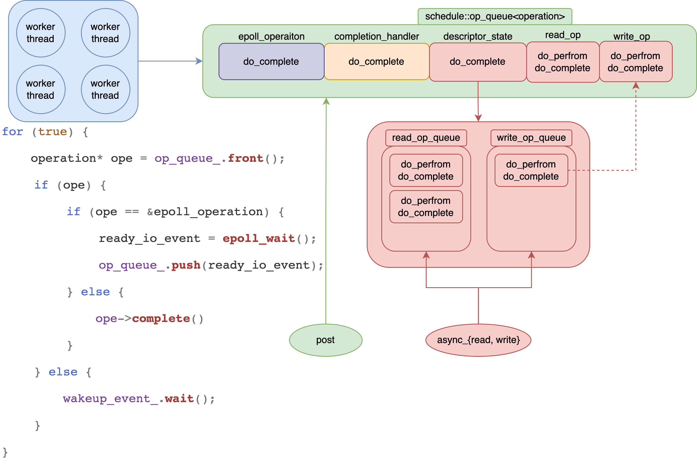
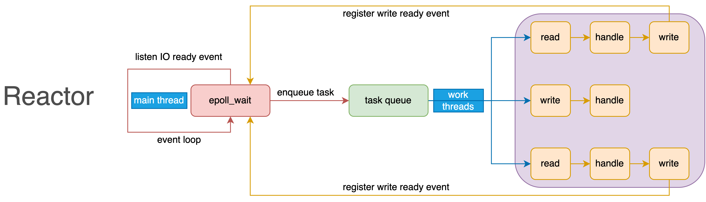
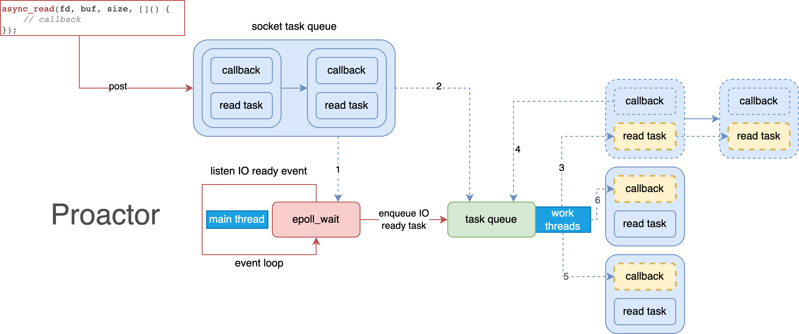

# Agenda
* [Official Doc](http://think-async.com/Asio/)
* [io_context::run](#io_contextrun)
* [async_accept](#async_accept)
* [async_connect](#async_connect)
* [async_read](#async_read)
* [async_read_util](#async_read_until)

* [async_write](#async_write)
    * [try_speculative](#try_speculative)
    * [tricky_switch](#tricky_switch)

* [io_context::post](#io_contextpost)
    * [event_loop_interrupt](#event_loop_interrupt)

* 

---

* 

---

* 

---

* 

---

* 

---

* [The Proactor Design Pattern: Concurrency Without Threads](https://www.boost.org/doc/libs/1_77_0/doc/html/boost_asio/overview/core/async.html)
    * 

# io_context::run
```c++
io_context::run()
    scheduler::run()
        thread_info this_thread;
        this_thread.private_outstanding_work = 0;

        for (do_run_one(&this_thread)) {
            while (!Stop) {
                if (!op_queue_.empty()) {
                    operation* o = op_queue_.front()
                    if (o == &task_operation_) {
                        if (more_handlers && !one_thread_)
                            wakeup_event_.unlock_and_signal_one(lock);
                        else
                            lock.unlock();

                        task_cleanup on_exit = { this, &lock, &this_thread };

                        epoll_reactor::run(ops = this_thread.private_op_queue) {
                            epoll_wait();
                            for (int i = 0; i < num_events; ++i) {
                                void* ptr = events[i].data.ptr;
                                if (ptr == &interrupter_) {

                                } else if (ptr == &timer_fd_) {
                                    check_timers = true;
                                } else {
                                    descriptor_state* descriptor_data = static_cast<descriptor_state*>(ptr);
                                    if (!ops.is_enqueued(descriptor_data)) {
                                        descriptor_data->set_ready_events(events[i].events);
                                            task_result_ = events;
                                        ops.push(descriptor_data);
                                    } else {
                                        descriptor_data->add_ready_events(events[i].events);
                                            task_result_ |= events;
                                    }
                                }
                            }

                            if (check_timers) {
                                mutex::scoped_lock common_lock(mutex_);
                                timer_queues_.get_ready_timers(ops);
                            }
                        }

                        /* when complete the epoll task add it back again into the op_queue
                         * so there always is a thead runs task_operation_.
                         *
                         * If there's no other tasks and epoll events,
                         * this thread blocks at epoll_wait. When add a new task [1]
                         * into op_queue, scheduler::wake_one_thread_and_unlock wakes up the
                         * epoll_wait, but there's no epoll_event, epoll_reactor::run returns
                         * immediately and add task_operation_ [2] again into op_queue.
                         * The thead continues its next `while` loop, gets task [1] from op_queue,
                         * since op_queue has task[2], this thread `unlock_and_signal_one`
                         * another thread to run task_operation_ [2], it runs task [1]
                         *
                         * The other thread will block at epoll_wait,
                         * task_operation_ ran by every thread in turn. */

                        ~task_cleanup() {
                            scheduler_->task_interrupted_ = true;
                            scheduler_->op_queue_.push(this_thread_->private_op_queue);
                            scheduler_->op_queue_.push(&scheduler_->task_operation_);
                        }
                    } else {
                        o->complete(this, ec, task_result)
                    }
                } else {
                    wakeup_event_.clear(lock);
                    wakeup_event_.wait(lock);
                        ::pthread_cond_wait()
                }
            }
        }

        ~thread_info_base()
```

# async_accept
```C++
basic_socket_acceptor::async_accept()
    reactive_socket_service::async_accept()
        reactive_socket_accept_op op()
        reactive_socket_service_base::start_accept_op(op)
            if (!peer_is_open) {
                reactive_socket_service_base::start_op(reactor::read_op)
                    if (socket_ops::set_internal_non_blocking()) {
                        epoll_reactor::start_op(op, reactor::read_op)
                            if (descriptor_data->op_queue_[op_type].empty()) {
                                if (allow_speculative && (op_type != read_op || descriptor_data->op_queue_[except_op].empty())) {
                                    if (descriptor_data->try_speculative_[op_type]) {
                                        reactor_op::perform()
                                        reactive_socket_accept_op_base::do_perform()
                                            socket_ops::non_blocking_accept()
                                                ::accept()
                                        schedueler::post_immediate_completion()
                                            schedule::do_run_one()
                                                operation::complete()
                                                    reactive_socket_accept_op::do_complete()
                                                        --->
                                        return
                                    }

                                    if (op_type == write_op) {
                                        if ((descriptor_data->registered_events_ & EPOLLOUT) == 0)
                                            epoll_ctl(epoll_fd_, EPOLL_CTL_MOD, descriptor, &ev)
                                    }
                                } else if (descriptor_data->registered_events_ == 0) {
                                    op->ec_ = boost::asio::error::operation_not_supported;
                                    scheduler_.post_immediate_completion(op, is_continuation);
                                    return
                                } else {
                                    if (op_type == write_op)
                                        descriptor_data->registered_events_ |= EPOLLOUT;
                                    epoll_ctl(epoll_fd_, EPOLL_CTL_MOD, descriptor, &ev)
                                }
                            }
                            descriptor_data->op_queue_[op_type].push(op)
                                // when client request connect, listen socket wake up from epoll
                                scheduler::do_run_one()
                                    operation::complete()
                                        descriptor_state::do_complete()
                                            descriptor_state::perform_io() // loop op_queue[]
                                                perform_io_cleanup_on_block_exit io_cleanup(reactor_)
                                                static const int flag[max_ops] = { EPOLLIN, EPOLLOUT, EPOLLPRI };
                                                for (int j = max_ops - 1; j >= 0; --j) {
                                                    if (events & (flag[j] | EPOLLERR | EPOLLHUP)) {
                                                        while (reactor_op* op = op_queue_[j].front()) {
                                                            if (reactor_op::status status = op->perform()) {
                                                                op_queue_[j].pop();
                                                                io_cleanup.ops_.push(op);
                                                            } else {
                                                                break;
                                                            }
                                                        }
                                                    }
                                                }

                                                op->perform()
                                                    reactor_op::perform()
                                                    reactive_socket_accept_op_base::do_perform()
                                                        --->

                                                ~perform_io_cleanup_on_block_exit()
                                                    schedueler::post_deferred_completions()
                                                        schedule::do_run_one()
                                                            operation::complete()
                                                                reactive_socket_accept_op::do_complete()
                                                                    --->
                    } else // blocking io
                        epoll_reactor::post_immediate_completion()
            } else // peer_is_open
                schedule::post_immediate_completion()
                    schedule::do_run_one()
                        operation::complete()
                            reactive_socket_accept_op::do_complete()
                                reactive_socket_accept_op::do_assign()
                                    basic_scoket::assign()
                                        reactive_descriptor_service::assign()
                                            epoll_reactor::register_descriptor()
                                                ev.events = EPOLLIN | EPOLLERR | EPOLLHUP | EPOLLPRI | EPOLLET;
                                                epoll_ctl(epoll_fd_, EPOLL_CTL_ADD, descriptor, &ev)
```

# async_connect

```C++
basic_stream_socket::async_connect()
    reactive_socket_service::async_connect()
        if (!is_open())
            reactive_socket_service_base::do_open()
                epoll_reactor::register_descriptor()
                    ev.events = EPOLLIN | EPOLLERR | EPOLLHUP | EPOLLPRI | EPOLLET;
                    epoll_ctl(epoll_fd_, EPOLL_CTL_ADD, descriptor, &ev)
        reactive_socket_connect_op<Handler> op();
        reactive_socket_service_base::start_connect_op(op)
            if (socket_ops::set_internal_non_blocking()) {
                socket_ops::connect()
                    ::connect(s, addr, (SockLenType)addrlen)
                epoll_reactor::start_op(op, reactor::connect_op)
                    if (descriptor_data->op_queue_[op_type].empty()) {
                        if (allow_speculative && (op_type != read_op || descriptor_data->op_queue_[except_op].empty())) {
                            if (descriptor_data->try_speculative_[op_type]) {
                                operation::perform()
                                    reactive_socket_connect_op_base::do_perform()
                                        socket_ops::non_blocking_connect()
                                            ::poll(&fds, 1, 0); // fd writable means it's connected
                                schedueler::post_immediate_completion()
                                    --->
                                return
                            }

                            if (op_type == write_op) {
                                if ((descriptor_data->registered_events_ & EPOLLOUT) == 0)
                                    epoll_ctl(epoll_fd_, EPOLL_CTL_MOD, descriptor, &ev)
                            }
                        } else if (descriptor_data->registered_events_ == 0) {
                            op->ec_ = boost::asio::error::operation_not_supported;
                            scheduler_.post_immediate_completion(op, is_continuation);
                            return
                        } else {
                            if (op_type == write_op)
                                descriptor_data->registered_events_ |= EPOLLOUT;
                            epoll_ctl(epoll_fd_, EPOLL_CTL_MOD, descriptor, &ev)
                        }
                    }
                    descriptor_data->op_queue_[op_type].push(op)
                        schedule::do_run_one()
                            operation::complete()
                                descriptor_state::do_complete()
                                    descriptor_state::perform_io() // loop op_queue[]
                                        perform_io_cleanup_on_block_exit io_cleanup(reactor_)
                                        static const int flag[max_ops] = { EPOLLIN, EPOLLOUT, EPOLLPRI };
                                        for (int j = max_ops - 1; j >= 0; --j) {
                                            if (events & (flag[j] | EPOLLERR | EPOLLHUP)) {
                                                while (reactor_op* op = op_queue_[j].front()) {
                                                    if (reactor_op::status status = op->perform()) {
                                                        op_queue_[j].pop();
                                                        io_cleanup.ops_.push(op);
                                                    } else {
                                                        break;
                                                    }
                                                }
                                            }
                                        }

                                        op->perform()
                                            reactor_op::perform()
                                            reactive_socket_connect_op_base::do_perform()
                                                --->

                                        ~perform_io_cleanup_on_block_exit()
                                            schedule::post_deferred_completions(op)
                                                schedule::do_run_one()
                                                    operation::complete()
                                                        reactive_socket_connect_op::do_complete()
                                                            user_callback()
            } else
                schedule::post_immediate_completion(op, is_continuation);
                    schedule::do_run_one()
                        operation::complete()
                            reactive_socket_connect_op::do_complete()
                                user_callback()
```

# async_read
```C++
template <typename AsyncReadStream, typename Allocator, typename ReadHandler>

template <typename AsyncReadStream, typename Allocator, typename CompletionCondition, typename ReadHandler>

template <typename AsyncReadStream, typename DynamicBuffer, typename ReadHandler>
async_read(AsyncReadStream& s, DynamicBuffer buffers, ReadHandler handler,
    typename enable_if<is_dynamic_buffer<typename decay<DynamicBuffer>::type>::value>::type* = 0);

template <typename AsyncReadStream, typename DynamicBuffer, typename CompletionCondition, typename ReadHandler>

template <typename AsyncReadStream, typename MutableBufferSequence, typename ReadHandler>

template <typename AsyncReadStream, typename MutableBufferSequence, typename CompletionCondition, typename ReadHandler>

template <typename AsyncReadStream, typename MutableBufferSequence,typename CompletionCondition, typename ReadHandler>

read.hpp::async_read()
    read.hpp::start_read_buffer_sequence_op()
        read.hpp::read_op()
            do {
                basic_stream_socket::async_read_some(buffer, read.hpp::read_op)
                    this->get_service().async_receive(this->get_implementation(), buffers, 0, init.completion_handler)
                    reactive_socket_service_base::async_receive()
                        reactive_socket_recv_op op()
                        reactive_socket_service_base::start_op(op)
                            epoll_reactor::start_op(op, reactor::read_op)
                                if (descriptor_data->op_queue_[op_type].empty()) {
                                    if (allow_speculative && (op_type != read_op || descriptor_data->op_queue_[except_op].empty())) {
                                        if (descriptor_data->try_speculative_[op_type]) {
                                            operation::perform()
                                                reactive_socket_recv_op_base::do_perform()
                                                    socket_ops::non_blocking_recv()
                                                        socket_ops::recv()
                                                            ::recvmsg()
                                            scheduler::post_immediate_completion()
                                                schedule::do_run_one()
                                                    operation::complete()
                                                        reactive_socket_recv_op::do_complete()
                                                            user_callback()
                                                                read.hpp::read_op()
                                            return
                                        }

                                        if (op_type == write_op) {
                                            if ((descriptor_data->registered_events_ & EPOLLOUT) == 0)
                                                epoll_ctl(epoll_fd_, EPOLL_CTL_MOD, descriptor, &ev)
                                        }
                                    } else if (descriptor_data->registered_events_ == 0) {
                                        op->ec_ = boost::asio::error::operation_not_supported;
                                        scheduler_.post_immediate_completion(op, is_continuation);
                                        return
                                    } else {
                                        if (op_type == write_op)
                                            descriptor_data->registered_events_ |= EPOLLOUT;
                                        epoll_ctl(epoll_fd_, EPOLL_CTL_MOD, descriptor, &ev)
                                    }
                                }
                                descriptor_data->op_queue_[op_type].push(op)
                                    // when client request connect, listen socket wake up from epoll
                                    scheduler::do_run_one()
                                        operation::complete()
                                            descriptor_state::do_complete()
                                                descriptor_state::perform_io() // loop op_queue[]
                                                    perform_io_cleanup_on_block_exit io_cleanup(reactor_)
                                                    static const int flag[max_ops] = { EPOLLIN, EPOLLOUT, EPOLLPRI };
                                                    for (int j = max_ops - 1; j >= 0; --j) {
                                                        if (events & (flag[j] | EPOLLERR | EPOLLHUP)) {
                                                            while (reactor_op* op = op_queue_[j].front()) {
                                                                if (reactor_op::status status = op->perform()) {
                                                                    op_queue_[j].pop();
                                                                    io_cleanup.ops_.push(op);
                                                                } else {
                                                                    break;
                                                                }
                                                            }
                                                        }
                                                    }

                                                    op->perform()
                                                        reactor_op::perform()
                                                        reactive_socket_recv_op_base::do_perform()
                                                            --->

                                                    ~perform_io_cleanup_on_block_exit()
                                                        scheduler::post_deferred_completions(io_cleanup.ops)
                                                            schedule::do_run_one()
                                                                operation::complete()
                                                                    reactive_socket_recv_op::do_complete()
                                                                        user_callback()
                                                                            read.hpp::read_op()
            } while (max_size > 0)
            completion_handler()
```

# async_read_until
```c++
template <typename AsyncReadStream, typename DynamicBuffer, typename ReadHandler>
BOOST_ASIO_INITFN_RESULT_TYPE(ReadHandler, void (boost::system::error_code, std::size_t))
async_read_until(AsyncReadStream& s,
    BOOST_ASIO_MOVE_ARG(DynamicBuffer) buffers,
    BOOST_ASIO_STRING_VIEW_PARAM delim,
    BOOST_ASIO_MOVE_ARG(ReadHandler) handler)
{
  async_completion<ReadHandler, void (boost::system::error_code, std::size_t)> init(handler);

    detail::read_until_delim_string_op<
        AsyncReadStream,
        typename decay<DynamicBuffer>::type,
        BOOST_ASIO_HANDLER_TYPE(ReadHandler, void (boost::system::error_code, std::size_t))
    >(s, BOOST_ASIO_MOVE_CAST(DynamicBuffer)(buffers),
        static_cast<std::string>(delim),
        init.completion_handler
    )(boost::system::error_code(), 0, 1);

  return init.result.get();
}

template <
    typename AsyncReadStream,
    typename DynamicBuffer,
    typename ReadHandler>
class read_until_delim_string_op
{
public:
    template <typename BufferSequence>
    read_until_delim_string_op(AsyncReadStream& stream,
        BOOST_ASIO_MOVE_ARG(BufferSequence) buffers,
        const std::string& delim, ReadHandler& handler)
    :   stream_(stream),
        buffers_(BOOST_ASIO_MOVE_CAST(BufferSequence)(buffers)),
        delim_(delim),
        start_(0),
        search_position_(0),
        handler_(BOOST_ASIO_MOVE_CAST(ReadHandler)(handler))
    { }

    void operator()(const boost::system::error_code& ec,
        std::size_t bytes_transferred, int start = 0)
    {
        const std::size_t not_found = (std::numeric_limits<std::size_t>::max)();
        std::size_t bytes_to_read;

        switch (start_ = start)
        {
        case 1:
            for (;;) {
                {
                    // Determine the range of the data to be searched.
                    typedef typename DynamicBuffer::const_buffers_type buffers_type;
                    typedef buffers_iterator<buffers_type> iterator;

                    buffers_type data_buffers = buffers_.data();
                    iterator begin = iterator::begin(data_buffers);
                    iterator start_pos = begin + search_position_;
                    iterator end = iterator::end(data_buffers);

                    // Look for a match.
                    std::pair<iterator, bool> result =
                        detail::partial_search(start_pos, end, delim_.begin(), delim_.end());
                    if (result.first != end && result.second)
                    {
                        // Full match. We're done.
                        search_position_ = result.first - begin + delim_.length();
                        bytes_to_read = 0;
                    }
                    // No match yet. Check if buffer is full.
                    else if (buffers_.size() == buffers_.max_size())
                    {
                        search_position_ = not_found;
                        bytes_to_read = 0;
                    }
                    // Need to read some more data.
                    else
                    {
                        if (result.first != end)
                        {
                            // Partial match. Next search needs to start from beginning of match.
                            search_position_ = result.first - begin;
                        }
                        else
                        {
                            // Next search can start with the new data.
                            search_position_ = end - begin;
                        }

                        bytes_to_read = std::min<std::size_t>(
                            std::max<std::size_t>(512, buffers_.capacity() - buffers_.size()),
                            std::min<std::size_t>(65536, buffers_.max_size() - buffers_.size())
                        );
                    }
                }

                // Check if we're done.
                if (!start && bytes_to_read == 0)
                    break;

                // Start a new asynchronous read operation to obtain more data.
                stream_.async_read_some(buffers_.prepare(bytes_to_read),
                    BOOST_ASIO_MOVE_CAST(read_until_delim_string_op)(*this));
                return;
        default:
                buffers_.commit(bytes_transferred);
                if (ec || bytes_transferred == 0)
                    break;
            }

            const boost::system::error_code result_ec =
                (search_position_ == not_found) ? error::not_found : ec;

            const std::size_t result_n =
                (ec || search_position_ == not_found) ? 0 : search_position_;

            handler_(result_ec, result_n);
        }
    }

  //private:
    AsyncReadStream& stream_;
    DynamicBuffer buffers_;
    std::string delim_;
    int start_;
    std::size_t search_position_;
    ReadHandler handler_;
};
```

# async_write
```C++
template <typename AsyncWriteStream, typename ConstBufferSequence, typename CompletionCondition, typename WriteHandler>

template <typename AsyncWriteStream, typename ConstBufferSequence, typename WriteHandler>

template <typename AsyncWriteStream, typename DynamicBuffer, typename WriteHandler>

template <typename AsyncWriteStream, typename DynamicBuffer, typename CompletionCondition, typename WriteHandler>

template <typename AsyncWriteStream, typename Allocator, typename WriteHandler>

template <typename AsyncWriteStream, typename Allocator, typename CompletionCondition, typename WriteHandler>


boost::asio::async_write(m_socket, buffer, completion_handler);
    write.hpp::async_write(stream, buffer, completion, completion_handler)
        write.hpp::start_write_buffer_sequence_op(stream, buffer, bufferIterator, completion_condition, completion_handler)
            write_op<AsyncWriteStream, ConstBufferSequence, ConstBufferIterator, CompletionCondition, WriteHandler>(
                stream, buffers, completion_condition, handler
            )(boost::system::error_code(), 0, 1); // (error_code, bytes_transferred, start)
                do {
                    write.hpp::write_op::operator()             // while loop until write completed
                        ssl::stream.hpp::async_write_some()     // while loop until write completed
                            ssl::io.hpp::async_io()
                                ssl::io.hpp::io_op::operator()  // while loop until write completed
                                    ssl::write_op.hpp::operator()
                                        ssl::engine::write()
                                            ssl::engine::perform()
                                                ssl::engin::write()
                                                    ::SSL_write()

                        basic_stream_socket::async_write_some(buffer, handler/*write_op*/)
                            reactive_socket_service_base::async_send()
                                reactive_socket_send_op<ConstBufferSequence, Handler> op()
                                reactive_socket_service_base::start_op(op, reactor::write_o)
                                    epoll_reactor::start_op(op, reactor::write_op)
                                        if (descriptor_data->op_queue_[op_type].empty()) {
                                            if (allow_speculative && (op_type != read_op || descriptor_data->op_queue_[except_op].empty())) {
                                                if (descriptor_data->try_speculative_[op_type]) {
                                                    reactor_op::perform()
                                                        reactive_socket_send_op::do_perform()
                                                                socket_ops::non_blocking_send()
                                                                    socket_ops::sendmsg()
                                                    epoll_reactor::post_immediate_completion()
                                                        schedule::do_run_one()
                                                            operation::complete()
                                                                reactive_socket_send_op::do_complete()
                                                                    write.hpp::write_op()
                                                    return
                                                }

                                                if (op_type == write_op) {
                                                    if ((descriptor_data->registered_events_ & EPOLLOUT) == 0)
                                                        epoll_ctl(epoll_fd_, EPOLL_CTL_MOD, descriptor, &ev)
                                                }
                                            } else if (descriptor_data->registered_events_ == 0) {
                                                op->ec_ = boost::asio::error::operation_not_supported;
                                                scheduler_.post_immediate_completion(op, is_continuation);
                                                return
                                            } else {
                                                if (op_type == write_op)
                                                    descriptor_data->registered_events_ |= EPOLLOUT;
                                                epoll_ctl(epoll_fd_, EPOLL_CTL_MOD, descriptor, &ev)
                                            }
                                        }
                                        descriptor_data->op_queue_[op_type].push(op)
                                            // when client request connect, listen socket wake up from epoll
                                            scheduler::do_run_one()
                                                operation::complete()
                                                    descriptor_state::do_complete()
                                                        descriptor_state::perform_io() // loop op_queue[]
                                                            perform_io_cleanup_on_block_exit io_cleanup(reactor_)
                                                            static const int flag[max_ops] = { EPOLLIN, EPOLLOUT, EPOLLPRI };
                                                            for (int j = max_ops - 1; j >= 0; --j) {
                                                                if (events & (flag[j] | EPOLLERR | EPOLLHUP)) {
                                                                    while (reactor_op* op = op_queue_[j].front()) {
                                                                        if (reactor_op::status status = op->perform()) {
                                                                            op_queue_[j].pop();
                                                                            io_cleanup.ops_.push(op);
                                                                        } else {
                                                                            break;
                                                                        }
                                                                    }
                                                                }
                                                            }

                                                            op->perform()
                                                                reactor_op::perform()
                                                                reactive_socket_send_op::do_perform()
                                                                    --->

                                                            ~perform_io_cleanup_on_block_exit()
                                                                scheduler::post_deferred_completions()
                                                                    schedule::do_run_one()
                                                                        operation::complete()
                                                                            reactive_socket_send_op::do_complete()
                                                                                user_callback()
                    max_size = this->check_for_completion(ec, buffers_.total_consumed());                                                                write.hpp::write_op()
                } while (max_size > 0);
                completion_handler();
```

## try_speculative

If the write queue is empty, this allows speculative, write the socket directly no need to push operation into queue.

If the queueu is not empty, register `EPOLLOUT` event for the socket, it will be available only when socket transform from `SOCK_NOSPACE` to `SOCK_QUEUE_SHRUNK` state. So EPOLLOUT is not need to unregister.

## tricky_switch
```C++
struct write_op {
  void operator()(const boost::system::error_code& ec, std::size_t bytes_transferred, int start = 0) {
    std::size_t max_size;
    switch (start_ = start) {
        case 1:
        max_size = this->check_for_completion(ec, buffers_.total_consumed());
        do {
            stream_.async_write_some(buffers_.prepare(max_size), BOOST_ASIO_MOVE_CAST(write_op)(*this));
            return;

        default:
            buffers_.consume(bytes_transferred);
            if ((!ec && bytes_transferred == 0) || buffers_.empty())
                break;
            max_size = this->check_for_completion(ec, buffers_.total_consumed());
      } while (max_size > 0);

      handler_(ec, buffers_.total_consumed());
    }
  }
};
```

# io_context::post
```C++
template <typename LegacyCompletionHandler>
BOOST_ASIO_INITFN_RESULT_TYPE(LegacyCompletionHandler, void ())
io_context::post((LegacyCompletionHandler) handler)
{
  async_completion<LegacyCompletionHandler, void ()> init(handler);

  bool is_continuation = boost_asio_handler_cont_helpers::is_continuation(init.completion_handler);

  // Allocate and construct an operation to wrap the handler.
  typedef detail::completion_handler<typename handler_type<LegacyCompletionHandler, void ()>::type> op;
  typename op::ptr p = { detail::addressof(init.completion_handler), op::ptr::allocate(init.completion_handler), 0 };
  p.p = new (p.v) op(init.completion_handler);

  impl_.post_immediate_completion(p.p, is_continuation);
  p.v = p.p = 0;

  return init.result.get()
}

#define BOOST_ASIO_DEFINE_HANDLER_PTR(op)
struct ptr
{
    Handler* h;
    op* v;
    op* p;

    ~ptr() {
        reset()
    }

    static op* allocate(Handler& handler) {
        typedef typename ::boost::asio::associated_allocator<Handler>::type associated_allocator_type;
        typedef typename ::boost::asio::detail::get_hook_allocator<Handler, associated_allocator_type>::type hook_allocator_type;

        BOOST_ASIO_REBIND_ALLOC(hook_allocator_type, op)
            a(::boost::asio::detail::get_hook_allocator<Handler, associated_allocator_type>
                ::get(handler, ::boost::asio::get_associated_allocator(handler)));
        return a.allocate(1);
    }

    void reset() {
        if (p) {
            p->~op();
            p = 0;
        }

        if (v) {
            typedef typename ::boost::asio::associated_allocator<Handler>::type associated_allocator_type;
            typedef typename ::boost::asio::detail::get_hook_allocator<Handler, associated_allocator_type>::type hook_allocator_type;

            BOOST_ASIO_REBIND_ALLOC(hook_allocator_type, op)
                a(::boost::asio::detail::get_hook_allocator<Handler, associated_allocator_type>
                    ::get(*h, ::boost::asio::get_associated_allocator(*h)));
            a.deallocate(static_cast<op*>(v), 1);
            v = 0;
        }
    }
}

void scheduler::post_immediate_completion(scheduler::operation* op, bool is_continuation)
{
  work_started()
  mutex::scoped_lock lock(mutex_);
  op_queue_.push(op);
  wake_one_thread_and_unlock(lock);
     if (!wakeup_event_.maybe_unlock_and_signal_one(lock))
        if (!task_interrupted_ && task_)
            task_interrupted_ = true;
            epoll_reactor::interrupt() {
                epoll_event ev = { 0, { 0 } };
                ev.events = EPOLLIN | EPOLLERR | EPOLLET;
                ev.data.ptr = &interrupter_;
                epoll_ctl(epoll_fd_, EPOLL_CTL_MOD, interrupter_.read_descriptor(), &ev);
            }
}
```

## event_loop_interrupt

The interrupter is used to break a blocking epoll_wait call.

When there's only epoll_reactor task in schedule::op_queue, there are two block actions:
1. The main thread (executes epoll_reactor) blocked at `schedule::do_run_on` -> `epoll_reactor::run` -> `epoll_wait`.
2. The worker threads blocked at `schedule::do_run_on` condition variable.

This time, when an operation is posted into op_queue, if no worker available (all worker threads are busy or one thread mode) the epoll_reator need to be woken up by intrrupter to do the operation.

```c++
class pipe_select_interrupter
{
public:
    pipe_select_interrupter() {
        open_descriptors();
    }

    void open_descriptors() {
        int pipe_fds[2];
        if (pipe(pipe_fds) == 0) {
            read_descriptor_ = pipe_fds[0];
            ::fcntl(read_descriptor_, F_SETFL, O_NONBLOCK);
            write_descriptor_ = pipe_fds[1];
            ::fcntl(write_descriptor_, F_SETFL, O_NONBLOCK);

            ::fcntl(read_descriptor_, F_SETFD, FD_CLOEXEC);
            ::fcntl(write_descriptor_, F_SETFD, FD_CLOEXEC);
        }
    }

    void recreate() {
        close_descriptors();

        write_descriptor_ = -1;
        read_descriptor_ = -1;

        open_descriptors();
    }

    bool reset() {
        for (;;) {
            char data[1024];
            signed_size_type bytes_read = ::read(read_descriptor_, data, sizeof(data));

            if (bytes_read < 0 && errno == EINTR)
                continue;

            bool was_interrupted = (bytes_read > 0);

            while (bytes_read == sizeof(data))
                bytes_read = ::read(read_descriptor_, data, sizeof(data));

            return was_interrupted;
        }
    }

    void interrupt() {
        char byte = 0;
        signed_size_type result = ::write(write_descriptor_, &byte, 1);
        (void)result;
    }

private:
  int read_descriptor_;
  int write_descriptor_;
};
```

```c++
epoll_reactor::epoll_reactor(boost::asio::execution_context& ctx)
:   interrupter_()
{
  // Add the interrupter's descriptor to epoll.
  epoll_event ev = { 0, { 0 } };
  ev.events = EPOLLIN | EPOLLERR | EPOLLET;
  ev.data.ptr = &interrupter_;
  epoll_ctl(epoll_fd_, EPOLL_CTL_ADD, interrupter_.read_descriptor(), &ev);
  interrupter_.interrupt();
}

void scheduler::post_immediate_completion(scheduler::operation* op, bool is_continuation)
{
  work_started()
  mutex::scoped_lock lock(mutex_);
  op_queue_.push(op);
  wake_one_thread_and_unlock(lock);
     if (!wakeup_event_.maybe_unlock_and_signal_one(lock))
        if (!task_interrupted_ && task_)
            task_interrupted_ = true;
            epoll_reactor::interrupt() {
                epoll_event ev = { 0, { 0 } };
                ev.events = EPOLLIN | EPOLLERR | EPOLLET;
                ev.data.ptr = &interrupter_;
                epoll_ctl(epoll_fd_, EPOLL_CTL_MOD, interrupter_.read_descriptor(), &ev);
            }
}
```

The interruptor is interrupted once when it is created. When epoll_reactor needs to be interrupted, it just calls **epoll_ctl EPOLL_CTL_MOD**, since there is already one byte data in interruptor rcv buffer, epoll_ctrl will add the interruptor fd to epoll ready list and wake up epoll_wait, and epoll doesn't ready that one byte data, the one byte data can be used again and again when epoll needs interrupt.