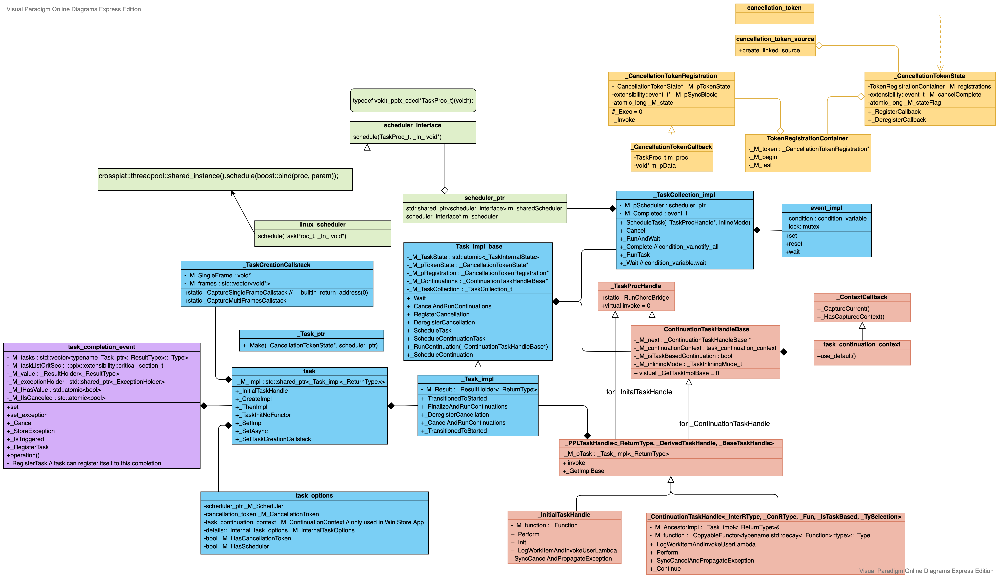

# CppRest
The [C++ REST SDK](https://github.com/microsoft/cpprestsdk) is a Microsoft project for cloud-based client-server communication in native code using a modern asynchronous C++ API design. This project aims to help C++ developers connect to and interact with services.

Features:
* [Programming with Tasks](https://github.com/microsoft/cpprestsdk/wiki/Programming-with-Tasks)
* [JSON](https://github.com/microsoft/cpprestsdk/wiki/JSON)
* Asynchronous Stream
* URIs
* [HTTP Client](https://github.com/microsoft/cpprestsdk/wiki/HTTP-Client)
* HTTP Listener
* [Websocket Client](https://github.com/microsoft/cpprestsdk/wiki/Web-Socket)
* OAuth Client

C++ Rest consists three parts:
* PPL
* C++ Rest
* Boost Asio


## Send Request
```C++
overrideable::g_casablancaHttpRequestFunc // CB-> handel http response

pplx::task<http_response> http_client::request
    http_pipeline::propagate
        oauth2_handler::propagate
            oauth2_config::_authenticate_request
                req.headers().add(header_names::authorization, "Bearer " + token().access_token());

            winhttp_client::propagate   // window platform
                _http_client_communicator::async_send_request
                    _http_client_communicator::open_and_send_request_async
                        _http_client_communicator::open_and_send_request
                            winhttp_client::send_request
                                winhttp_client::_start_request_send

            asio_client::propagate // create asio_context, obtain a reused connection from pool
                auto result_task = pplx::create_task(context->m_request_completion);
                    _http_client_communicator::async_send_request
                        _http_client_communicator::push_request             // 1. gurantee order
                            m_requests_queue.push(request);
                        _http_client_communicator::open_and_send_request    // 2. don't gurantee order
                            _http_client_communicator::open_and_send_request
                                asio_client::send_request
                                    asio_context::start_request
                                        ssl_proxy_tunnel::start_proxy_connect   // if it's ssl and not connected
                                            ssl_proxy_tunnel::write_connect
                                            basic_resolver.hpp::async_resolve
                                                ssl_proxy_tunnel::handle_resolve
                                                    ssl_proxy_tunnel::connect   // handler: ssl_proxy_tunnel::handle_tcp_connect
                                                        asio_connection_fast_ipv4_fallback::connect
                                                            asio_connection_fast_ipv4_fallback::connect_unlock  // if connection is not reused
                                                                asio_connection::async_connect
                                                                    reactive_socket_service.hpp::async_connect
                                                                        reactive_socket_service_base::start_connect_op
                                                                            // ctrl socket to async, else post_immediate_completion
                                                                asio_connection_fast_ipv4_fallback::handle_tcp_connect
                                                                    // call ssl or normal socket connection handler
                                                            ssl_proxy_tunnel::handle_tcp_connect                // if connection is reused
                                                                asio_connection_fast_ipv4_fallback::async_write
                                                                    asio_connection::async_write
                                                                        --->
                                                                    ssl_proxy_tunnel::handle_write_request
                                                                        ssl_proxy_tunnel::async_read_until
                                                                            asio_connection::async_read_until
                                                                        ssl_proxy_tunnel::handle_status_line
                                                                            start_http_request_flow    // web::http::status_codes::OK
                                                                                --->
                                                                            ssl_proxy_tunnel::handle_body_read
                                                                                // check proxy auth required
                                                            asio_context::handle_connect
                                                                asio_context::write_request
                                                                    --->
                                        start_http_request_flow
                                            // compose raw request stream, start timer: ctx->m_timer.start();
                                            basic_resolver.hpp::async_resolve   // if it's not ssl and not connected
                                                asio_context::handle_resolve
                                                    asio_context::connect
                                                        asio_connection_fast_ipv4_fallback::connect
                                                            --->
                                            asio_context::write_request
                                                asio_connection_fast_ipv4_fallback::async_handshake     // if ssl and not reused
                                                    asio_connection::async_handshake
                                                        stream.hpp::async_handshake
                                                            ....
                                                        asio_context::handle_handshake
                                                            asio_connection_fast_ipv4_fallback::async_write
                                                                --->
                                                asio_connection_fast_ipv4_fallback::async_write
                                                    asio_connect::async_write                           // else
                                                        boost::asio::async_write(m_socket, buffer, writeHandler);
                                                            write.hpp::async_write(stream, buffer, completion, handler)
                                                                write.hpp::start_write_buffer_sequence_op(stream, buffer, bufferIterator, completion_condition, handler)
                                                                    write_op<AsyncWriteStream, ConstBufferSequence, ConstBufferIterator, CompletionCondition, WriteHandler>(
                                                                        stream, buffers, completion_condition, handler
                                                                    )(boost::system::error_code(), 0, 1); // (error_code, bytes_transferred, start)
                                                                        write.hpp::write_op::operator()             // while loop until write completed
                                                                            ssl::stream.hpp::async_write_some       // while loop until write completed
                                                                                ssl::io.hpp::async_io
                                                                                    ssl::io.hpp::io_op::operator()  // while loop until write completed
                                                                                        ssl::write_op.hpp::operator()
                                                                                            ssl::engine::write
                                                                                                ssl::engine::perform
                                                                                                    ssl::engin::write
                                                                                                        ::SSL_write
                                                                            basic_stream_socket::async_write_some
                                                                                reactive_socket_service_base::async_send
                                                                                    reactive_socket_service_base::start_op
                                                                                        epoll_reactor::start_op
                                                                                            epoll_reactor::post_immediate_completion
                                                                                                scheduler::post_immediate_completion
                                                                                                    op_queue_.push(op);
                                                                                                    wake_one_thread_and_unlock(lock);
                                                                                                        posix_event.hpp::maybe_unlock_and_signal_one
                                                                                                            ::pthread_cond_signal
                                                                                                        epoll_reactor::interrupt
                                                                                                            epoll_ctl(epoll_fd_, EPOLL_CTL_MOD, interrupter_.read_descriptor(), &ev);
                return result_task; // return a async pplx::task<response> object to client, client then use response.extract_string() to get the real response string

// write callback for boost::asio::async_write
asio_context::handle_write_headers // request header has sent, then send request body
    asio_context::handle_write_chunked_body //  data is chunked
        ....
    asio_context::handle_write_large_body   // data is not chunked
        // continue write request payload untill completed
        asio_context::handle_write_body // both request header and body sent, wait & handle reponse
            boost::asio::async_read_until;
                    ...
                asio_context::handle_status_line
                    asio_context::read_headers
                      asio_context::complete_headers
                        m_request.set_body(Concurrency::streams::istream());
                        m_request_completion.set(m_response);

                      asio_context::handle_read_content
                        asio_context::async_read_until_buffersize
                          boost::asio::async_read(m_socket, buffer, readCondition, readHandler);
                        request_context::complete_request
                          m_response._get_impl()->_complete(body_size);
                            http_msg_base::_complete
                              m_data_available.set(body_size); // notify client which is blocked at reponse.extract_string
                          request_context::finish;
                            m_http_client->finish_request();
                              _http_client_communicator::finish_request
                                m_requests_queue.pop();
                                open_and_send_request(request);

                      asio_context::handle_chunk_header
                        asio_context::handle_chunk
                          // if to_read == 0 complete_request
                          stream_decompressor::decompress
                          // comtinue read and handle_chunk_header
                        request_context::complete_request
                          --->
```

## Receive Response
```C++
_TaskProcHandle::_RunChoreBridge
    _PPLTaskHandle::_invoke
        _Perform
            _Continue
                _LogWorkItemAndInvokeUserLambda
                MercuryNetworkConnection::handleIncomingMercuryEvent
                    --->

ws_client_wspp.cpp::connect_impl
  endpoint.hpp::run

    io_service::run
      win_iocp_io_service::run
        win_iocp_io_service::do_one
          ....
          strand_service::dispatch
            connection.hpp::handle_async_read
              connection<config>::handle_read_http_response
                connection<config>::read_frame

                  connection<config>::async_read_at_least | connection<config>::handle_async_read
                    read.hpp::async_read    // boost
                      connection.hpp::handle_async_read
                          connection<config>::handle_read_frame   // invoke by connection::m_handle_read_frame
                            m_message_handler   // set by ws_client_wspp.cpp::connect_impl set_message_handler

                              MercuryNetworkConnection::handleIncomingMercuryEvent    // set at MercuryNetworkConnection::connectToMercury set_message_handler
                                  MercuryConnectionManager::onMercuryEventArrived
                                      MercuryConnectionManager::fireMercuryEventArrived
```

# PPLX
PPLX is a special version of PPL for non-winodws platform.

The [Parallel Patterns Library (PPL)](https://docs.microsoft.com/en-us/cpp/parallel/concrt/parallel-patterns-library-ppl?view=msvc-160) provides an imperative programming model that promotes scalability and ease-of-use for developing concurrent applications. The PPL builds on the scheduling and resource management components of the [Concurrency Runtime](https://docs.microsoft.com/en-us/cpp/parallel/concrt/concurrency-runtime?view=msvc-160). It raises the level of abstraction between your application code and the underlying threading mechanism by providing generic, type-safe algorithms and containers that act on data in parallel. The PPL also lets you develop applications that scale by providing alternatives to shared state.

The PPL provides the following features:
* [Task Parallelism](https://docs.microsoft.com/en-us/cpp/parallel/concrt/task-parallelism-concurrency-runtime?view=msvc-160): a mechanism that works on top of the Windows ThreadPool to execute several work items (tasks) in parallel
* [Parallel algorithms](https://docs.microsoft.com/en-us/cpp/parallel/concrt/parallel-algorithms?view=msvc-160): generic algorithms that works on top of the Concurrency Runtime to act on collections of data in parallel
* [Parallel containers and objects](https://docs.microsoft.com/en-us/cpp/parallel/concrt/parallel-containers-and-objects?view=msvc-160): generic container types that provide safe concurrent access to their elements
* [Cancellation in PPL](https://docs.microsoft.com/en-us/cpp/parallel/concrt/cancellation-in-the-ppl?view=msvc-160): Explains how to cancel the work that is being performed by a parallel algorithm.



## class task
```C++
template<typename _ReturnType>
class task
{
public:
    typedef _ReturnType result_type;

    task() : _M_Impl(nullptr) {
        // The default constructor should create a task with a nullptr impl. This is a signal that the
        // task is not usable and should throw if any wait(), get() or then() APIs are used.
    }


    template<typename _Ty>
    __declspec(noinline)
    explicit task(_Ty _Param) {
        task_options _TaskOptions;
        _ValidateTaskConstructorArgs<_ReturnType,_Ty>(_Param);
        _CreateImpl(_TaskOptions.get_cancellation_token()._GetImplValue(), _TaskOptions.get_scheduler());
        _SetTaskCreationCallstack(_CAPTURE_CALLSTACK());
        _TaskInitMaybeFunctor(_Param, _IsCallable(_Param,0));
    }

    template<typename _Ty>
    __declspec(noinline)
    explicit task(_Ty _Param, const task_options &_TaskOptions) {
        _ValidateTaskConstructorArgs<_ReturnType,_Ty>(_Param);

        _CreateImpl(_TaskOptions.get_cancellation_token()._GetImplValue(), _TaskOptions.get_scheduler());
        _SetTaskCreationCallstack(_get_internal_task_options(_TaskOptions)._M_hasPresetCreationCallstack ? _get_internal_task_options(_TaskOptions)._M_presetCreationCallstack : _CAPTURE_CALLSTACK());
        _TaskInitMaybeFunctor(_Param, _IsCallable(_Param,0));
    }

    template<typename _Function>
    __declspec(noinline)
    auto then(_Function&& _Func) const -> typename _ContinuationTypeTraits<_Function, _ReturnType>::_TaskOfType
    {
        task_options _TaskOptions;
        _get_internal_task_options(_TaskOptions)._set_creation_callstack(_CAPTURE_CALLSTACK());
        return _ThenImpl<_ReturnType, _Function>(std::forward<_Function>(_Func), _TaskOptions);
    }


    template<typename _Function>
    __declspec(noinline)
    auto then(_Function&& _Func, task_options _TaskOptions) const -> typename _ContinuationTypeTraits<_Function, _ReturnType>::_TaskOfType
    {
        _get_internal_task_options(_TaskOptions)._set_creation_callstack(_CAPTURE_CALLSTACK());
        return _ThenImpl<_ReturnType, _Function>(std::forward<_Function>(_Func), _TaskOptions);
    }


    template<typename _Function>
    __declspec(noinline)
    auto then(_Function&& _Func, cancellation_token _CancellationToken, task_continuation_context _ContinuationContext) const -> typename _ContinuationTypeTraits<_Function, _ReturnType>::_TaskOfType
    {
        task_options _TaskOptions(_CancellationToken, _ContinuationContext);
        _get_internal_task_options(_TaskOptions)._set_creation_callstack(_CAPTURE_CALLSTACK());
        return _ThenImpl<_ReturnType, _Function>(std::forward<_Function>(_Func), _TaskOptions);
    }


    task_status wait() const {
        if (!_M_Impl) {
            throw invalid_operation("wait() cannot be called on a default constructed task.");
        }

        return _M_Impl->_Wait();
    }


    _ReturnType get() const {
        if (!_M_Impl) {
            throw invalid_operation("get() cannot be called on a default constructed task.");
        }

        if (_M_Impl->_Wait() == canceled) {
            throw task_canceled();
        }

        return _M_Impl->_GetResult();
    }

    bool is_done() const {
        if (!_M_Impl) {
            throw invalid_operation("is_done() cannot be called on a default constructed task.");
        }

        return _M_Impl->_IsDone();
    }

    scheduler_ptr scheduler() const {
        if (!_M_Impl) {
            throw invalid_operation("scheduler() cannot be called on a default constructed task.");
        }

        return _M_Impl->_GetScheduler();
    }


    bool is_apartment_aware() const {
        if (!_M_Impl) {
            throw invalid_operation("is_apartment_aware() cannot be called on a default constructed task.");
        }
        return _M_Impl->_IsApartmentAware();
    }

    void _CreateImpl(_CancellationTokenState * _Ct, scheduler_ptr _Scheduler) {
        _ASSERTE(_Ct != nullptr);
        _M_Impl = _Task_ptr<_ReturnType>::_Make(_Ct, _Scheduler);
        if (_Ct != _CancellationTokenState::_None()) {
            _M_Impl->_RegisterCancellation(_M_Impl);
        }
    }

    void _SetAsync(bool _Async = true) {
        _GetImpl()->_SetAsync(_Async);
    }

    template<typename _Function>
    auto _Then(_Function&& _Func, _CancellationTokenState *_PTokenState,
        _TaskInliningMode_t _InliningMode = _ForceInline) const -> typename _ContinuationTypeTraits<_Function, _ReturnType>::_TaskOfType
    {
        // inherit from antecedent
        auto _Scheduler = _GetImpl()->_GetScheduler();

        return _ThenImpl<_ReturnType, _Function>(std::forward<_Function>(_Func), _PTokenState, task_continuation_context::use_default(), _Scheduler, _CAPTURE_CALLSTACK(), _InliningMode);
    }

private:
    template<typename _InternalReturnType, typename _Function>
    void _TaskInitWithFunctor(const _Function& _Func) {
        typedef typename _InitFunctorTypeTraits<_InternalReturnType, decltype(_Func())> _Async_type_traits;

        _M_Impl->_M_fFromAsync = _Async_type_traits::_IsAsyncTask;
        _M_Impl->_M_fUnwrappedTask = _Async_type_traits::_IsUnwrappedTaskOrAsync;
        _M_Impl->_M_taskEventLogger._LogScheduleTask(false);
        _M_Impl->_ScheduleTask(new _InitialTaskHandle<_InternalReturnType, _Function, typename _Async_type_traits::_AsyncKind>(_GetImpl(), _Func), _NoInline);
    }

    void _TaskInitNoFunctor(task_completion_event<_ReturnType>& _Event) {
        _Event._RegisterTask(_M_Impl);
    }

    template<typename _Function>
    void _TaskInitMaybeFunctor(_Function & _Func, std::true_type) {
        _TaskInitWithFunctor<_ReturnType, _Function>(_Func);
    }

    template<typename _Ty>
    void _TaskInitMaybeFunctor(_Ty & _Param, std::false_type) {
        _TaskInitNoFunctor(_Param);
    }

    template<typename _InternalReturnType, typename _Function>
    auto _ThenImpl(_Function&& _Func, const task_options& _TaskOptions) const -> typename _ContinuationTypeTraits<_Function, _InternalReturnType>::_TaskOfType
    {
        if (!_M_Impl) {
            throw invalid_operation("then() cannot be called on a default constructed task.");
        }

        _CancellationTokenState *_PTokenState = _TaskOptions.has_cancellation_token() ? _TaskOptions.get_cancellation_token()._GetImplValue() : nullptr;
        auto _Scheduler = _TaskOptions.has_scheduler() ? _TaskOptions.get_scheduler() : _GetImpl()->_GetScheduler();
        auto _CreationStack = _get_internal_task_options(_TaskOptions)._M_hasPresetCreationCallstack ? _get_internal_task_options(_TaskOptions)._M_presetCreationCallstack : _TaskCreationCallstack();
        return _ThenImpl<_InternalReturnType, _Function>(std::forward<_Function>(_Func), _PTokenState, _TaskOptions.get_continuation_context(), _Scheduler, _CreationStack);
    }

    template<typename _InternalReturnType, typename _Function>
    auto _ThenImpl(_Function&& _Func,
      scheduler_ptr _Scheduler,
      _TaskCreationCallstack _CreationStack,
      _CancellationTokenState *_PTokenState,
      const task_continuation_context& _ContinuationContext,
      _TaskInliningMode_t _InliningMode = _NoInline
    ) const -> typename _ContinuationTypeTraits<_Function, _InternalReturnType>::_TaskOfType {
        if (!_M_Impl) {
            throw invalid_operation("then() cannot be called on a default constructed task.");
        }

        typedef _FunctionTypeTraits<_Function, _InternalReturnType> _Function_type_traits;
        typedef _TaskTypeTraits<typename _Function_type_traits::_FuncRetType> _Async_type_traits;
        typedef typename _Async_type_traits::_TaskRetType _TaskType;

        if (_PTokenState == nullptr) {
            if (_Function_type_traits::_Takes_task::value) {
              _PTokenState = _CancellationTokenState::_None();
            } else {
              _PTokenState = _GetImpl()->_M_pTokenState;
            }
        }

        task<_TaskType> _ContinuationTask;
        _ContinuationTask._CreateImpl(_PTokenState, _Scheduler);
        _ContinuationTask._GetImpl()->_M_fFromAsync = (_GetImpl()->_M_fFromAsync || _Async_type_traits::_IsAsyncTask);
        _ContinuationTask._GetImpl()->_M_fUnwrappedTask = _Async_type_traits::_IsUnwrappedTaskOrAsync;
        _ContinuationTask._SetTaskCreationCallstack(_CreationStack);

        _GetImpl()->_ScheduleContinuation(new _ContinuationTaskHandle<_InternalReturnType, _TaskType, _Function,
          typename _Function_type_traits::_Takes_task, typename _Async_type_traits::_AsyncKind>
            (_GetImpl(), _ContinuationTask._GetImpl(), std::forward<_Function>(_Func), _ContinuationContext,
            _InliningMode)
          );

        return _ContinuationTask;
    }

    // The underlying implementation for this task
    typename _Task_ptr<_ReturnType>::_Type _M_Impl;
};
```

```C++
template<>
class task<void>
{
public:

private:
     task<details::_Unit_type> _M_unitTask;
}
```

## Type Traits
```C++
template<typename _Type>
task<_Type> _To_task(_Type t);

template<typename _Func>
task<void> _To_task_void(_Func f);
```

```C++
struct _BadContinuationParamType{ };

template <typename _Function, typename _Type>
auto _ReturnTypeHelper(_Type t, _Function _Func, int, int) -> decltype(_Func(_To_task(t)));

template <typename _Function, typename _Type>
auto _ReturnTypeHelper(_Type t, _Function _Func, int, ...) -> decltype(_Func(t));

template <typename _Function, typename _Type>
auto _ReturnTypeHelper(_Type t, _Function _Func, ...) -> _BadContinuationParamType;
```

```C++
template <typename _Function>
auto _VoidReturnTypeHelper(_Function _Func, int, int) -> decltype(_Func(_To_task_void(_Func)));

template <typename _Function>
auto _VoidReturnTypeHelper(_Function _Func, int, ...) -> decltype(_Func());
```

```C++
template <typename _Function>
auto _VoidIsTaskHelper(_Function _Func, int, int) -> decltype(_Func(_To_task_void(_Func)), std::true_type());

template <typename _Function>
std::false_type _VoidIsTaskHelper(_Function _Func, int, ...);
```

```C++
template <typename _Function, typename _Type>
auto _IsTaskHelper(_Type t, _Function _Func, int, int) -> decltype(_Func(_To_task(t)), std::true_type());

template <typename _Function, typename _Type>
std::false_type _IsTaskHelper(_Type t, _Function _Func, int, ...);
```

```C++
template<typename _Function, typename _ExpectedParameterType>
struct _FunctionTypeTraits
{
  typedef decltype(_ReturnTypeHelper(stdx::declval<_ExpectedParameterType>(),stdx::declval<_Function>(), 0, 0))
    _FuncRetType;

  static_assert(!std::is_same<_FuncRetType,_BadContinuationParamType>::value, "incorrect parameter type for the
    callable object in 'then'; consider _ExpectedParameterType or task<_ExpectedParameterType> (see below)");

  typedef decltype(_IsTaskHelper(stdx::declval<_ExpectedParameterType>(),stdx::declval<_Function>(), 0, 0)) _Takes_task;
};

template<typename _Function>
struct _FunctionTypeTraits<_Function, void>
{
  typedef decltype(_VoidReturnTypeHelper(stdx::declval<_Function>(), 0, 0)) _FuncRetType;
  typedef decltype(_VoidIsTaskHelper(stdx::declval<_Function>(), 0, 0)) _Takes_task;
};
```

```C++
template <typename _Type, bool _IsAsync = false>
struct _TaskTypeTraits
{
    typedef typename _UnwrapTaskType<_Type>::_Type _TaskRetType;
    typedef decltype(_AsyncOperationKindSelector(stdx::declval<_Type>())) _AsyncKind;
    typedef typename _NormalizeVoidToUnitType<_TaskRetType>::_Type _NormalizedTaskRetType;

    static const bool _IsAsyncTask = false;
    static const bool _IsUnwrappedTaskOrAsync = _IsUnwrappedAsyncSelector<_AsyncKind>::_Value;
};

template <>
struct _TaskTypeTraits<void>
{
    typedef void _TaskRetType;
    typedef _TypeSelectorNoAsync _AsyncKind;
    typedef _Unit_type _NormalizedTaskRetType;

    static const bool _IsAsyncTask = false;
    static const bool _IsUnwrappedTaskOrAsync = false;
};

template <typename _Function>
auto _IsCallable(_Function _Func, int) -> decltype(_Func(), std::true_type()) {
    (void)(_Func);
    return std::true_type();
}

template <typename _Function>
std::false_type _IsCallable(_Function, ...) { return std::false_type(); }
```

```C++
template<typename _Function, typename _ReturnType>
struct _ContinuationTypeTraits
{
  typedef task<typename _TaskTypeTraits<typename _FunctionTypeTraits<_Function, _ReturnType>::_FuncRetType>::_TaskRetType> _TaskOfType;
};

template <typename _TaskType, typename _FuncRetType>
struct _InitFunctorTypeTraits
{
  typedef typename _TaskTypeTraits<_FuncRetType>::_AsyncKind _AsyncKind;
  static const bool _IsAsyncTask = _TaskTypeTraits<_FuncRetType>::_IsAsyncTask;
  static const bool _IsUnwrappedTaskOrAsync = _TaskTypeTraits<_FuncRetType>::_IsUnwrappedTaskOrAsync;
};

template<typename T>
struct _InitFunctorTypeTraits<T, T>
{
  typedef _TypeSelectorNoAsync _AsyncKind;
  static const bool _IsAsyncTask = false;
  static const bool _IsUnwrappedTaskOrAsync = false;
};
```

## task::task
```C++
_CreateImpl
  _Task_ptr<_ReturnType>::_Make
    std::make_shared<_Task_impl<_ReturnType>>(_Ct, _Scheduler_arg);
_SetTaskCreationCallstack(_CAPTURE_CALLSTACK());
_TaskInitMaybeFunctor(_Param, _IsCallable(_Param,0));
    _TaskInitWithFunctor(const _Function& _Func)
        _Task_impl_base::_ScheduleTask(new _InitialTaskHandle());
            --->

    _TaskInitNoFunctor(task_completion_event<_ReturnType>& _Event)
        _Event._RegisterTask(_M_Impl)
            task_completion_event::_RegisterTask
                _M_Impl->_M_tasks.push_back(_TaskParam)         // 1. else

                _Task_impl_base::CancelWithExceptionHolder      // 2. _M_Impl->_HasUserException()

                _Task_impl_base::_FinalizeAndRunContinuations   // 3. _M_Impl->_M_fHasValue
                    --->
```

##  task::then
```C++
task::then
  _M_unitTask._ThenImpl
    _GetImpl()->_ScheduleContinuation
      _PTaskHandle->_M_next = _M_Continuations;                 // 1. if (!_IsCompleted)

    _Task_impl_base::_ScheduleContinuationTask(_PTaskHandle);   // 2. if (_IsCompleted)
        --->

    _Task_impl_base::_Cancel(true);                             // 3. if cancel

    _Task_impl_base::_CancelWithExceptionHolder(_GetExceptionHolder(), true); // 4. if cancel with exception
```

## task::wait
```C++
_Task_impl_base::_Wait
    _TaskCollection_impl::_Wait
        event_impl::wait
            condition_variable.wait

```

## Run Continuation
```C++
task_completion_event::set
  _Task_impl_base::_FinalizeAndRunContinuations(_M_Impl->_M_value.Get()); // while loop
    _M_Result.Set(_Result);
      _TaskCollectionImpl::_Complete();
        condition_variable.notify_all();
      _Task_impl_base::_RunTaskContinuations // while loop iterate all continuation
        _Task_impl_base::_RunContinuation
            _Task_impl_base::_ScheduleContinuationTask // _ContinuationTaskHandleBase * _PTaskHandle
                // _ScheduleFuncWithAutoInline([]() { });
                _Task_impl_base::_ScheduleFuncWithAutoInline // 1. _HasCapturedContext
                    _TaskCollection_t::_RunTask(&_TaskProcThunk::_Bridge, new _TaskProcThunk(_Func), _InliningMode);
                        _Bridge(_ThunkFunc);                            // 1.1 if __ForceInline
            --->            _Func = []() {
                                _Task_impl_base::_ScheduleTask   // 1.1.1 _M_continuationContext == _ContextCallback::_CaptureCurrent()
                                _ContextCallback::_CallInContext // 1.1.2 else
                            }

                        linux_scheduler::schedule(_Bridge, _ThunkFunc)  // 1.2 else not _ForceInline

                _Task_impl_base::_ScheduleTask                // 2. not _HasCapturedContext
                    _TaskCollectionImpl::_ScheduleTask(_TaskProcHandle* _PTaskHandle, _TaskInliningMode _InliningMode)
                        _TaskProcHandle_t::_RunChoreBridge(_PTaskHandle)    // 2.1. if _ForceInline
                            _PTaskHandle->invoke();
                                (this)->_Perform();
                                    _ContinuationTaskHandle::_Perform();
                                        _ContinuationTaskHandle::_Continue(std::true_type, _TypeSelectorNoAsync)
                                            _Task_impl_base::_FinalizeAndRunContinuations(
                                                _LogWorkItemAndInvokeUserLambda(
                                                    _Continuation_func_transformer<_FuncInputType, _ContinuationReturnType>::_Perform(_M_function),
                                                    std::move(_ResultTask)
                                                )
                                            );

                                        _ContinuationTaskHandle::_Continue(std::true_type, _TypeSelectorAsyncOperationOrTask)
                                            _Task_impl_base::_AsyncInit<_NormalizedContinuationReturnType, _ContinuationReturnType>(
                                                    this->_M_pTask,
                                                    _LogWorkItemAndInvokeUserLambda(_M_function, std::move(_ResultTask))
                                                );

                        linux_scheduler::schedule                               // 2.2 else if not _ForceInline
                            crossplat::threadpool::shared_instance().schedule(boost::bind(proc, param));
```