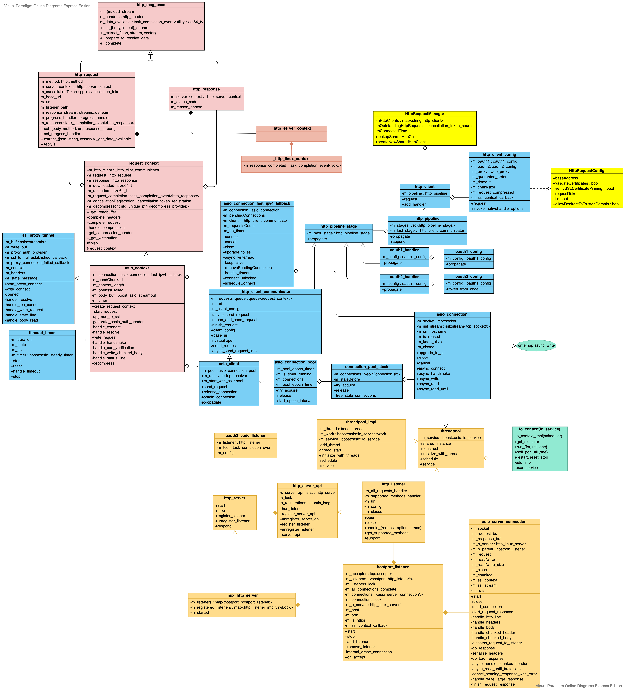

# Architecture


# Call Stack
## Send
```C++
overrideable::g_casablancaHttpRequestFunc // CB-> handel http response

    http_client::request
        http_pipeline::propagate
            oauth2_handler::propagate
                oauth2_config::_authenticate_request
                    req.headers().add(header_names::authorization, "Bearer " + token().access_token());

                winhttp_client::propagate   // window platform
                    _http_client_communicator::async_send_request
                        _http_client_communicator::open_and_send_request_async
                            _http_client_communicator::open_and_send_request
                                winhttp_client::send_request
                                    winhttp_client::_start_request_send

                asio_client::propagate // create asio_context, obtain a reused connection from pool
                    _http_client_communicator::async_send_request
                        _http_client_communicator::push_request                // 1. gurantee order
                            m_requests_queue.push(request);
                        _http_client_communicator::open_and_send_request_async // 2. don't gurantee order
                            _http_client_communicator::open_and_send_request
                                asio_client::send_request
                                    asio_context::start_request
                                        ssl_proxy_tunnel::start_proxy_connect   // if it's ssl and not connected
                                            ssl_proxy_tunnel::write_connect
                                            basic_resolver.hpp::async_resolve
                                                ssl_proxy_tunnel::handle_resolve
                                                    ssl_proxy_tunnel::connect   // handler: ssl_proxy_tunnel::handle_tcp_connect
                                                        asio_connection_fast_ipv4_fallback::connect
                                                            asio_connection_fast_ipv4_fallback::connect_unlock  // if connection is not reused
                                                                asio_connection::async_connect
                                                                    reactive_socket_service.hpp::async_connect
                                                                        reactive_socket_service_base::start_connect_op
                                                                            // ctrl socket to async, else post_immediate_completion
                                                                asio_connection_fast_ipv4_fallback::handle_tcp_connect
                                                                    // call ssl or normal socket connection handler
                                                            ssl_proxy_tunnel::handle_tcp_connect                // if connection is reused
                                                                asio_connection_fast_ipv4_fallback::async_write
                                                                    asio_connection::async_write
                                                                        --->
                                                                    ssl_proxy_tunnel::handle_write_request
                                                                        ssl_proxy_tunnel::async_read_until
                                                                            asio_connection::async_read_until
                                                                        ssl_proxy_tunnel::handle_status_line
                                                                            start_http_request_flow    // web::http::status_codes::OK
                                                                                --->
                                                                            ssl_proxy_tunnel::handle_body_read
                                                                                // check proxy auth required
                                                            asio_context::handle_connect
                                                                asio_context::write_request
                                                                    --->
                                        start_http_request_flow
                                            // compose raw request stream, start timer: ctx->m_timer.start();
                                            basic_resolver.hpp::async_resolve   // if it's not ssl and not connected
                                                asio_context::handle_resolve
                                                    asio_context::connect
                                                        asio_connection_fast_ipv4_fallback::connect
                                                            --->
                                            asio_context::write_request
                                                asio_connection_fast_ipv4_fallback::async_handshake     // if ssl and not reused
                                                    asio_connection::async_handshake
                                                        stream.hpp::async_handshake
                                                            ....
                                                        asio_context::handle_handshake
                                                            asio_connection_fast_ipv4_fallback::async_write
                                                                --->
                                                asio_connection_fast_ipv4_fallback::async_write
                                                    asio_connect::async_write                           // else
                                                        boost::asio::async_write(m_socket, buffer, writeHandler);                 handler                 CompletionCondition
                                                            write.hpp::async_write(stream, buffer, completion, handler)[580]    write_stream_handler
                                                                write.hpp::write_op::operator()[324]                                    \|/             transfer_all
                                                                    ssl::stream.hpp::async_write_some[635]                           write::write_op
                                                                        io.hpp::async_io[334]
                                                                            io.hpp::io_op operator()[135]
                                                                                write_op.hpp::operator()[43]
                                                                                    engine::write
                                                                                        engine::perform
                                                                                            engin::write
                                                                                                ::SSL_write
                                                                    basic_stream_socket::async_write_some
                                                                        reactive_socket_service_base::async_send
                                                                            reactive_socket_service_base::start_op
                                                                                ....
                                                asio_context::handle_write_headers // write callback for boost::asio::async_write
                                                    asio_context::handle_write_chunked_body //  data is chunked
                                                        ....
                                                    asio_context::handle_write_large_body   // data is not chunked
                                                        // continue write untill completion
                                                        asio_context::handle_write_body
                                                            asio_context::handle_status_line
                                                                asio_context::read_headers
                                                                    asio_context::complete_headers
                                                                    asio_context::handle_chunk_header / asio_context::handle_read_content
                                                                        asio_context::handle_chunk
                                                                            // if to_read == 0 complete_request
                                                                            stream_decompressor::decompress
                                                                            // comtinue read and handle_chunk_header
```

## Receive
```C++
_TaskProcHandle::_RunChoreBridge
    _PPLTaskHandle::_invoke
        _Perform
            _Continue
                _LogWorkItemAndInvokeUserLambda
                    MercuryNetworkConnection::handleIncomingMercuryEvent
                        --->

ws_client_wspp.cpp::connect_impl
    endpoint.hpp::run

        io_service::run
            win_iocp_io_service::run
                win_iocp_io_service::do_one
                    ....
                    strand_service::dispatch
                        connection.hpp::handle_async_read
                            connection<config>::handle_read_http_response
                                connection<config>::read_frame

                                    connection<config>::async_read_at_least | connection<config>::handle_async_read
                                        read.hpp::async_read    // boost
                                            connection.hpp::handle_async_read
                                                connection<config>::handle_read_frame   // invoke by connection::m_handle_read_frame
                                                    m_message_handler   // set by ws_client_wspp.cpp::connect_impl set_message_handler

                                                        MercuryNetworkConnection::handleIncomingMercuryEvent    // set at MercuryNetworkConnection::connectToMercury set_message_handler
                                                            MercuryConnectionManager::onMercuryEventArrived
                                                                MercuryConnectionManager::fireMercuryEventArrived
```