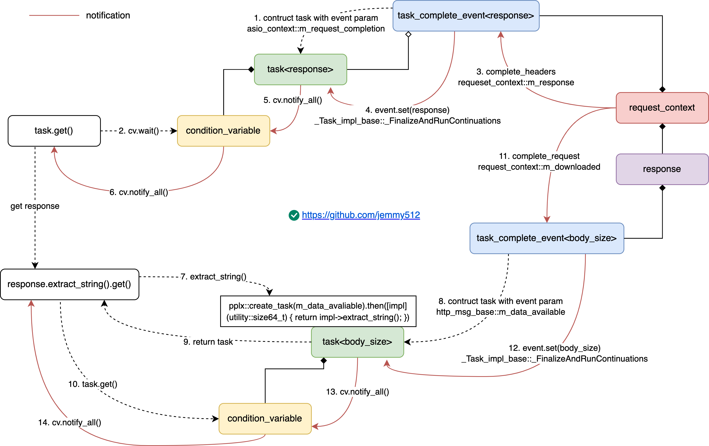
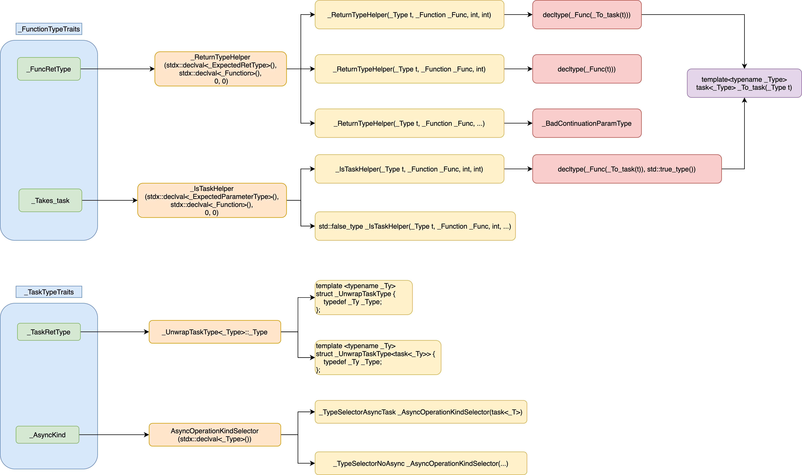
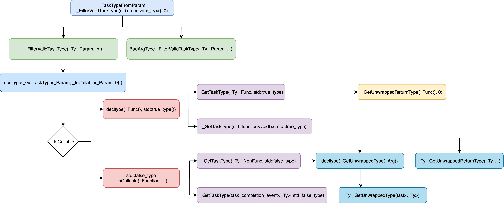

# Agenda
* [CppRest](#CppRest)
    * [Client](#Client)
        * [write](#write-client)
        * [read](#read-client)
    * [Server](#Server)
        * [listen](#listen)
        * [accept](#accept)
        * [read](#read-server)
        * [write](#write-server)
    * [Exception](#Exception)

* [PPLX](#PPLX)
    * [Task](#class-task)
    * [Type Traits](#Type-Traits)
        * [Check args compatibility](#Check-args-compatibility)
        * [Get task type from parameter](#Get-task-type-from-parameter)
    * [task::task](#tasktask)
    * [task::then](#taskthen)
    * [task::wait](#taskwait)
    * [Run Continuation](#Run-Continuation)


* [Boost.Asio](#BoostAsio)

# CppRest
The [C++ REST SDK](https://github.com/microsoft/cpprestsdk) is a Microsoft project for cloud-based client-server communication in native code using a modern asynchronous C++ API design. This project aims to help C++ developers connect to and interact with services.

Features:
* [Programming with Tasks](https://github.com/microsoft/cpprestsdk/wiki/Programming-with-Tasks)
* [JSON](https://github.com/microsoft/cpprestsdk/wiki/JSON)
* Asynchronous Stream
* URIs
* [HTTP Client](https://github.com/microsoft/cpprestsdk/wiki/HTTP-Client)
* HTTP Listener
* [Websocket Client](https://github.com/microsoft/cpprestsdk/wiki/Web-Socket)
* OAuth Client

C++ Rest consists of three components:
* [PPL](#PPLX)
* [C++ Rest](#CppRest)
* [Boost Asio](#BoostAsio)


## Client
### write-client
```C++
overrideable::g_casablancaHttpRequestFunc // CB-> handle http response

web::http::http_request request(http::method)
request.set_body(jsonPayload)
    http_msg_base::set_body(concurrency::streams::istream(jsonPayload))
        m_inStream = instream
request.addHeader(headers)

pplx::task<http_response> http_client::request()
    http_pipeline::propagate()
        oauth2_handler::propagate()
            oauth2_config::_authenticate_request()
                req.headers().add(header_names::authorization, "Bearer " + token().access_token());

        asio_client::propagate() // create asio_context, obtain a reused connection from pool
            auto context = asio_context::create_request_context()
                asio_client::obtain_connection()
                    asio_connection_poll::acquire()
                    conn = std::make_shared<asio_connection>(crossplat::threadpool::shared_instance().service());
                    auto context = std::make_shared<asio_context>(client, request, connection)
            auto result_task = pplx::create_task(context->m_request_completion) // task_completion_event<http_response>
            _http_client_communicator::async_send_request(context)
                _http_client_communicator::push_request()           // 1. gurantee order
                    m_requests_queue.push(request)
                _http_client_communicator::open_and_send_request()  // 2. don't gurantee order
                    _http_client_communicator::open_if_required()
                    asio_client::send_request()
                        asio_context::start_request()
                            ssl_proxy_tunnel::start_proxy_connect()  // if it's ssl and not connected
                                ssl_proxy_tunnel::write_connect()
                                basic_resolver.hpp::async_resolve()
                                    ssl_proxy_tunnel::handle_resolve()
                                        ssl_proxy_tunnel::connect()  // handler: ssl_proxy_tunnel::handle_tcp_connect()
                                            asio_connection_fast_ipv4_fallback::connect()
                                                asio_connection_fast_ipv4_fallback::connect_unlock() // if connection is not reused
// connect socket
                                                    asio_connection::async_connect()
                                                        basic_stream_socket::async_connect()
                                                            ---> Boost.Asio
                                                    asio_connection_fast_ipv4_fallback::handle_tcp_connect()
                                                        // call ssl or normal socket connection handler
                                                ssl_proxy_tunnel::handle_tcp_connect()                // if connection is reused
                                                    asio_connection_fast_ipv4_fallback::async_write()
                                                        asio_connection::async_write()
                                                            ---> Boost.Asio
                                                        ssl_proxy_tunnel::handle_write_request()
                                                            ssl_proxy_tunnel::async_read_until()
                                                                asio_connection::async_read_until()
                                                            ssl_proxy_tunnel::handle_status_line()
                                                                start_http_request_flow()    // web::http::status_codes::OK()
                                                                    --->
                                                                ssl_proxy_tunnel::handle_body_read()
                                                                    // check proxy auth required
                                                asio_context::handle_connect()
                                                    asio_context::write_request()
                                                        boost::asio::async_write()
                                                            --->
                            start_http_request_flow()
                                // compose raw request header stream, start timer: ctx->m_timer.start()
                                    std::ostream request_stream(&ctx->m_body_buf)
                                    request_stream << method << " " << encoded_resource << " " << "HTTP/1.1" << CRLF;
                                    request_stream << "Host: " << host << ":" << port << CRLF;
                                if (ctx->m_connection->is_reused() || proxy_type == http_proxy_type::ssl_tunnel)
                                    asio_context::write_request()
                                        if (m_connection->is_ssl() && !m_connection->is_reused())
                                            asio_connection_fast_ipv4_fallback::async_handshake()
                                                asio_connection::async_handshake()
                                                    stream.hpp::async_handshake()
                                                        ....
                                                    asio_context::handle_handshake()
                                                        asio_connection::async_write(asio_context::handle_write_headers)
                                                            --->
                                        else
                                            asio_connect::async_write(buffer, asio_context::handle_write_headers)
                                                boost::asio::async_write(asio_context::handle_write_large_body)
                                                        --->
                                else
                                    client->m_resolver.async_resolve()
                                    --->asio_context::handle_resolve()
                                            asio_context::connect()
                                                basic_socket.hpp::async_connect()
                                                    ---> Boost.Asio
                                                        epoll_ctl(epoll_fd_, EPOLL_CTL_ADD, descriptor, &ev)
                                            --->asio_context::handle_connect()
                                                asio_context::write_request()
            return result_task; // return a async pplx::task<response> object to client, client then use response.extract_string() to get the real response string

// write callback for asio_context::write_request()
asio_context::handle_write_headers() // request header has sent, then send request body
    asio_context::handle_write_chunked_body() //  data is chunked
        ....
    asio_context::handle_write_large_body()   // data is not chunked
        // continue write request payload untill completed
        if (ec || m_uploaded >= m_content_length)
            asio_context::handle_write_body() // both request header and body sent, wait & handle reponse
                boost::asio::async_read_until(CRLF + CRLF)
                        ---> Boost.Asio
                    asio_context::handle_status_line()
                        asio_context::read_headers()
                            request_context::complete_headers()
                                m_request.set_body(Concurrency::streams::istream());
                                m_request_completion.set(m_response);
                                    task_completion_event<http_response>::set(m_response)
                                        _Task_impl_base::_FinalizeAndRunContinuations(m_response); // while loops all tasks
                                            _M_Result.Set(m_response);
                                                _TaskCollectionImpl::_Complete()
                                                    // 1. [notify] clients which are blocked at task<http_reponse>::wait/get()
                                                    condition_variable.notify_all()
                                                _Task_impl_base::_RunTaskContinuations() // while loops all continuations
                            if (!needChunked)
                                asio_context::async_read_until_buffersize(asio_context::handle_read_content)
                            --->asio_context::handle_read_content()
                                    if (m_downloaded < m_content_length)
                                        asio_context::async_read_until_buffersize()
                                            boost::asio::async_read(m_socket, buffer, readCondition, asio_context::handle_read_content();
                                    else
                                        request_context::complete_request(body_size)
                                            m_response._get_impl()->_complete(body_size);
                                                http_msg_base::_complete(body_size)
                                                m_data_available.set(body_size);
                                                    task_completion_event<size64_t>::set(body_size)
                                                    _Task_impl_base::_FinalizeAndRunContinuations(body_size); // while loops all tasks
                                                        _M_Result.Set(body_size);
                                                            _TaskCollectionImpl::_Complete()
                                                                // 2. [notify] clients which are blocked at reponse.extract_string()
                                                                condition_variable.notify_all()
                                                            _Task_impl_base::_RunTaskContinuations() // while loops all continuations
                                            request_context::finish()
                                                m_http_client->finish_request()
                                                _http_client_communicator::finish_request()
                                                    m_requests_queue.pop()
                                                    open_and_send_request(request);
                            else
                                asio_context::async_read_until(asio_context::handle_chunk_header)
                            --->asio_context::handle_chunk_header()
                                    asio_context::handle_chunk()
                                    // if to_read == 0 complete_request
                                    stream_decompressor::decompress()
                                    // comtinue read and handle_chunk_header
                                    request_context::complete_request()
                                        --->
        else
            auto readbuf = _get_readbuffer()
                m_request.body()
                    m_instream;
            // get readSize data from m_instream to m_body_buf, and send it out
            readbuf.getn(boost::asio::buffer_cast<uint8_t *>(m_body_buf.prepare(readSize)), readSize)
            asio_connect::async_write(m_body_buf, asio_context::handle_write_large_body)
                boost::asio::async_write(m_body_buf, asio_context::handle_write_large_body)
                    --->
```

### read-client
```C++
boost::asio::scheduler::do_run_one()
    operation::complete()
        _TaskProcHandle::_RunChoreBridge()
            _PPLTaskHandle::_invoke()
                if (initHandle)
                    _InitialTaskHandle::_Perform()
                        _InitialTaskHandle::_Init()
                            _Task_impl_base::_FinalizeAndRunContinuations()
                                --->
                else
                    _ContinuationTaskHandle::_Perform()
                        _ContinuationTaskHandle::_Continue()
                            _Task_impl_base::_FinalizeAndRunContinuations()
                                --->
                --->                MercuryNetworkConnection::handleIncomingMercuryEvent()

ws_client_wspp.cpp::connect_impl()
  endpoint.hpp::run()

    io_service::run()
      win_iocp_io_service::run()
        win_iocp_io_service::do_one()
          ....
          strand_service::dispatch()
            connection.hpp::handle_async_read()
              connection<config>::handle_read_http_response()
                connection<config>::read_frame()

                  connection<config>::async_read_at_least | connection<config>::handle_async_read()
                    read.hpp::async_read    // boost
                      connection.hpp::handle_async_read()
                          connection<config>::handle_read_frame   // invoke by connection::m_handle_read_frame()
                            m_message_handler   // set by ws_client_wspp.cpp::connect_impl set_message_handler

                              MercuryNetworkConnection::handleIncomingMercuryEvent    // set at MercuryNetworkConnection::connectToMercury set_message_handler
                                  MercuryConnectionManager::onMercuryEventArrived()
                                      MercuryConnectionManager::fireMercuryEventArrived()
```

## Server
```c++
typedef basic_stream_socket<tcp>    socket;
typedef basic_socket_acceptor<tcp>  acceptor;
typedef basic_resolver<tcp>         resolver;
```

### listen
```C++
http_listener::open()
    http_server_api::register_listener()
        if (s_registrations == 1)
            http_linux_server::start()
                hostport_listener::start()
                    m_acceptor.reset(new tcp::acceptor(service, endpoint));
                        basic_socket_acceptor::basic_socket_acceptor()
                            reactive_socket_service_base::do_open()
                                epoll_reactor::register_descriptor()
                                    allocate_descriptor_state()
                                    epoll_ctl(epoll_fd_, EPOLL_CTL_ADD, descriptor, &ev);
                            // set reuse address
                            reactive_socket_service::bind()
                            reactive_socket_service::listen()
                    auto socket = new ip::tcp::socket(service);
                    m_acceptor->async_accept(*socket, &hostport_listener::on_accept);
                        --->
        http_linux_server::register_listener()
            m_registered_listeners[listener] = make_unique<reader_writer_lock_t>();
            std::map<std::string, hostport_listener>.insert({hostport, make_unique<hostport_listener>(this, hostport, is_https, listener->configuration())});
            if (http_server_started)
                hostport_listener::start()
                    --->
            hostport_listener::add_listener(path, listener);
```

### accept
```C++
hostport_listener::on_accept()
    basic_socket_acceptor::async_accept()
        ---> Boost.Asio
    m_connections.insert(new connection(std::move(socket), m_p_server, this, m_is_https, m_ssl_context_callback));
    if (m_acceptor) {
        // spin off another async accept
        auto newSocket = new ip::tcp::socket(crossplat::threadpool::shared_instance().service());
        m_acceptor->async_accept(*newSocket, &hostport_listener::on_accept);
    }
```

### read-server
```C++
        connection::start_request_response()
            boost::asio::async_read_until() // crlfcrlf_nonascii_searcher
                ---> Boost.Asio
                connection::handle_http_line()
                    m_request = http_request::_create_request(new linux_request_context())
                    // parse m_request_buf to compose request object
                    std::istream request_stream(&m_request_buf);
                    connection::handle_headers()
                        if (m_chunked)
                            connection::async_read_until() // CRLF
                                boost::asio::async_read_until(*m_socket, m_request_buf, CRLF, connection::handle_chunked_header)
                                    ---> Boost.Asio
                                --->connection::handle_chunked_header()
                                        if (er || len == 0)
                                            // 1.1 [client request] has been received
                                            http_msg_base::_complete()
                                                m_data_available.set(body_size)
                                        else
                                            connection::async_read_until_buffersize(len + 2, connection::handle_chunked_body)
                                            --->connection::handle_chunked_body()
                                                    auto writebuf = m_request._get_impl()->outstream().streambuf();
                                                    writebuf.putn_nocopy(m_request_buf.data(), toWrite).then()
                                                        connection::async_read_until()
                            connection::dispatch_request_to_listener();
                            return

                        if (m_read_size == 0)
                            m_request._get_impl()->_complete(0)
                                http_msg_base::_complete()  // 1.2 [client request] has been received
                                    m_data_available.set(body_size)
                        else
                            connection::async_read_until_buffersize(std::min(ChunkSize, m_read_size), connection::handle_body)
                                connection::handle_body()
                                    if (m_read < m_read_size)  // there is more to read
                                        auto writebuf = m_request._get_impl()->outstream().streambuf();
                                        writebuf.putn_nocopy(m_request_buf, std::min(m_request_buf.size(), m_read_size - m_read)).then()
                                            connection::async_read_until_buffersize(std::min(ChunkSize, m_read_size - m_read), connection::handle_body)
                                    else
                                        m_request._get_impl()->_complete(m_read)
                                            // 1.3 [client request] has been received
                                            http_msg_base::_complete(m_read)
                                                m_data_available.set(body_size)

                        connection::dispatch_request_to_listener()
                            // find listern by request URI path
                            http_request::_set_listener_path(pListener->uri().path())
                            connection::do_response(false)
                                ---> //1. [m_response] link a task to m_response: task_completion_event<http_response>
                            http_listener_impl::handle_request()
                                m_supported_methods[mtd](request)
                                    http_request::reply(const http_response &response)
                                        _http_request::_reply_impl()
                                            http_response::_set_server_context(http_linux_context)
                                            http_linux_server::respond()
                                                // 1. [m_response_completed] wait
                                                return pplx::create_task(response->linux_request_context::m_response_completed)
                                            http_request::m_response::set(response)
                                                task_completion_event<http_response>::set(response)
                                                // 2. [m_response] activate task linked with m_response: task_completion_event<http_response>
```

### write-server
```C++
connection::do_response()
    http_request::m_request.get_response()
        pplx::task<http_response>(m_response) // 3. [m_response] wait for m_response data
    .then()
        m_request.content_ready() // 2. [client request] wait for all request stream to be received
            pplx::create_task(m_data_available).then([req](utility::size64_t) { return req; }
        .then()
            connection::async_process_response(response)
                // compose response header
                connection::async_write(&connection::handle_headers_written, response);
                    boost::asio::async_write()
                        --->
            --->connection::handle_headers_written()
                    connection::handle_write_large_response() // handle_write_chunked_response
                        connection::async_write(&connection::handle_write_large_response, response);
                            --->
                        if (ec || m_write == m_write_size)
                            connection::handle_response_written()
                                linux_request_context::m_response_completed.set() // 2. [m_response_completed] notify
                                if (!close_connection)
                                    connection::start_request_response()
                                else
                                    connection::finish_request_response()
                                        m_connections.erase(this)
                                        connection::close()
                                            basic_socket::cancel()
                                                reactive_socket_service_base::cancel()
                                                    epoll_reactor::cancel_ops()
                                                        // schedule unfinished operations
                                            basic_socket::shotdown()
                                                reactive_socket_service_base::base_shutdown()
                                            basic_socket::close()
                                                reactive_socket_service_base::close()
                                                    epoll_reactor::deregister_descriptor()
                                                        epoll_ctl(epoll_fd_, EPOLL_CTL_DEL, descriptor, &ev);
                                                        // schedule unfinished operations
                                                    socket_ops::close()
                                                    epoll_reactor::cleanup_descriptor_data()
                                                        epoll_reactor::free_descriptor_state()
```

## Exception
```c++
request_context::report_error()
    request_context::report_exception()
        exceptionPtr = std::make_exception_ptr();
        m_request_completion.set_exception(exceptionPtr)
            _M_exceptionHolder = exceptionPtr
                _CancelInternal()
                    _CancelAndRunContinuations()
                        _task_impl._M_exceptionHolder = _ExceptionHolder_arg
                        _TaskCollectionImpl::set()
                            condition_variable.notify_all()
                        _ScheduleFuncWithAutoInline([=](){ _RunTaskContinuations(); }, details::_DefaultAutoInline)
        response_impl->_complete(0, exceptionPtr)
            http_msg_base::_complete()
                m_data_available.set_exception(exceptionPtr) // task_completion_event
                create_task(m_data_available)
                    _TaskInitNoFunctor(task_completion_event<_ReturnType>& _Event)
                        _Event._RegisterTask()
                            task_completion_event::_RegisterTask(_TaskPram)
                                if (_Event->HasUserException)
                                    _Task_impl_base::CancelWithExceptionHolder()
                                        _M_exceptionHolder = _ExceptionHolder_arg
                                        _condition.notify_all()
        request_context::finish()

_Task_impl_base::_Wait()
    if (_HasUserException())
        _M_exceptionHolder->_RethrowUserException()
            std::rethrow_exception(_M_stdException)
    if (_IsCanceled())
        return canceled
```

# PPLX

PPLX is a special version of PPL for non-winodws platform.

The [Parallel Patterns Library (PPL)](https://docs.microsoft.com/en-us/cpp/parallel/concrt/parallel-patterns-library-ppl?view=msvc-160) provides an imperative programming model that promotes scalability and ease-of-use for developing concurrent applications. The PPL builds on the scheduling and resource management components of the [Concurrency Runtime](https://docs.microsoft.com/en-us/cpp/parallel/concrt/concurrency-runtime?view=msvc-160). It raises the level of abstraction between your application code and the underlying threading mechanism by providing generic, type-safe algorithms and containers that act on data in parallel. The PPL also lets you develop applications that scale by providing alternatives to shared state.

The PPL provides the following features:
* [Task Parallelism](https://docs.microsoft.com/en-us/cpp/parallel/concrt/task-parallelism-concurrency-runtime?view=msvc-160): a mechanism that works on top of the Windows ThreadPool to execute several work items (tasks) in parallel
* [Parallel algorithms](https://docs.microsoft.com/en-us/cpp/parallel/concrt/parallel-algorithms?view=msvc-160): generic algorithms that works on top of the Concurrency Runtime to act on collections of data in parallel
* [Parallel containers and objects](https://docs.microsoft.com/en-us/cpp/parallel/concrt/parallel-containers-and-objects?view=msvc-160): generic container types that provide safe concurrent access to their elements
* [Cancellation in PPL](https://docs.microsoft.com/en-us/cpp/parallel/concrt/cancellation-in-the-ppl?view=msvc-160): Explains how to cancel the work that is being performed by a parallel algorithm.


* Task wait-notify work flow
    

## class task
```C++
template<typename _ReturnType>
class task
{
public:
    typedef _ReturnType result_type;

    task() : _M_Impl(nullptr) {
        // The default constructor should create a task with a nullptr impl. This is a signal that the
        // task is not usable and should throw if any wait(), get() or then() APIs are used.
    }


    template<typename _Ty>
    explicit task(_Ty _Param) {
        task_options _TaskOptions;
        _ValidateTaskConstructorArgs<_ReturnType,_Ty>(_Param);
        _CreateImpl(_TaskOptions.get_cancellation_token()._GetImplValue(), _TaskOptions.get_scheduler());
        _SetTaskCreationCallstack(_CAPTURE_CALLSTACK());
        _TaskInitMaybeFunctor(_Param, _IsCallable(_Param,0));
    }

    template<typename _Ty>
    explicit task(_Ty _Param, const task_options &_TaskOptions) {
        _ValidateTaskConstructorArgs<_ReturnType,_Ty>(_Param);

        _CreateImpl(_TaskOptions.get_cancellation_token()._GetImplValue(), _TaskOptions.get_scheduler());
        _SetTaskCreationCallstack(
            _get_internal_task_options(_TaskOptions)._M_hasPresetCreationCallstack
            ? _get_internal_task_options(_TaskOptions)._M_presetCreationCallstack
            : _CAPTURE_CALLSTACK());
        _TaskInitMaybeFunctor(_Param, _IsCallable(_Param,0));
    }

    template<typename _Function>
    void _TaskInitMaybeFunctor(_Function & _Func, std::true_type) {
        _TaskInitWithFunctor<_ReturnType, _Function>(_Func);
    }

    template<typename _Ty>
    void _TaskInitMaybeFunctor(_Ty & _Param, std::false_type) {
        _TaskInitNoFunctor(_Param);
    }

    template<typename _InternalReturnType, typename _Function>
    void _TaskInitWithFunctor(const _Function& _Func) {
        typedef typename _InitFunctorTypeTraits<_InternalReturnType, decltype(_Func())> _Async_type_traits;

        _M_Impl->_M_fFromAsync = _Async_type_traits::_IsAsyncTask;
        _M_Impl->_M_fUnwrappedTask = _Async_type_traits::_IsUnwrappedTaskOrAsync;
        _M_Impl->_M_taskEventLogger._LogScheduleTask(false);
        _M_Impl->_ScheduleTask(new _InitialTaskHandle<_InternalReturnType, _Function, typename _Async_type_traits::_AsyncKind>(_GetImpl(), _Func), _NoInline);
    }

    void _TaskInitNoFunctor(task_completion_event<_ReturnType>& _Event) {
        _Event._RegisterTask(_M_Impl);
    }

    template<typename _Function>
    auto then(_Function&& _Func) const -> typename _ContinuationTypeTraits<_Function, _ReturnType>::_TaskOfType()
    {
        task_options _TaskOptions;
        _get_internal_task_options(_TaskOptions)._set_creation_callstack(_CAPTURE_CALLSTACK());
        return _ThenImpl<_ReturnType, _Function>(std::forward<_Function>(_Func), _TaskOptions);
    }

    template<typename _Function>
    typename _ContinuationTypeTraits<_Function, _ReturnType>::_TaskOfType()
    then(_Function&& _Func, task_options _TaskOptions) const
    {
        _get_internal_task_options(_TaskOptions)._set_creation_callstack(_CAPTURE_CALLSTACK());
        return _ThenImpl<_ReturnType, _Function>(std::forward<_Function>(_Func), _TaskOptions);
    }


    template<typename _Function>
    typename _ContinuationTypeTraits<_Function, _ReturnType>::_TaskOfType()
    then(_Function&& _Func, cancellation_token _CancellationToken, task_continuation_context _ContinuationContext) const
    {
        task_options _TaskOptions(_CancellationToken, _ContinuationContext);
        _get_internal_task_options(_TaskOptions)._set_creation_callstack(_CAPTURE_CALLSTACK());
        return _ThenImpl<_ReturnType, _Function>(std::forward<_Function>(_Func), _TaskOptions);
    }

    template<typename _InternalReturnType, typename _Function>
    typename _ContinuationTypeTraits<_Function, _InternalReturnType>::_TaskOfType()
    _ThenImpl(_Function&& _Func, const task_options& _TaskOptions) const
    {
        if (!_M_Impl) {
            throw invalid_operation("then() cannot be called on a default constructed task.");
        }

        _CancellationTokenState *_PTokenState = _TaskOptions.has_cancellation_token() ? _TaskOptions.get_cancellation_token()._GetImplValue() : nullptr;
        auto _Scheduler = _TaskOptions.has_scheduler() ? _TaskOptions.get_scheduler() : _GetImpl()->_GetScheduler()
        auto _CreationStack = _get_internal_task_options(_TaskOptions)._M_hasPresetCreationCallstack ? _get_internal_task_options(_TaskOptions)._M_presetCreationCallstack : _TaskCreationCallstack()
        return _ThenImpl<_InternalReturnType, _Function>(std::forward<_Function>(_Func), _PTokenState, _TaskOptions.get_continuation_context(), _Scheduler, _CreationStack);
    }

    template<typename _Function>
    typename _ContinuationTypeTraits<_Function, _ReturnType>::_TaskOfType()
    _Then(_Function&& _Func, _CancellationTokenState *_PTokenState, _TaskInliningMode_t _InliningMode = _ForceInline) const
    {
        // inherit from antecedent
        auto _Scheduler = _GetImpl()->_GetScheduler()

        return _ThenImpl<_ReturnType, _Function>(std::forward<_Function>(_Func), _PTokenState,
            task_continuation_context::use_default(), _Scheduler, _CAPTURE_CALLSTACK(), _InliningMode);
    }

    template<typename _InternalReturnType, typename _Function>
    typename _ContinuationTypeTraits<_Function, _InternalReturnType>::_TaskOfType
    _ThenImpl(_Function&& _Func,
      scheduler_ptr _Scheduler,
      _TaskCreationCallstack _CreationStack,
      _CancellationTokenState *_PTokenState,
      const task_continuation_context& _ContinuationContext,
      _TaskInliningMode_t _InliningMode = _NoInline
    ) const {
        if (!_M_Impl) {
            throw invalid_operation("then() cannot be called on a default constructed task.");
        }

        typedef _FunctionTypeTraits<_Function, _InternalReturnType> _Function_type_traits;
        typedef _TaskTypeTraits<typename _Function_type_traits::_FuncRetType> _Async_type_traits;
        typedef typename _Async_type_traits::_TaskRetType _TaskType;

        if (_PTokenState == nullptr) {
            if (_Function_type_traits::_Takes_task::value) {
              _PTokenState = _CancellationTokenState::_None()
            } else {
              _PTokenState = _GetImpl()->_M_pTokenState;
            }
        }

        task<_TaskType> _ContinuationTask;
        _ContinuationTask._CreateImpl(_PTokenState, _Scheduler);
        _ContinuationTask._GetImpl()->_M_fFromAsync = (_GetImpl()->_M_fFromAsync || _Async_type_traits::_IsAsyncTask);
        _ContinuationTask._GetImpl()->_M_fUnwrappedTask = _Async_type_traits::_IsUnwrappedTaskOrAsync;
        _ContinuationTask._SetTaskCreationCallstack(_CreationStack);

        _GetImpl()->_ScheduleContinuation(
            new _ContinuationTaskHandle<_InternalReturnType, _TaskType, _Function,
                typename _Function_type_traits::_Takes_task, typename _Async_type_traits::_AsyncKind>
            (_GetImpl(), _ContinuationTask._GetImpl(), std::forward<_Function>(_Func), _ContinuationContext, _InliningMode)
        );

        return _ContinuationTask;
    }


    task_status wait() const {
        if (!_M_Impl) {
            throw invalid_operation("wait() cannot be called on a default constructed task.");
        }

        return _M_Impl->_Wait()
    }

    _ReturnType get() const {
        if (!_M_Impl) {
            throw invalid_operation("get() cannot be called on a default constructed task.");
        }

        if (_M_Impl->_Wait() == canceled) {
            throw task_canceled()
        }

        return _M_Impl->_GetResult()
    }

    bool is_done() const {
        if (!_M_Impl) {
            throw invalid_operation("is_done() cannot be called on a default constructed task.");
        }

        return _M_Impl->_IsDone()
    }

    scheduler_ptr scheduler() const {
        if (!_M_Impl) {
            throw invalid_operation("scheduler() cannot be called on a default constructed task.");
        }

        return _M_Impl->_GetScheduler()
    }


    bool is_apartment_aware() const {
        if (!_M_Impl) {
            throw invalid_operation("is_apartment_aware() cannot be called on a default constructed task.");
        }
        return _M_Impl->_IsApartmentAware()
    }

    void _CreateImpl(_CancellationTokenState * _Ct, scheduler_ptr _Scheduler) {
        _ASSERTE(_Ct != nullptr);
        _M_Impl = _Task_ptr<_ReturnType>::_Make(_Ct, _Scheduler);
        if (_Ct != _CancellationTokenState::_None()) {
            _M_Impl->_RegisterCancellation(_M_Impl);
        }
    }

    void _SetAsync(bool _Async = true) {
        _GetImpl()->_SetAsync(_Async);
    }

private:
    // The underlying implementation for this task
    typename _Task_ptr<_ReturnType>::_Type _M_Impl;
};
```

```C++
template<>
class task<void>
{
public:

private:
    task<_Unit_type> _M_unitTask;
}
```

## Type Traits
```C++
template <typename _Function>
auto _VoidReturnTypeHelper(_Function _Func, int, int) -> decltype(_Func(_To_task_void(_Func)));

template <typename _Function>
auto _VoidReturnTypeHelper(_Function _Func, int, ...) -> decltype(_Func());
```

```C++
template <typename _Function>
auto _VoidIsTaskHelper(_Function _Func, int, int) -> decltype(_Func(_To_task_void(_Func)), std::true_type());

template <typename _Function>
std::false_type _VoidIsTaskHelper(_Function _Func, int, ...);
```

```C++
template <typename _Function, typename _Type>
auto _IsTaskHelper(_Type t, _Function _Func, int, int) -> decltype(_Func(_To_task(t)), std::true_type());

template <typename _Function, typename _Type>
std::false_type _IsTaskHelper(_Type t, _Function _Func, int, ...);
```
```C++
template<typename _Type>
task<_Type> _To_task(_Type t);

template<typename _Func>
task<void> _To_task_void(_Func f);
```

```C++
struct _BadContinuationParamType{ };

template <typename _Function, typename _Type>
auto _ReturnTypeHelper(_Type t, _Function _Func, int, int) -> decltype(_Func(_To_task(t)));

template <typename _Function, typename _Type>
auto _ReturnTypeHelper(_Type t, _Function _Func, int, ...) -> decltype(_Func(t));

template <typename _Function, typename _Type>
auto _ReturnTypeHelper(_Type t, _Function _Func, ...) -> _BadContinuationParamType;
```

```C++
template<typename _Function, typename _ExpectedParameterType>
struct _FunctionTypeTraits
{
  typedef decltype(_ReturnTypeHelper(stdx::declval<_ExpectedParameterType>(),stdx::declval<_Function>(), 0, 0))
    _FuncRetType;

  static_assert(!std::is_same<_FuncRetType,_BadContinuationParamType>::value, "incorrect parameter type for the
    callable object in 'then'; consider _ExpectedParameterType or task<_ExpectedParameterType> (see below)");

  typedef decltype(_IsTaskHelper(stdx::declval<_ExpectedParameterType>(),stdx::declval<_Function>(), 0, 0)) _Takes_task;
};

template<typename _Function>
struct _FunctionTypeTraits<_Function, void>
{
  typedef decltype(_VoidReturnTypeHelper(stdx::declval<_Function>(), 0, 0)) _FuncRetType;
  typedef decltype(_VoidIsTaskHelper(stdx::declval<_Function>(), 0, 0)) _Takes_task;
};
```

```c++
template <typename _T>
_TypeSelectorAsyncTask _AsyncOperationKindSelector(task<_T>);

_TypeSelectorNoAsync _AsyncOperationKindSelector(...);
```

```c++
template <typename _Ty>
struct _UnwrapTaskType
{
    typedef _Ty _Type;
};

template <typename _Ty>
struct _UnwrapTaskType<task<_Ty>>
{
    typedef _Ty _Type;
};
```

```C++
template <typename _Type, bool _IsAsync = false>
struct _TaskTypeTraits
{
    typedef typename _UnwrapTaskType<_Type>::_Type _TaskRetType;
    typedef decltype(_AsyncOperationKindSelector(stdx::declval<_Type>())) _AsyncKind;
    typedef typename _NormalizeVoidToUnitType<_TaskRetType>::_Type _NormalizedTaskRetType;

    static const bool _IsAsyncTask = false;
    static const bool _IsUnwrappedTaskOrAsync = _IsUnwrappedAsyncSelector<_AsyncKind>::_Value;
};

template <>
struct _TaskTypeTraits<void>
{
    typedef void _TaskRetType;
    typedef _TypeSelectorNoAsync _AsyncKind;
    typedef _Unit_type _NormalizedTaskRetType;

    static const bool _IsAsyncTask = false;
    static const bool _IsUnwrappedTaskOrAsync = false;
};
```

```C++
template<typename _Function, typename _ReturnType>
struct _ContinuationTypeTraits
{
    typedef task<typename _TaskTypeTraits<
        typename _FunctionTypeTraits<_Function, _ReturnType>::_FuncRetType>
    ::_TaskRetType> _TaskOfType;
};

template <typename _TaskType, typename _FuncRetType>
struct _InitFunctorTypeTraits
{
  typedef typename _TaskTypeTraits<_FuncRetType>::_AsyncKind _AsyncKind;
  static const bool _IsAsyncTask = _TaskTypeTraits<_FuncRetType>::_IsAsyncTask;
  static const bool _IsUnwrappedTaskOrAsync = _TaskTypeTraits<_FuncRetType>::_IsUnwrappedTaskOrAsync;
};

template<typename T>
struct _InitFunctorTypeTraits<T, T>
{
  typedef _TypeSelectorNoAsync _AsyncKind;
  static const bool _IsAsyncTask = false;
  static const bool _IsUnwrappedTaskOrAsync = false;
};
```

### Check args compatibility



```C++
// Unwrap task<T>
template<typename _Ty>
_Ty _GetUnwrappedType(task<_Ty>);

// Unwrap all supportted types
template<typename _Ty>
auto _GetUnwrappedReturnType(_Ty _Arg, int) -> decltype(_GetUnwrappedType(_Arg));
// fallback
template<typename _Ty>
_Ty _GetUnwrappedReturnType(_Ty, ...);
```

```C++
// Non-Callable
template<typename _Ty>
_Ty _GetTaskType(task_completion_event<_Ty>, std::false_type);

// Non-Callable
template<typename _Ty>
auto _GetTaskType(_Ty _NonFunc, std::false_type) -> decltype(_GetUnwrappedType(_NonFunc));

// Callable
template<typename _Ty>
auto _GetTaskType(_Ty _Func, std::true_type) -> decltype(_GetUnwrappedReturnType(_Func(), 0));

// Special callable returns void
void _GetTaskType(std::function<void()>, std::true_type);
```

```C++
template <typename _Function>
auto _IsCallable(_Function _Func, int) -> decltype(_Func(), std::true_type()) {
    (void)(_Func);
    return std::true_type()
}

template <typename _Function>
std::false_type _IsCallable(_Function, ...) { return std::false_type() }

template<typename _Ty>
auto _FilterValidTaskType(_Ty _Param, int) -> decltype(_GetTaskType(_Param, _IsCallable(_Param, 0)));

struct _BadArgType{};

template<typename _Ty>
_BadArgType _FilterValidTaskType(_Ty _Param, ...);

template<typename _Ty>
struct _TaskTypeFromParam
{
    typedef decltype(_FilterValidTaskType(stdx::declval<_Ty>(), 0)) _Type;
};
```

### Get task type from parameter



## task::task()
```C++
template<typename _Ty>
task<typename _TaskTypeFromParam<_Ty>::_Type>
create_task(_Ty _Param, task_options _TaskOptions = task_options())
{
    static_assert(!std::is_same_v<typename _TaskTypeFromParam<_Ty>::_Type, _BadArgType>,
        "incorrect argument for create_task; can be a callable object or a task_completion_event"
    );

    _get_internal_task_options(_TaskOptions)._set_creation_callstack(_CAPTURE_CALLSTACK());
    task<typename _TaskTypeFromParam<_Ty>::_Type> _CreatedTask(_Param, _TaskOptions);
    return _CreatedTask;
}

template<typename _ReturnType>
task<_ReturnType> create_task(const task<_ReturnType>& _Task)
{
    task<_ReturnType> _CreatedTask(_Task);
    return _CreatedTask;
}

template<typename _Ty>
task<_Ty> task_from_result(_Ty _Param, const task_options& _TaskOptions = task_options())
{
    task_completion_event<_Ty> _Tce;
    _Tce.set(_Param);
    return create_task(_Tce, _TaskOptions);
}

inline task<void> task_from_result(const task_options& _TaskOptions = task_options())
{
    task_completion_event<void> _Tce;
    _Tce.set()
    return create_task(_Tce, _TaskOptions);
}

template<typename _TaskType, typename _ExType>
task<_TaskType> task_from_exception(_ExType _Exception, const task_options& _TaskOptions = task_options()) {
    task_completion_event<_TaskType> _Tce;
    _Tce.set_exception(_Exception);
    return create_task(_Tce, _TaskOptions);
}
```

```C++
task::task()
    _CreateImpl()
        _Task_ptr<_ReturnType>::_Make()
            std::make_shared<_Task_impl<_ReturnType>>(_Ct, _Scheduler_arg);
    _SetTaskCreationCallstack(_CAPTURE_CALLSTACK());
    _TaskInitMaybeFunctor(_Param, _IsCallable(_Param,0));
        if (_IsCallable)
            _TaskInitWithFunctor(const _Function& _Func)
                _Task_impl_base::_ScheduleTask(new _InitialTaskHandle(_Func) { _M_function = _Func;});
                    --->
        else
            _TaskInitNoFunctor(task_completion_event<_ReturnType>& _Event)
                _Event._RegisterTask()
                    task_completion_event::_RegisterTask(_TaskPram)
                        if (_Event->HasUserException)
                            _Task_impl_base::CancelWithExceptionHolder()
                        else if (_Event->_M_fHasValue)
                            _Task_impl_base::_FinalizeAndRunContinuations()
                                --->
                        else
                            _M_Impl->_M_tasks.push_back(_TaskParam)
```

## task::then
```C++
task::then()
  task::_ThenImpl()
    typedef details::_FunctionTypeTraits<_Function, _InternalReturnType> _Function_type_traits;
    typedef details::_TaskTypeTraits<typename _Function_type_traits::_FuncRetType> _Async_type_traits;
    typedef typename _Async_type_traits::_TaskRetType _TaskType;
    task<_TaskType> _ContinuationTask;

    _Task_impl_base::_ScheduleContinuation()
        if (!_IsCompleted)
            _PThenTaskHandle->_M_next = _M_Continuations;
            _M_Continuations = _PThenTaskHandle;
        else if (_IsCompleted)
            _Task_impl_base::_ScheduleContinuationTask(_PThenTaskHandle);
                --->
        else if (cancel)
            _Task_impl_base::_Cancel(true);
        else if (cancel_and_exception)
            _Task_impl_base::_CancelWithExceptionHolder(_GetExceptionHolder(), true);

    return _ContinuationTask;
```

## task::wait
```C++
_Task_impl_base::_Wait()
    _TaskCollection_impl::_Wait()
        event_impl::wait()
            condition_variable.wait
```

## Run Continuation
```C++
// 1. _InitialTaskHandle finished
_InitialTaskHandle::_Perform()
    _Task_impl_base::_FinalizeAndRunContinuations()

// 2. task_completion_event completed
task_completion_event::set(_Result)
    _M_Impl->_M_value.Set(_Result)
    _M_Impl->_M_fHasValue = true // a task can be linked before or after event trigger
  // while loops all tasks
  _Task_impl_base::_FinalizeAndRunContinuations(_M_Impl->_M_value.Get()); 
    _M_Result.Set(_Result);
        _TaskCollectionImpl::_Complete()
            condition_variable.notify_all()
        // while loops all continuations
        _Task_impl_base::_RunTaskContinuations() 
            _Task_impl_base::_RunContinuation()
                _Task_impl_base::_ScheduleContinuationTask() // _ContinuationTaskHandleBase * _PTaskHandle
                    if (_HasCapturedContext)
                        _ScheduleFuncWithAutoInline(const std::function<void ()> & _Func, _InliningMode)
                            _TaskCollectionImpl::_RunTask(&_TaskProcThunk::_Bridge, new _TaskProcThunk(_Func), _InliningMode);
                                if (__ForceInline)
                                    _TaskProcThunk::_Bridge(_ThunkFunc);
                                        _ThunkFunc->_M_func()
                    --->                    _Func = []() {
                                                if (_M_continuationContext == _ContextCallback::_CaptureCurrent)
                                                    _Task_impl_base::_ScheduleTask()
                                                        --->
                                                else
                                                    task_continuation_context::_CallInContext()
                                            }
                                else // not _ForceInline
                                    linux_scheduler::schedule(_Bridge, _ThunkFunc)
                                        crossplat::threadpool::shared_instance().schedule(boost::bind(proc, param))
                                            threadpoll::schedule(T task)
                                                boost::asio::io_service(task)
                    else // no _HasCapturedContext
                        _Task_impl_base::_ScheduleTask()
                            _TaskCollectionImpl::_ScheduleTask(_TaskProcHandle* _PTaskHandle, _TaskInliningMode _InliningMode)
                                if (_ForceInline)
                                    static _TaskProcHandle::_RunChoreBridge(_PTaskHandle)
                                        _PTaskHandle->invoke()
                                            if (is_init_handle)
                                                _InitialTaskHandle::_Perform()
                                                    if (NoAsync)
                                                        _Init(_TypeSelectorNoAsync)
                                                            _Task_impl_base::_FinalizeAndRunContinuations(_ReturnType _Result)
                                                                --->
                                                    else // Async
                                                        _Init(_TypeSelectorAsyncOperationOrTask)
                                                            _Task_impl_base::_AsyncInit()
                                            else // is continuation handle
                                                _ContinuationTaskHandle::_Perform()
                                                    if (is_task_based && NoAsync)
                                                        _ContinuationTaskHandle::_Continue(_IsTaskBased(), _TypeSelectorNoAsync)
                                                            task<_InternalReturnType> ancestorTask;
                                                            ancestorTask._SetImpl(std::move(_M_ancestorTaskImpl));

                                                            _Task_impl_base::_FinalizeAndRunContinuations(_ReturnType _Result)(
                                                                _LogWorkItemAndInvokeUserLambda(
                                                                    _Continuation_func_transformer<_FuncInputType, _ContinuationReturnType>::_Perform(_M_function),
                                                                    std::move(ancestorTaskResult)
                                                                ) {
                                                                    _func(std::forward<_Arg>(_value))
                                                                };
                                                            );
                                                    if (is_task_based && Async)
                                                        _ContinuationTaskHandle::_Continue(_IsTaskBased(), _TypeSelectorAsyncOperationOrTask)
                                                            _Task_impl_base::_AsyncInit<_NormalizedContinuationReturnType, _ContinuationReturnType>(
                                                                this->_M_pTask,
                                                                _LogWorkItemAndInvokeUserLambda(_M_function, std::move(ancestorTask))
                                                            );
                                                    if (not_task_based && NoAsync)
                                                        _ContinuationTaskHandle::_Continue(!_IsTaskBased(), _TypeSelectorNoAsync)
                                                            _Task_impl_base::_FinalizeAndRunContinuations(_ReturnType _Result)(
                                                                _LogWorkItemAndInvokeUserLambda(
                                                                    _Continuation_func_transformer<_FuncInputType, _FuncOutputType>::_Perform(_M_function),
                                                                    _M_ancestorTaskImpl->_GetResult()
                                                                );
                                                            );
                                                    if (not_task_based && Async)
                                                        _ContinuationTaskHandle::_Continue(!_IsTaskBased(), _TypeSelectorNoAsync)
                                                            _Task_impl_base::_AsyncInit<_NormalizedContinuationReturnType, _ContinuationReturnType>(
                                                                this->_M_pTask,
                                                                _LogWorkItemAndInvokeUserLambda(_M_function, _M_ancestorTaskImpl->_GetResult())
                                                            );
                                else // not _ForceInline
                                    linux_scheduler::schedule(_TaskProcHandle_t::_RunChoreBridge, _PTaskHandle);
                                        crossplat::threadpool::shared_instance().schedule(boost::bind(proc, param))
                                            threadpoll::schedule(T task)
                                                boost::asio::io_service(task)
```

# [BoostAsio](../Boost/README.md)
