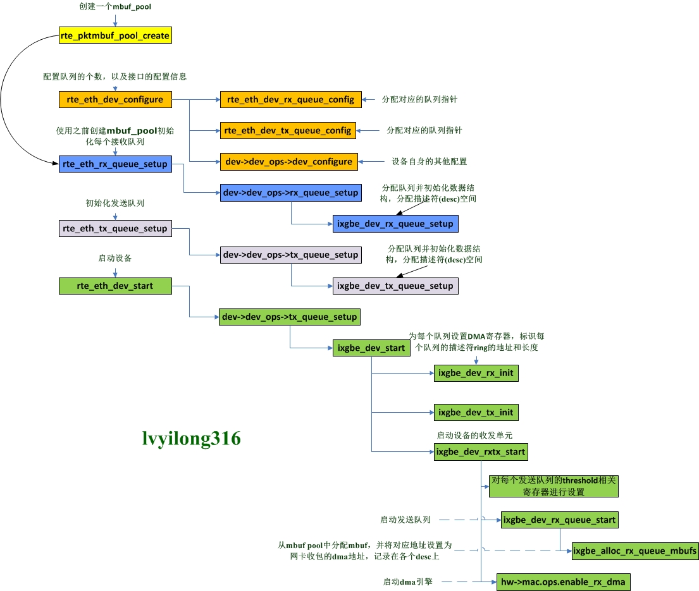

# eal_init


---


## rte_eal_config_create
```c++
rte_config_init()
    switch (rte_config.process_type)
    case RTE_PROC_PRIMARY:
        rte_eal_config_create()
            mem_cfg_fd = open("/var/run/config", O_RDWR | O_CREAT, 0600)
            ftruncate(mem_cfg_fd, sizeof(*rte_config.mem_config))
            fcntl(mem_cfg_fd, F_SETLK, &wr_lock)
            rte_mem_cfg_addr = eal_get_virtual_area(rte_mem_cfg_addr, &cfg_len_aligned, page_sz, 0, 0)
            mapped_mem_cfg_addr = mmap(rte_mem_cfg_addr, cfg_len_aligned, PROT_READ | PROT_WRITE, MAP_SHARED | MAP_FIXED, mem_cfg_fd, 0)
            memcpy(rte_mem_cfg_addr, &early_mem_config, sizeof(early_mem_config))
        eal_mcfg_update_from_internal();
        break;

    case RTE_PROC_SECONDARY:
        rte_eal_config_attach()
            mem_cfg_fd = open(pathname, O_RDWR)
            mem_config = (struct rte_mem_config *) mmap(NULL, sizeof(*mem_config), PROT_READ, MAP_SHARED, mem_cfg_fd, 0)
        eal_mcfg_wait_complete();
            struct rte_mem_config *mcfg = rte_eal_get_configuration()->mem_config;
            while (mcfg->magic != RTE_MAGIC)
                rte_pause();
```

## eal_hugepage_info_init
```c++
struct hugepage_info {
    uint64_t hugepage_sz;
    char hugedir[PATH_MAX];
    uint32_t num_pages[RTE_MAX_NUMA_NODES];
    int lock_descriptor;
};

eal_hugepage_info_init()
    hugepage_info_init()
        opendir("/sys/kernel/mm/hugepages")
            /*  hugepages-2048kB
                    free_hugepages
                    resv_hugepages
                    surplus_hugepages
                    nr_hugepages_mempolicy
                    nr_hugepages
                    nr_overcommit_hugepages
                hugepages-1048576kB */
        hpi->hugepage_sz = 2048kB | 1048576kB

        get_hugepage_dir(hpi->hugepage_sz, hpi->hugedir, sizeof(hpi->hugedir))
            fopen("/proc/mounts", "r")

        calc_num_pages(hpi, dirent)
            eal_parse_sysfs_value("/sys/devices/system/node/node%u/hugepages", &num_pages)
                /*  hugepages-2048kB
                        free_hugepages
                        surplus_hugepages
                        nr_hugepages
                    hugepages-1048576kB */
        /* sort the page directory entries by size, largest to smallest */
        qsort(&internal_config.hugepage_info[0], num_sizes, sizeof(internal_config.hugepage_info[0]), compare_hpi)

    tmp_hpi = create_shared_memory()
        fd = open("/var/run/hugepage_info", flags, 0600)
        ftruncate(fd, mem_size)
        mmap(NULL, mem_size, PROT_READ | PROT_WRITE, MAP_SHARED, fd, 0)
    memcpy(tmp_hpi, hpi, sizeof(internal_config.hugepage_info))
```

## rte_eal_memzone_init
```c++
struct rte_mem_config {
    struct malloc_heap malloc_heaps[RTE_MAX_HEAPS];
    struct rte_fbarray memzones;
};

struct rte_fbarray {
    char name[RTE_FBARRAY_NAME_LEN];
    unsigned int count;
    unsigned int len;
    unsigned int elt_sz;
    void *data;
    rte_rwlock_t rwlock;
};

rte_eal_memzone_init()
    rte_fbarray_init(&mcfg->memzones, "memzone", RTE_MAX_MEMZONE 2560, sizeof(struct rte_memzone))
        page_sz = sysconf(_SC_PAGESIZE)
        mmap_len = calc_data_size(page_sz, elt_sz, len)
        data = eal_get_virtual_area(NULL, &mmap_len, page_sz, 0, 0)
            mapped_addr = mmap(requested_addr, (size_t)map_sz, PROT_NONE, mmap_flags, -1, 0)
        if (!internal_config.no_shconf)
            mmap(data, mmap_len, PROT_READ | PROT_WRITE, MAP_FIXED | MAP_PRIVATE | MAP_ANONYMOUS, -1, 0)
        else
            fd = open("/var/run/fbarray_%s", O_CREAT | O_RDWR, 0600)
            ftruncate(fd, len)
            map_addr = mmap(data, len, PROT_READ | PROT_WRITE, MAP_SHARED | MAP_FIXED, fd, 0)
```

## rte_eal_memory_init
```c++
static struct {
    int *fds;
    int memseg_list_fd;
    int len;
    int count;
} fd_list[RTE_MAX_MEMSEG_LISTS];

rte_eal_memory_init()
    rte_eal_memseg_init()
        memseg_primary_init()
            alloc_memseg_list()
                rte_fbarray_init()

            alloc_va_space()
                addr = eal_get_virtual_area(msl->base_va, &mem_sz, page_sz, 0, flags)
                msl->base_va = addr
                msl->len = mem_sz

    eal_memalloc_init()
        rte_memseg_list_walk(fd_list_create_walk, NULL)
            for (i = 0; i < RTE_MAX_MEMSEG_LISTS; i++)
                fd_list_create_walk()
                    alloc_list(msl_idx, len)
                        if (!internal_config.single_file_segments)
                            data = malloc(sizeof(int) * len)
                            fd_list[list_idx].fds = data
                            fd_list[list_idx].len = len
                        else
                            fd_list[list_idx].fds = NULL
                            fd_list[list_idx].len = 0

                        fd_list[list_idx].count = 0
                        fd_list[list_idx].memseg_list_fd = -1


    rte_eal_hugepage_init()
        eal_memalloc_alloc_seg_bulk()
            alloc_seg_walk()
                alloc_seg()
                    fd = get_seg_fd(path, sizeof(path), hi, list_idx, seg_idx)
                        if (internal_config.in_memory)
                            return get_seg_memfd()
                                if (internal_config.single_file_segments)
                                    fd = memfd_create("seg_%d", RTE_MFD_HUGETLB)
                                    fd_list[list_idx].memseg_list_fd = fd
                                else
                                    fd = memfd_create("seg_%i-%i", RTE_MFD_HUGETLB)
                                    fd_list[list_idx].fds[seg_idx] = fd

                        if (internal_config.single_file_segments)
                            fd = fd_list[list_idx].memseg_list_fd
                            if (fd < 0)
                                fd = open("rtemap_%d", O_CREAT | O_RDWR, 0600)
                            fd_list[list_idx].memseg_list_fd = fd
                        else
                            fd = fd_list[list_idx].fds[seg_idx]
                            if (fd < 0)
                                fd = open("rtemap_%d", O_CREAT | O_RDWR, 0600)
                            fd_list[list_idx].fds[seg_idx] = fd

                    if (internal_config.single_file_segments)
                        resize_hugefile(fd, map_offset, alloc_sz, true)
                            if (internal_config.in_memory)
                                resize_hugefile_in_memory(fd, fa_offset, page_sz, grow)
                                    fallocate(fd, flags, fa_offset, page_sz)
                            else
                                resize_hugefile_in_filesystem(fd, fa_offset, page_sz, grow)
                                    ftruncate(fd, new_size)
                    else
                        ftruncate(fd, alloc_sz)

                    addr = RTE_PTR_ADD(cur_msl->base_va, cur_idx * page_sz)
                    va = mmap(addr, alloc_sz, PROT_READ | PROT_WRITE, mmap_flags, fd, map_offset)
                    iova = rte_mem_virt2iova()
                        rte_mem_virt2phy()
                            fd = open("/proc/self/pagemap", O_RDONLY)
                            virt_pfn = (unsigned long)virtaddr / page_size;
                            offset = sizeof(uint64_t) * virt_pfn
                            lseek(fd, offset, SEEK_SET)
                            read(fd, &page, PFN_MASK_SIZE)
                            physaddr = ((page & 0x7fffffffffffffULL) * page_size) + ((unsigned long)virtaddr % page_size)

                    ms->addr = addr
                    ms->hugepage_sz = alloc_sz
                    ms->len = alloc_sz
                    ms->nchannel = rte_memory_get_nchannel()
                    ms->nrank = rte_memory_get_nrank()
                    ms->iova = iova
                    ms->socket_id = socket_id
```

## rte_eal_malloc_heap_init
```c++
struct rte_mem_config {
    struct malloc_heap malloc_heaps[RTE_MAX_HEAPS];
    struct rte_fbarray memzones;
};

struct malloc_heap {
    rte_spinlock_t lock;
    LIST_HEAD(, malloc_elem) free_head[RTE_HEAP_NUM_FREELISTS];
    struct malloc_elem *volatile first;
    struct malloc_elem *volatile last;

    unsigned int alloc_count;
    unsigned int socket_id;
    size_t total_size;
    char name[RTE_HEAP_NAME_MAX_LEN];
} __rte_cache_aligned;

struct malloc_elem {
    struct malloc_elem *orig_elem;
    struct malloc_elem *volatile prev;
    struct malloc_elem *volatile next;
    LIST_ENTRY(malloc_elem) free_list;
    struct malloc_heap *heap;
    struct rte_memseg_list *msl;
    volatile enum elem_state state;
    uint32_t pad;
    size_t size;
    size_t orig_size;
    uint64_t header_cookie;         /* Cookie marking start of data */
                                    /* trailer cookie at start + size */
} __rte_cache_aligned;

rte_eal_malloc_heap_init()
    for (i = 0; i < RTE_MAX_MEMSEG_LISTS; i++)
        while (ms_idx >= 0)
            malloc_add_seg()
                malloc_heap_add_memory()
                    malloc_elem_init(elem, heap, msl, len, elem, len)
                    malloc_elem_insert(elem)
                    elem = malloc_elem_join_adjacent_free(elem)
                    malloc_elem_free_list_insert(elem)
```

## rte_eal_intr_init
```c++
struct rte_intr_source {
    TAILQ_ENTRY(rte_intr_source) next;
    struct rte_intr_handle intr_handle;
    struct rte_intr_cb_list callbacks; /* rte_intr_callback.next */
    uint32_t active;
};

struct rte_intr_callback {
    TAILQ_ENTRY(rte_intr_callback) next;
    rte_intr_callback_fn cb_fn;
    void *cb_arg;
    uint8_t pending_delete;
    rte_intr_unregister_callback_fn ucb_fn;
};

struct rte_intr_handle {
    union {
        int vfio_dev_fd;
        int uio_cfg_fd;
    };
    int fd;
    enum rte_intr_handle_type type;
    uint32_t max_intr;
    uint32_t nb_efd;
    uint8_t efd_counter_size;
    int efds[RTE_MAX_RXTX_INTR_VEC_ID];
    struct rte_epoll_event elist[RTE_MAX_RXTX_INTR_VEC_ID];
    int *intr_vec;
};

struct rte_epoll_event {
    volatile uint32_t status;
    int fd;
    int epfd;
    struct rte_epoll_data epdata;
};

struct rte_epoll_data {
    uint32_t event;
    void *data;
    rte_intr_event_cb_t cb_fun;
    void *cb_arg;
};
```

```c++
TAILQ_INIT(&intr_sources)
pipe(intr_pipe.pipefd)
rte_ctrl_thread_create(&intr_thread, "eal-intr-thread", NULL, eal_intr_thread_main, NULL)

eal_intr_thread_main()
    for (;;) {
        static struct epoll_event pipe_event = {
            .events = EPOLLIN | EPOLLPRI,
        };
        struct rte_intr_source *src;
        unsigned numfds = 0;

        int pfd = epoll_create(1);
        pipe_event.data.fd = intr_pipe.readfd;
        /* add pipe fd into wait list, this pipe is used to
         * rebuild the wait list. */
        epoll_ctl(pfd, EPOLL_CTL_ADD, intr_pipe.readfd, &pipe_event)

        TAILQ_FOREACH(src, &intr_sources, next) {
            struct epoll_event ev;
            memset(&ev, 0, sizeof(ev));
            ev.events = EPOLLIN | EPOLLPRI | EPOLLRDHUP | EPOLLHUP;
            ev.data.fd = src->intr_handle.fd;

            epoll_ctl(pfd, EPOLL_CTL_ADD, src->intr_handle.fd, &ev);
        }

        eal_intr_handle_interrupts(pfd, numfds) {
            for (;;) {
                nfds = epoll_wait(pfd, events, totalfds, EAL_INTR_EPOLL_WAIT_FOREVER);
                ret = eal_intr_process_interrupts(events, nfds) {
                    for (n = 0; n < nfds; n++) {
                        if (events[n].data.fd == intr_pipe.readfd){
                            int r = read(intr_pipe.readfd, buf.charbuf, sizeof(buf.charbuf));
                            RTE_SET_USED(r);
                            return -1;
                        }

                        /* set the length to be read dor different handle type */
                        switch (src->intr_handle.type) {
                        case RTE_INTR_HANDLE_UIO_INTX:
                            bytes_read = sizeof(buf.uio_intr_count);
                            break;
                        case RTE_INTR_HANDLE_ALARM:
                            bytes_read = sizeof(buf.timerfd_num);
                            break;
                        case RTE_INTR_HANDLE_VFIO_LEGACY:
                            bytes_read = sizeof(buf.vfio_intr_count);
                            break;
                        default:
                            bytes_read = 1;
                            break;
                        }

                        if (bytes_read > 0) {
                            bytes_read = read(events[n].data.fd, &buf, bytes_read);
                            call = true;
                        }

                        if (call) {
                            /* Finally, call all callbacks. */
                            TAILQ_FOREACH(cb, &src->callbacks, next) {
                                /* make a copy and unlock. */
                                struct rte_intr_callback active_cb = *cb;
                                rte_spinlock_unlock(&intr_lock);

                                /* call the actual callback */
                                active_cb.cb_fn(active_cb.cb_arg);

                                /*get the lock back. */
                                rte_spinlock_lock(&intr_lock);
                            }
                        }
                        /* we done with that interrupt source, release it. */
                        src->active = 0;

                        /* notify the pipe fd waited by epoll_wait to rebuild the wait list */
                        if (rv > 0 && write(intr_pipe.writefd, "1", 1) < 0) {
                            rte_spinlock_unlock(&intr_lock);
                            return -EPIPE;
                        }
                    }
                }

                if (ret < 0)
                    return;
            }
        }
        close(pfd);
    }
```

### rte_intr_callback_register
```c++
fd = eventfd(0, EFD_NONBLOCK | EFD_CLOEXEC);

dev->vfio_req_intr_handle.fd = fd;
dev->vfio_req_intr_handle.type = RTE_INTR_HANDLE_VFIO_REQ;
dev->vfio_req_intr_handle.vfio_dev_fd = vfio_dev_fd;

ret = rte_intr_callback_register(&dev->vfio_req_intr_handle, pci_vfio_req_handler, (void *)&dev->device);
    struct rte_intr_source *src = alloc(1, sizeof(*src));
    src->intr_handle = *intr_handle;
    TAILQ_INIT(&src->callbacks);
    TAILQ_INSERT_TAIL(&(src->callbacks), callback, next);
    TAILQ_INSERT_TAIL(&intr_sources, src, next);

    write(intr_pipe.writefd, "1", 1)
```

## rte_eal_alarm_init
```c++
```

# memory

## rte_malloc
```c++
malloc_heap_alloc()
```

## rte_memzone_reserve

```c++
struct rte_memzone {
    char name[32];
    union {
        phys_addr_t phys_addr;
        rte_iova_t iova;
    };

    union {
        void *addr;
        uint64_t addr_64;
    };

    size_t len;
    uint64_t hugepage_sz;
    int32_t socket_id;
    uint32_t flags;
};

mz_addr = malloc_heap_alloc()
mz_idx = rte_fbarray_find_next_free(arr, 0)
rte_fbarray_set_used(arr, mz_idx)
mz = rte_fbarray_get(arr, mz_idx)

mz->iova = rte_malloc_virt2iova(mz_addr);
mz->addr = mz_addr;
mz->len = requested_len == 0
    ? elem->size - elem->pad - MALLOC_ELEM_OVERHEAD
    : requested_len;
mz->hugepage_sz = elem->msl->page_sz;
mz->socket_id = elem->msl->socket_id;
mz->flags = 0;
```

## malloc_heap_alloc
```c++
struct malloc_heap {
    rte_spinlock_t lock;
    LIST_HEAD(, malloc_elem) free_head[RTE_HEAP_NUM_FREELISTS];
    struct malloc_elem *volatile first;
    struct malloc_elem *volatile last;

    unsigned int alloc_count;
    unsigned int socket_id;
    size_t total_size;
    char name[RTE_HEAP_NAME_MAX_LEN];
};

heap_id = malloc_socket_to_heap_id(socket)
malloc_heap_alloc_on_heap_id()
    heap_alloc()
        elem = find_suitable_element(heap, size, flags, align, bound, contig)
        elem = malloc_elem_alloc(elem, size, align, bound, contig)
```

## ring

```c++
struct rte_ring {
    char name[RTE_MEMZONE_NAMESIZE] __rte_cache_aligned;
    int flags;
    const struct rte_memzone *memzone;

    uint32_t size;
    uint32_t mask;
    uint32_t capacity;
    char pad0 __rte_cache_aligned;

    struct rte_ring_headtail prod __rte_cache_aligned;
    char pad1 __rte_cache_aligned;

    struct rte_ring_headtail cons __rte_cache_aligned;
    char pad2 __rte_cache_aligned;
};

struct rte_ring_headtail {
    volatile uint32_t head;
    volatile uint32_t tail;
    uint32_t single;
};
```

### rte_ring_create
```c++

```

### rte_ring_dequeue_bulk
```c++
__rte_ring_do_dequeue()
    __rte_ring_move_cons_head()
    DEQUEUE_PTRS(r, &r[1], cons_head, obj_table, n, void *)
    update_tail(&r->cons, cons_head, cons_next, is_sc, 0)
```

## mempool
```c++
struct rte_mempool {
    char name[RTE_MEMZONE_NAMESIZE];

    union {
        void *pool_data;
        uint64_t pool_id;
    };
    void *pool_config;
    const struct rte_memzone *mz;
    unsigned int flags;
    int socket_id;
    uint32_t size;
    uint32_t cache_size;

    uint32_t elt_size;
    uint32_t header_size;
    uint32_t trailer_size;

    unsigned private_data_size;

    int32_t ops_index;

    struct rte_mempool_cache *local_cache;

    uint32_t populated_size;
    struct rte_mempool_objhdr_list elt_list;
    uint32_t nb_mem_chunks;
    struct rte_mempool_memhdr_list mem_list;
};
```

### rte_mempool_create
```c++
rte_mempool_create_empty()
    rte_mempool_calc_obj_size()
    mz = rte_memzone_reserve()
        --->
    mp = mz->addr

rte_mempool_set_ops_byname() /* ring_sp_sc, ring_sp_mc, ring_mp_sc, ring_mp_mc */
rte_mempool_populate_default()
    /* 1. alloc ring */
    mempool_ops_alloc_once()
        rte_mempool_ops_alloc()
            mp->ops->alloc(mp)
                common_ring_alloc()
                    rte_ring_create()

    /* 2. alloc for each obj */
    for (mz_id = 0, n = mp->size; n > 0; mz_id++, n -= ret) {
        rte_mempool_ops_calc_mem_size()
        rte_memzone_reserve_aligned()
        if (pg_sz == 0 || (mz_flags & RTE_MEMZONE_IOVA_CONTIG))
            rte_mempool_populate_iova()
                __rte_mempool_populate_iova()
                    memhdr = rte_zmalloc("MEMPOOL_MEMHDR", sizeof(struct rte_mempool_memhdr), 0)
                    memhdr->mp = mp;
                    memhdr->addr = vaddr;
                    memhdr->iova = iova;
                    memhdr->len = len;
                    memhdr->free_cb = free_cb;
                    memhdr->opaque = opaque;
                    rte_mempool_ops_populate(obj_cb)
                        obj_cb()
                            mempool_add_elem(mempool_add_elem)
                                STAILQ_INSERT_TAIL(&mp->elt_list, hdr, next)
                        rte_mempool_ops_enqueue_bulk()
        else
            rte_mempool_populate_virt()
                __rte_mempool_populate_iova()
    }

rte_mempool_obj_iter()
```

### rte_pktmbuf_pool_create
```c++
rte_pktmbuf_pool_create_by_ops()
    rte_mempool_create_empty()
        rte_memzone_reserve()
            --->
    rte_mempool_set_ops_byname()
    rte_pktmbuf_pool_init()
    rte_mempool_populate_default()
    rte_mempool_obj_iter(mp, rte_pktmbuf_init, NULL)
```

### rte_mempool_get_bulk
```c++
cache = rte_mempool_default_cache()
    mp->local_cache[lcore_id]
rte_mempool_generic_get(cache)
    __mempool_generic_get()
        /* 1. get from local cache*/
        for (index = 0, len = cache->len - 1; index < n; ++index, len--, obj_table++)
            *obj_table = cache_objs[len];

        /* 2. get from ring */
        rte_mempool_ops_dequeue_bulk()
            mp->ops->dequeue()
                common_ring_sc_dequeue()
                    rte_ring_sc_dequeue_bulk()
```

### rte_mempool_put_bulk
```c++
cache = rte_mempool_default_cache()
    mp->local_cache[lcore_id]
rte_mempool_generic_put(cache)
    __mempool_generic_put()
        /* 1. put to cache */
        rte_memcpy(&cache->objs[cache->len], obj_table, sizeof(void *) * n)

        /* 2. put to ring*/
        rte_mempool_ops_enqueue_bulk()
            mp->ops->enqueue()
                common_ring_sp_enqueue()
                    rte_ring_sp_enqueue_bulk()
                        __rte_ring_do_enqueue()
                            __rte_ring_move_prod_head()
                            ENQUEUE_PTRS(r, &r[1], prod_head, obj_table, n, void *)
                            update_tail()
```

## ret_mbuf


```c++
struct rte_mbuf {
    MARKER cacheline0;

    void *buf_addr;

    union {
        rte_iova_t buf_iova;
        rte_iova_t buf_physaddr;
    } __rte_aligned(sizeof(rte_iova_t));

    MARKER64 rearm_data;
    uint16_t data_off;

    union {
        rte_atomic16_t refcnt_atomic;

        uint16_t refcnt;
    };
    uint16_t nb_segs;


    uint16_t port;
    uint64_t ol_flags;

    MARKER rx_descriptor_fields1;

    union {
        uint32_t packet_type;
        struct {
            uint32_t l2_type:4;
            uint32_t l3_type:4;
            uint32_t l4_type:4;
            uint32_t tun_type:4;

            union {
                uint8_t inner_esp_next_proto;
                struct {
                    uint8_t inner_l2_type:4;
                    uint8_t inner_l3_type:4;
                };
            };
            uint32_t inner_l4_type:4;
        };
    };

    uint32_t pkt_len;
    uint16_t data_len;
    uint16_t vlan_tci;

    union {
        union {
            uint32_t rss;

            struct {
                union {
                    struct {
                        uint16_t hash;
                        uint16_t id;
                    };
                    uint32_t lo;
                };
                uint32_t hi;
            } fdir;

            struct rte_mbuf_sched sched;

            struct {
                uint32_t reserved1;
                uint16_t reserved2;
                uint16_t txq;
            } txadapter;

            uint32_t usr;
        } hash;
    };


    uint16_t vlan_tci_outer;

    uint16_t buf_len;

    uint64_t timestamp;

    /* second cache line - fields only used in slow path or on TX */
    MARKER cacheline1 __rte_cache_min_aligned;

    union {
        void *userdata;
        uint64_t udata64;
    };

    struct rte_mempool *pool;
    struct rte_mbuf *next;

    /* fields to support TX offloads */

    union {
        uint64_t tx_offload;
        struct {
            uint64_t l2_len:RTE_MBUF_L2_LEN_BITS;
            uint64_t l3_len:RTE_MBUF_L3_LEN_BITS;
            uint64_t l4_len:RTE_MBUF_L4_LEN_BITS;
            uint64_t tso_segsz:RTE_MBUF_TSO_SEGSZ_BITS;

            uint64_t outer_l3_len:RTE_MBUF_OUTL3_LEN_BITS;
            uint64_t outer_l2_len:RTE_MBUF_OUTL2_LEN_BITS;
        };
    };

    uint16_t priv_size;
    uint16_t timesync;
    uint32_t seqn;

    struct rte_mbuf_ext_shared_info *shinfo;
    uint64_t dynfield1[2];
}
```

# dev



Ref:
* http://blog.chinaunix.net/uid-28541347-id-5785122.html

## rte_eth_dev_configure
```c++
rte_eth_dev_configure(uint16_t port_id, uint16_t nb_rx_q, uint16_t nb_tx_q, const struct rte_eth_conf *dev_conf)
    struct rte_eth_dev* dev = &rte_eth_devices[port_id]

    memcpy(&dev->data->dev_conf, dev_conf, sizeof(dev->data->dev_conf))

    rte_eth_dev_rx_queue_config(dev, nb_rx_q)
        dev->data->rx_queues = rte_zmalloc(sizeof(dev->data->rx_queues[0]) * nb_queues)

    rte_eth_dev_tx_queue_config(dev, nb_tx_q)
        dev->data->tx_queues = rte_zmalloc(sizeof(dev->data->tx_queues[0]) * nb_queues)

    /* eth_dev->dev_ops = &ixgbe_eth_dev_ops */
    (*dev->dev_ops->dev_configure)(dev)
```

## rte_eth_rx_queue_setup
```c++
struct rte_eth_dev* dev = &rte_eth_devices[port_id]
(*dev->dev_ops->rx_queue_setup)(dev, rx_queue_id, nb_rx_desc, socket_id, &local_conf, mp)
    ixgbe_dev_rx_queue_setup()
        /* 1. alloc ixgbe_rx_queue */
        struct ixgbe_rx_queue* rxq = rte_zmalloc_socket(sizeof(struct ixgbe_rx_queue))
        rxq->mb_pool = mp;
        rxq->nb_rx_desc = nb_desc;
        rxq->rx_free_thresh = rx_conf->rx_free_thresh;
        rxq->queue_id = queue_idx;

        rxq->rdt_reg_addr = IXGBE_PCI_REG_ADDR(hw, IXGBE_RDT(rxq->reg_idx));
        rxq->rdh_reg_addr = IXGBE_PCI_REG_ADDR(hw, IXGBE_RDH(rxq->reg_idx));

         /* 2. alloc rx ring */
        const struct rte_memzone* rz = rte_eth_dma_zone_reserve(queue_idx, RX_RING_SZ, IXGBE_ALIGN)
        rxq->rx_ring_phys_addr = rz->iova;
        rxq->rx_ring = (union ixgbe_adv_rx_desc *) rz->addr;
        rxq->sw_ring = rte_zmalloc_socket(sizeof(struct ixgbe_rx_entry) * nb_rx_q)
        rxq->sw_sc_ring = rte_zmalloc_socket(sizeof(struct ixgbe_scattered_rx_entry) * nb_rx_q)

        dev->data->rx_queues[queue_idx] = rxq

        ixgbe_reset_rx_queue(adapter, rxq)
            rxq->rx_nb_avail = 0;
            rxq->rx_next_avail = 0;
            rxq->rx_free_trigger = (uint16_t)(rxq->rx_free_thresh - 1);
            rxq->rx_tail = 0;
            rxq->nb_rx_hold = 0;
            rxq->pkt_first_seg = NULL;
            rxq->pkt_last_seg = NULL;
```

## rte_eth_tx_queue_setup
```c++
```

## rte_eth_dev_start
```c++
(*dev->dev_ops->dev_start)(dev)
    ixgbe_dev_start()
        rte_intr_disable(intr_handle);

        hw->adapter_stopped = 0;
        ixgbe_stop_adapter(hw);

        ixgbe_pf_reset_hw(hw);

        /* check and configure queue intr-vector mapping */
        rte_intr_efd_enable(intr_handle, intr_vector)

        ixgbe_dev_tx_init(dev);
            /* Setup the Base and Length of the Tx Descriptor Rings */
            for (i = 0; i < dev->data->nb_tx_queues; i++) {
                txq = dev->data->tx_queues[i];
                bus_addr = txq->tx_ring_phys_addr;
                IXGBE_WRITE_REG(hw, IXGBE_TDBAL(txq->reg_idx), (uint32_t)(bus_addr & 0x00000000ffffffffULL));
                IXGBE_WRITE_REG(hw, IXGBE_TDBAH(txq->reg_idx), (uint32_t)(bus_addr >> 32));
                IXGBE_WRITE_REG(hw, IXGBE_TDLEN(txq->reg_idx), txq->nb_tx_desc * sizeof(union ixgbe_adv_tx_desc));
                /* Setup the HW Tx Head and TX Tail descriptor pointers */
                IXGBE_WRITE_REG(hw, IXGBE_TDH(txq->reg_idx), 0);
                IXGBE_WRITE_REG(hw, IXGBE_TDT(txq->reg_idx), 0);
            }

            /* Device configured with multiple TX queues. */
            ixgbe_dev_mq_tx_configure(dev);

        ixgbe_dev_rx_init(dev);
            /* Setup the Base and Length of the Rx Descriptor Rings */
            for (i = 0; i < dev->data->nb_rx_queues; i++) {
                rxq = dev->data->rx_queues[i];
                bus_addr = rxq->rx_ring_phys_addr;
                IXGBE_WRITE_REG(hw, IXGBE_RDBAL(rxq->reg_idx), (uint32_t)(bus_addr & 0x00000000ffffffffULL));
                IXGBE_WRITE_REG(hw, IXGBE_RDBAH(rxq->reg_idx), (uint32_t)(bus_addr >> 32));
                IXGBE_WRITE_REG(hw, IXGBE_RDLEN(rxq->reg_idx), rxq->nb_rx_desc * sizeof(union ixgbe_adv_rx_desc));
                IXGBE_WRITE_REG(hw, IXGBE_RDH(rxq->reg_idx), 0);
                IXGBE_WRITE_REG(hw, IXGBE_RDT(rxq->reg_idx), 0);
            }

            /* Device configured with multiple RX queues. */
            ixgbe_dev_mq_rx_configure(dev);

        ixgbe_vlan_offload_config(dev, mask);

        ixgbe_flow_ctrl_enable(dev, hw);

        ixgbe_dev_rxtx_start(dev);
            /* Setup Transmit Threshold Registers */
            for (i = 0; i < dev->data->nb_tx_queues; i++) {
                txq = dev->data->tx_queues[i];
                txdctl = IXGBE_READ_REG(hw, IXGBE_TXDCTL(txq->reg_idx));
                txdctl |= txq->pthresh & 0x7F;
                txdctl |= ((txq->hthresh & 0x7F) << 8);
                txdctl |= ((txq->wthresh & 0x7F) << 16);
                IXGBE_WRITE_REG(hw, IXGBE_TXDCTL(txq->reg_idx), txdctl);
            }

            for (i = 0; i < dev->data->nb_tx_queues; i++) {
                txq = dev->data->tx_queues[i];
                if (!txq->tx_deferred_start) {
                    ret = ixgbe_dev_tx_queue_start(dev, i);
                        txdctl = IXGBE_READ_REG(hw, IXGBE_TXDCTL(txq->reg_idx));
                        txdctl |= IXGBE_TXDCTL_ENABLE;
                        IXGBE_WRITE_REG(hw, IXGBE_TXDCTL(txq->reg_idx), txdctl);
                        IXGBE_WRITE_REG(hw, IXGBE_TDH(txq->reg_idx), 0);
                        IXGBE_WRITE_REG(hw, IXGBE_TDT(txq->reg_idx), 0);
                    dev->data->rx_queue_state[rx_queue_id] = RTE_ETH_QUEUE_STATE_STARTED;
                }
            }

            for (i = 0; i < dev->data->nb_rx_queues; i++) {
                rxq = dev->data->rx_queues[i];
                if (!rxq->rx_deferred_start) {
                    ret = ixgbe_dev_rx_queue_start(dev, i);
                        ixgbe_alloc_rx_queue_mbufs(rxq)
                            /* Initialize software ring entries
                             * establish relation ship: mempool, queue, DMA, ring */
                            for (i = 0; i < rxq->nb_rx_desc; i++) {
                                volatile union ixgbe_adv_rx_desc *rxd;
                                struct rte_mbuf *mbuf = rte_mbuf_raw_alloc(rxq->mb_pool);
                                mbuf->data_off = RTE_PKTMBUF_HEADROOM;
                                mbuf->port = rxq->port_id;

                                dma_addr = rte_cpu_to_le_64(rte_mbuf_data_iova_default(mbuf));
                                rxd = &rxq->rx_ring[i];
                                rxd->read.hdr_addr = 0;
                                rxd->read.pkt_addr = dma_addr;
                                rxe[i].mbuf = mbuf;
                            }
                }
            }

        ixgbe_setup_link(hw, speed, link_up);
```

## rte_eth_rx_burst
```c++
rte_eth_rx_burst(uint16_t port_id, uint16_t queue_id, struct rte_mbuf **rx_pkts, const uint16_t nb_pkts)
    nb_rx = (*dev->rx_pkt_burst)(dev->data->rx_queues[queue_id], rx_pkts, nb_pkts)
        ixgbe_recv_pkts()
            nb_rx = 0;
            nb_hold = 0;
            rxq = rx_queue;
            rx_id = rxq->rx_tail;
            rx_ring = rxq->rx_ring;
            sw_ring = rxq->sw_ring;
            vlan_flags = rxq->vlan_flags;

            while (nb_rx < nb_pkts) {
                rxdp = &rx_ring[rx_id];
                staterr = rxdp->wb.upper.status_error;
                if (!(staterr & rte_cpu_to_le_32(IXGBE_RXDADV_STAT_DD)))
                    break;

                rxd = *rxdp;

                nmb = rte_mbuf_raw_alloc(rxq->mb_pool);
                rxe = &sw_ring[rx_id];
                rxm = rxe->mbuf;
                rxe->mbuf = nmb;
                rxdp->read.hdr_addr = 0; /* set DD 0 */
                dma_addr = rte_cpu_to_le_64(rte_mbuf_data_iova_default(nmb));
                rxdp->read.pkt_addr = dma_addr;

                rx_pkts[nb_rx++] = rxm;
            }

            rxq->rx_tail = rx_id;

            return nb_rx;
```

## rte_eth_tx_burst
```c++
/* write-back:
 * 1. Updating by writing back into the Tx descriptor
 * 2. Update by writing to the head pointer in system memory */

rte_eth_tx_burst(uint16_t port_id, uint16_t queue_id, struct rte_mbuf **tx_pkts, uint16_t nb_pkts)
    (*dev->tx_pkt_burst)(dev->data->tx_queues[queue_id], tx_pkts, nb_pkts)
        ixgbe_xmit_pkts()

```